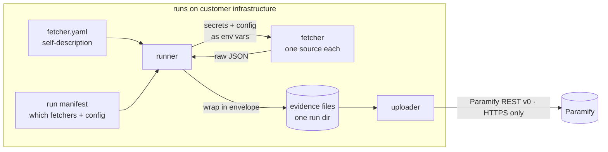

# Paramify Fetchers

[](https://github.com/paramify/paramify-fetchers/actions/workflows/ci.yml)
[](LICENSE)
[](pyproject.toml)
[](CHANGELOG.md)
[](https://deepwiki.com/paramify/paramify-fetchers)

Fetchers are small scripts that collect compliance evidence from your infrastructure and write it to disk as JSON. A separate uploader stage pushes that evidence to Paramify. This repo contains the fetchers, the runner that executes them, and the uploader — the fetchers themselves never talk to Paramify directly.

```
  customer tool  ──fetcher──▶  JSON evidence file  ──uploader──▶  Paramify
                               (on disk, per run)     (separate stage)
```

---

## Supported services

<div align="center">

<a href="fetchers/aws/"></a>
<a href="fetchers/datadog/"></a>
<a href="fetchers/okta/"></a>
<a href="fetchers/sentinelone/"></a>
<a href="fetchers/knowbe4/"></a>
<a href="fetchers/gitlab/"></a>
<a href="fetchers/k8s/"></a>
<a href="fetchers/rippling/"></a>
<a href="fetchers/checkov/"></a>

</div>

| Category | Fetchers | What it collects |
|---|---:|---|
| **AWS** | 80 | Encryption at rest, IAM, high availability, logging, network segmentation — across the AWS service surface |
| **Azure** | 27 | Storage/disk/SQL encryption and CMK use, Entra identity + Conditional Access, RBAC assignments and custom roles, network security groups, Key Vault config and key rotation, Defender plans, diagnostic settings and activity-log alerts, backup, and the managed databases |
| **GCP** | 19 | Disk/bucket/Cloud SQL/BigQuery/Secret Manager encryption and CMEK use, IAM policy bindings, custom roles and service-account keys, KMS key rotation, GKE cluster hardening, Cloud Logging sinks and metric alerts, VPC/firewall/DNS segmentation, load-balancer TLS, and API keys |
| **Datadog** | 13 | Cloud SIEM detection rules & signals, log pipelines/indexes/archives, host & container inventory, agent checks, APM services, and incidents with timelines |
| **Okta** | 8 | Phishing-resistant MFA, authenticators, least privilege, just-in-time access, account management |
| **SentinelOne** | 5 | Agents, activities, cloud detection rules, XDR assets, user config |
| **KnowBe4** | 4 | Security-awareness, high-risk, developer, and module-based training summaries |
| **GitLab** | 4 | CI/CD pipeline config, merge-request and project summaries, significant change notifications |
| **Kubernetes** | 3 | EKS pod inventory, microservice segmentation, `kubectl` security posture |
| **Rippling** | 3 | Employee roster, current employees, managed devices |
| **Checkov** | 2 | IaC scans over cloned Terraform / Kubernetes source |

### Coming soon

More integrations are in progress. To request a fetcher or upvote what should be prioritized next, visit [Paramify Community Feature Requests](https://support.paramify.com/hc/en-us/community/topics/31851789568275-Feature-Requests).

<div align="center">


GitHub · and more

</div>

---

## Install

**Prerequisites:** Python 3.10+. The CLIs your fetchers need (`aws`, `jq`, `curl`, `kubectl`, etc.) must be on your `PATH` — install only what applies to the categories you'll run. Each service's credential setup guide is in `fetchers/<category>/README.md`.

```bash
git clone https://github.com/paramify/paramify-fetchers.git
cd paramify-fetchers
python -m venv .venv && source .venv/bin/activate
pip install -e '.[all]'      # '[all]' bundles the TUI; use `pip install -e .` for the headless CLI only
```

Azure and GCP are the exceptions to the CLI rule above: both talk to their cloud
through the official SDKs rather than a CLI, so each has its own extra and
neither needs a cloud CLI at runtime.

```bash
pip install -e '.[azure]'    # 23 packages; no `az` CLI at runtime
pip install -e '.[gcp]'      # 12 packages; no `gcloud` at runtime
```

Both are deliberately kept out of `[all]` — they are the heaviest extras here
and only matter if you actually run those categories. Azure authenticates
through `DefaultAzureCredential`, GCP through Application Default Credentials;
neither takes a static key file.

There are three ways to drive it — an interactive **TUI**, an **AI agent**, or the **CLI** directly. All three go through one facade (`framework.api`), so they behave identically; pick whichever fits how you work.

---

## The TUI

The fastest way in. `paramify tui` browses the catalog, builds and validates a
manifest, runs it, and reviews evidence — all without leaving the keyboard:


> **Zero-credential first run:** the bundled `demo_hello` fetcher emits synthetic
> evidence, so you can watch the whole collect → envelope pipeline before wiring
> up a real service:
>
> ```bash
> paramify run examples/demo.yaml                    # synthetic evidence — no credentials
> paramify evidence evidence/run-*/demo_hello.json   # inspect the enveloped result
> ```

The recordings on this page were made against a larger set of synthetic fetchers
than the repo ships, so a run of your own will be shorter than the one on film —
`examples/demo.yaml` collects once and exits clean. What the frames show of the
runner, the envelope and each command's output is exactly what you get.


---

## Drive it with an AI agent

Every command takes `--json`, and each `paramify manifest` edit returns a stable
`{ok, path, errors}` object — so an agent can assemble a runnable manifest by
reading `errors` and closing each gap, no screen-scraping:

```bash
paramify catalog --json                                  # discover what's available
paramify manifest add okta_phishing_resistant_mfa --json # → {"ok": false, "errors": [ …missing secrets… ]}
paramify manifest set-secret okta_phishing_resistant_mfa api_token OKTA_API_TOKEN --json
# …repeat until:
paramify validate manifest.yaml --json                   # → {"ok": true, "errors": []}
```

The repo also ships Claude Code skills under [`.claude/skills/`](.claude/skills/) —
`create-fetcher`, `wire-manifest`, and `suggest-validator` — so an agent can
scaffold a new fetcher, wire it into a manifest, or propose a validator directly.

---

## Using the CLI

The same operations, run by hand. `paramify catalog` lists the catalog and
`paramify describe <fetcher>` shows exactly what any one fetcher needs:


A typical run, step by step:

```bash
# 1. Browse available fetchers by category
paramify catalog

# 2. Start a manifest and wire in your fetchers
paramify manifest init
paramify manifest add okta_phishing_resistant_mfa
paramify manifest set-secret okta_phishing_resistant_mfa api_token OKTA_API_TOKEN
paramify manifest set-secret okta_phishing_resistant_mfa org_url OKTA_ORG_URL
# The manifest builder reports missing secrets after each step —
# keep going until it says the manifest is runnable.

# 3. Set your credentials and run
export OKTA_API_TOKEN=<your token>
export OKTA_ORG_URL=https://your-org.okta.com
paramify validate manifest.yaml
paramify run     manifest.yaml         # evidence → ./evidence/run-<timestamp>/

# 4. Upload to Paramify
export PARAMIFY_UPLOAD_API_TOKEN=<your token>   # see uploaders/paramify_evidence/README.md for setup
paramify upload                                  # push the latest run
```

Each service has a credential setup guide in its fetcher directory — for example, [`fetchers/okta/README.md`](fetchers/okta/README.md) covers creating an Okta API token and the required admin role. See [`examples/`](examples/) for complete worked manifests (multi-region AWS, GitLab fanout, etc.) and [`deploy/README.md`](deploy/README.md) for running on a schedule in Docker.

The full command surface:

```bash
paramify list                  # discovered fetchers (flat)
paramify catalog               # categories → fetchers → editable fields
paramify describe <fetcher>    # one fetcher's config / secrets / target fields
paramify ksi                   # FedRAMP KSI coverage
paramify doctor   [manifest]   # preflight: Python, CLIs/packages, manifest, upload
paramify manifests             # discovered run manifests (manifests/*.yaml)
paramify validate <manifest>   # validate a manifest without running
paramify run      <manifest>   # run it
paramify runs                  # past runs under an output dir (newest first)
paramify evidence <file>       # read one evidence file, or an issue-report sidecar
paramify upload   [run-dir]    # push a run's evidence to Paramify (default: latest run)
paramify issues   upload       # push a run's issue reports to assessment intake
paramify programs <sub>        # list workspace programs; turn them into targets
paramify assessments <sub>     # list workspace assessments; point issue reports at one
paramify manifest <sub>        # build/edit a manifest (see below)
```

Fanning a fetcher out across the programs in a Paramify workspace is its own
step, because the API takes project UUIDs while people know their programs by
name. `paramify programs` closes that gap — list what's there, pick by name, and
it writes the targets for you:

```bash
paramify programs list                       # name + UUID for every program
paramify programs target                     # choose interactively, then wire them up
paramify programs target --all \
    --cert-uri https://example.gov/cpo --report-from 2026-01-01
```

With no fetcher argument it targets every manifest entry that takes a program, so
one command fans all of them out at once. Re-running it tops the manifest up
rather than duplicating targets.

Which manifest it edits is chosen, never assumed. With no `-f/--file` it lists
the discovered manifests — `manifests/*.yaml` plus a legacy `./manifest.yaml` —
and you pick one by number; a lone candidate is used outright and named. `-f`
takes a path or a bare name (`-f azure`, `-f azure.yaml`), resolved against
`manifests/` and the repo root so it works from any directory in the tree. A `-f`
that matches nothing is an error, not an empty manifest.

A target carries only what varies per program — `project_id` and its readable
`program_name`. Everything shared is written once to `platforms.paramify.config`:
the Certification Package Overview URI (not in Paramify's API, one value per
workspace) and the report period start. Every interactive run shows both with
whatever the manifest holds today as the prompt default — enter keeps it and
writes nothing, typing over it updates it — so `paramify programs target` is
equally how you add a program and how you roll the report window forward.
Passing `--cert-uri`/`--report-from` overwrites what's there without asking.

`--report-from` is checked for an ISO date up front — an unparseable one produces
an empty report window, which drops every closed issue from the report without
failing.

Both subcommands need `PARAMIFY_API_TOKEN` with read scope and accept `--json`
(under `--json` nothing prompts, so pass the flags).

> Back-compat: `python -m framework.runner <cmd>` and `python -m framework.tui`
> still work and are exactly equivalent to the corresponding `paramify`
> subcommands.

Before a real run, `paramify doctor <manifest>` preflights the environment —
Python, the CLIs and pip packages each category needs, whether the manifest can
run at all, whether its secret env vars hold usable values, and whether an upload
would work — and exits non-zero if anything's missing, so it drops straight into
CI:

```text
$ paramify doctor examples/minimal_run.yaml
✅ Python 3.11.9 (need ≥ 3.10)

Required CLIs:
  ✅ curl     /usr/bin/curl  (okta)
  ✅ jq       /opt/homebrew/bin/jq  (okta)

Upload:
  ❌ API token not set — PARAMIFY_UPLOAD_API_TOKEN (or PARAMIFY_API_TOKEN)
  → production: https://app.paramify.com/api/v0  (default)
  (informational — collecting without uploading is fine)

✅ Manifest valid (examples/minimal_run.yaml): 2 entries

Manifest secrets (examples/minimal_run.yaml):
  ❌ okta_phishing_resistant_mfa  missing: OKTA_API_TOKEN, OKTA_ORG_URL
  ❌ gitlab_ci_cd_pipeline_config  missing: GITLAB_TOKEN_1, GITLAB_TOKEN_2

Issues found — see above.
```

Passing a manifest scopes every dependency check to the categories it actually
uses, so a GitLab-only run is never told to install the aws CLI or the Azure
SDKs. Each category declares what it needs in
`fetchers/_categories/<name>.yaml`; version pins come from `requirements.txt`.
The declarations are themselves tested (`tests/test_category_requires.py`) — an
import or a shelled-out binary that nothing declares fails the suite, because
doctor's report is only as good as what the category files say.

The manifest is validated exactly the way `paramify validate` does it, so a
misspelled fetcher name, a missing required config key, or an unmapped declared
secret fails here rather than at run time — none of which a secret-presence check
can see, since a secret the manifest never mapped leaves nothing to check.

Secret *values* are checked, not just their presence. A whitespace-only value
counts as missing (it reads as set and fails at the API), and values that look
like copy-paste artifacts — surrounding quotes, a trailing newline from
`$(cat file)`, a `*_URL` with no scheme — are reported as warnings that never
affect the exit code, since a legitimate value can look odd:

```text
Manifest secrets (manifest.yaml):
  ✅ okta_phishing_resistant_mfa  (OKTA_API_TOKEN, OKTA_ORG_URL)
  ⚠️  OKTA_ORG_URL: name reads as a URL but the value has no http(s):// scheme
```

Two flags worth knowing:

- `--probe` authenticates against each cloud category and prints which identity
  answered (caller ARN, Azure principal and subscription, GCP account and
  project). Without it doctor only checks that variables are *set* — which says
  nothing for the ambient credential chains, where the working path sets no
  variable at all. It makes network calls, so it is opt-in, and a failed probe
  is reported without failing the command.
- `--require-upload` makes a missing API token fail the exit code. By default
  upload readiness is reported but not gated, since collecting without
  uploading is a legitimate workflow.

### Building a manifest

`paramify manifest <sub>` edits a manifest file in place (`-f/--file`, default
`./manifest.yaml`). It reads each `fetcher.yaml` and warns which secrets and
config are still missing until the manifest is runnable.

Nothing ships at `./manifest.yaml`, so the one you build there is yours — commit
it or don't, as you prefer. `paramify manifest new <name>` starts one under
`manifests/`. For a worked reference see
[`example_manifest.yaml`](example_manifest.yaml); [`examples/`](examples/) holds
smaller per-scenario samples.


```bash
paramify manifest init [--output-dir DIR]            # start a manifest at -f/--file
paramify manifest new <name> [--output-dir DIR]      # create manifests/<name>.yaml
paramify manifest add <fetcher>                      # add a fetcher
paramify manifest remove <fetcher>
paramify manifest set-config <fetcher> key=value
paramify manifest set-secret <fetcher> <secret_name> <ENV_VAR>
paramify manifest add-target <fetcher> k=v ... [--secret name=ENV_VAR ...]
paramify manifest remove-target <fetcher> <index>
paramify manifest set-platform-config <category> key=value
paramify manifest set-passthrough <category> ENV_VAR ...
paramify manifest set-output-dir <dir>
paramify manifest show [--json]
```

Every `manifest` subcommand also accepts `--json`, emitting a stable
`{"ok", "path", "errors"}` object — so an agent can build a manifest step by step
and read `errors` to see what's still missing.

### Collect, then upload

Collection and upload are separate stages on purpose. The runner only collects;
pushing to Paramify is a second step, run against the enveloped run directory:

```bash
paramify run manifest.yaml          # collect → enveloped JSON in run-<ts>/
paramify upload                     # upload the latest run (get-or-create evidence
                                    # set by reference_id, multipart artifacts)
```

`paramify upload` takes an optional run directory (default: the latest run under
`--output-dir`) and supports `--dry-run`, `--config`, and `--json`; the same
uploader can also be invoked directly as
`python -m uploaders.paramify_evidence <run-dir>`. It is idempotent within a run,
talks Paramify REST v0 over HTTPS only, and reads `PARAMIFY_UPLOAD_API_TOKEN`
(with optional `PARAMIFY_API_BASE_URL`). See
[`uploaders/paramify_evidence/README.md`](uploaders/paramify_evidence/README.md)
for how to create a Paramify API key with the required permissions. Chaining the two stages is the
customer's job, not the runner's; `run_and_upload.sh` at the repo root is
example glue.

### Scan results, not evidence

Some tools don't need you to assert anything — they already computed the findings.
A Nessus export or a Wiz misconfiguration report *is* the answer, and Paramify has
a parser for it. Those go through a second kind of fetcher, `kind: issue_report`,
which writes the tool's own file untouched to `run-<ts>/issue-reports/` and posts
it to a Paramify **assessment**, where it becomes issues rather than evidence:

```bash
paramify assessments select my_scanner_report   # pick the assessment by name, once
paramify run manifest.yaml                      # raw report → run-<ts>/issue-reports/
paramify issues upload                          # → POST /assessment/{id}/intake
```

The file is never wrapped or rewritten — the intake parser reads the vendor's own
CSV/XML/JSON/Nessus structure, so anything added to it breaks the parse. That one
constraint is what makes this a separate kind with a separate uploader instead of
a flag on the existing one. Nothing ships in this category yet; to write the
first, start from [`docs/issue_report_fetchers.md`](docs/issue_report_fetchers.md).

### Show how evidence is generated (optional)

Beyond the evidence itself, you can push each fetcher's **entry script** to
Paramify and link it to that fetcher's evidence set — so the tenant shows *how*
each piece of evidence was collected. This is a **provisioning** step, separate
from upload: run it when `fetchers/**` change, not on every collection.

```bash
paramify scripts sync --dry-run     # preview the plan (read-only)
paramify scripts sync               # push entry scripts + associate to evidence sets
```

It reconciles the tenant to the repo GitOps-style — keyed off a marker in each
script's `description` and the `fetcher.yaml` `version`, with a sha256 drift guard
(warn/skip unless `--force`) — and supports `--reassociate` and `--json`. Like the
uploader it talks Paramify REST v0 over HTTPS only and reads
`PARAMIFY_UPLOAD_API_TOKEN`. See
[`uploaders/paramify_scripts/README.md`](uploaders/paramify_scripts/README.md) for
the full model, or [`docs/uploader_design.md`](docs/uploader_design.md) for how it
fits alongside evidence upload.

---

## How it runs

Four pieces, kept deliberately separate:

- **Fetcher** — a small script (`fetcher.py` or `fetcher.sh`) that collects from
  *one* source and writes a JSON file. It reads everything it needs from
  environment variables and writes only to `EVIDENCE_DIR`.
- **`fetcher.yaml`** — the fetcher's self-description: its name, what secrets and
  config it needs, what it outputs, and its `evidence_set` identity. Ships with
  the code, validated against a schema. Customers never edit this.
- **Run manifest** — the customer's intent: which fetchers to run, with what
  config, against what targets. Lives in the customer's environment, not here.
- **Runner** — reads `fetcher.yaml` files and a manifest, resolves secrets and
  config into environment variables, and executes each fetcher.



Everything goes through one facade, `framework.api` — discovery, manifest
editing, validation, and running. The TUI, the CLI, and the `--json` surface an
agent drives all sit on that single code path, which is why they behave
identically.

Output lands in `<output_dir>/run-<UTC-timestamp>/`, one JSON file per fetcher
(or per target for fan-out), alongside a `_run_metadata.json` run index. The
runner wraps each evidence file in an envelope —
`{schema_version, metadata, payload}` — where `metadata` carries the fetcher
name/version/category, run id, target, `collected_at`, status, exit code, and
the `evidence_set` identity; failed invocations also get a `stderr_tail`. The
`_run_metadata.json` index itself is not enveloped.

A finished evidence file looks like this — an AWS VPC-segmentation run,
abbreviated:

```json
{
  "schema_version": "1.0",
  "metadata": {
    "fetcher_name": "aws_vpc_network_segmentation",
    "fetcher_version": "0.1.0",
    "category": "aws",
    "run_id": "2026-06-16T15-56-41Z",
    "target": { "region": "us-east-1" },
    "collected_at": "2026-06-16T16:00:14Z",
    "status": "success",
    "exit_code": 0,
    "evidence_set": {
      "reference_id": "EVD-VPC-SEGMENTATION",
      "name": "VPC Network Segmentation",
      "instructions": "Script: fetcher.sh. Commands: aws ec2 describe-vpcs, describe-subnets, describe-vpc-peering-connections, describe-vpc-endpoints.",
      "description": "Lists VPCs, subnets, peering connections, and endpoints to document network topology and segmentation."
    }
  },
  "payload": {
    "metadata": { "account_id": "111122223333", "region": "us-east-1", "datetime": "2026-06-16T16:00:14Z" },
    "results": [
      { "ResourceType": "Vpcs", "Items": [
        { "VpcId": "vpc-0a1b2c3d", "CidrBlock": "172.31.0.0/16", "IsDefault": true, "State": "available" }
      ] },
      { "ResourceType": "Subnets", "Items": [
        { "SubnetId": "subnet-0d7e6de0", "VpcId": "vpc-0a1b2c3d", "CidrBlock": "172.31.80.0/20", "AvailabilityZone": "us-east-1b" }
      ] }
    ]
  }
}
```

The runner owns the `metadata` envelope; the fetcher owns `payload`. The
`evidence_set` block (from `fetcher.yaml`) is what an uploaded file maps to in
Paramify. Note there is no pass/fail verdict — that judgment is Paramify-side, by
design (peering connections and endpoints are omitted above for brevity).

> **Status:** pre-1.0 (v0.x). The runner now wraps every output in the
> `metadata`+`payload` envelope, but fetchers still write raw evidence dicts and
> read env directly rather than receiving a typed secrets object — both are
> tracked interim shortcuts, not the target. Comparators (`depends_on`) and
> structured exit-code categories (still binary `0`/`1`, plus `124` for a runner
> timeout-kill) are not built yet. Issue-report collection is built end to end —
> contract, runner, uploader, template — but no vendor fetcher ships in that
> category yet. See `docs/design.md` for what's deferred.

---

## Repository layout

```
framework/                      # shared code (facade, runner, contract, schemas)
  api.py                        # the facade — discovery, manifest edit, validate, run
  schemas/                      # fetcher / manifest / category JSON Schemas
  cli.py                        # the `paramify` CLI — one command, steers every front-end
  runner/                       # executor + manifest loader (+ `python -m framework.runner` shim)
  tui/                          # terminal UI front-end (Textual)
fetchers/
  _categories/<name>.yaml       # platform-wide config + auth for a category
  _template/                    # copy this to start a new fetcher
  _template_issue_report/       # …or this, for a raw scan-report fetcher
  <category>/
    README.md                   # credential setup guide for this service
    _shared/                    # code shared across fetchers in this category
    <short_name>/               # one directory per fetcher
      fetcher.yaml
      fetcher.py | fetcher.sh
comparators/                    # cross-source comparators (template only so far)
uploaders/
  paramify_evidence/            # push evidence to Paramify (built)
  paramify_issues/              # push raw scan reports to assessment intake (built)
  paramify_scripts/             # push fetcher entry scripts + associate to evidence sets (built)
examples/                       # sample run manifests
tests/                          # framework test suite (pytest)
manifest.yaml                   # working manifest at repo root
run_and_upload.sh               # example collect→upload glue
docs/                           # contract, design, and reference guides
```

Directories starting with `_` are not fetchers — the runner skips them.

---

## Adding a fetcher

To add evidence collection for a new control or a new tool, see [`docs/authoring_a_fetcher.md`](docs/authoring_a_fetcher.md). If the tool already produces the findings — a vulnerability scan or a CSPM export — you want an issue-report fetcher instead: [`docs/issue_report_fetchers.md`](docs/issue_report_fetchers.md).

---

## Where to read next

| Doc | What it covers |
|---|---|
| [`fetchers/aws/README.md`](fetchers/aws/README.md) | AWS credential setup (ambient + multi-account fanout) |
| [`fetchers/okta/README.md`](fetchers/okta/README.md) | Okta API token + required admin role |
| [`fetchers/gitlab/README.md`](fetchers/gitlab/README.md) | GitLab project access token setup |
| [`fetchers/sentinelone/README.md`](fetchers/sentinelone/README.md) | SentinelOne service user + API token |
| [`fetchers/knowbe4/README.md`](fetchers/knowbe4/README.md) | KnowBe4 Reporting API key |
| [`fetchers/rippling/README.md`](fetchers/rippling/README.md) | Rippling Developer Hub token + scopes |
| [`fetchers/k8s/README.md`](fetchers/k8s/README.md) | Kubernetes / EKS credential setup |
| [`fetchers/checkov/README.md`](fetchers/checkov/README.md) | Checkov setup + git token for IaC scanning |
| [`uploaders/paramify_evidence/README.md`](uploaders/paramify_evidence/README.md) | Paramify API key setup + upload options |
| [`uploaders/paramify_issues/README.md`](uploaders/paramify_issues/README.md) | Intaking raw scan reports into an assessment + why the file is never touched |
| [`uploaders/paramify_scripts/README.md`](uploaders/paramify_scripts/README.md) | Syncing fetcher entry scripts to Paramify + the association model |
| [`docs/uploader_design.md`](docs/uploader_design.md) | How the three uploaders work + the shared evidence-set identity model |
| [`docs/authoring_a_fetcher.md`](docs/authoring_a_fetcher.md) | Writing a new fetcher from scratch |
| [`docs/issue_report_fetchers.md`](docs/issue_report_fetchers.md) | The second kind of fetcher: raw scan reports → assessment issues |
| [`docs/fetcher_contract.md`](docs/fetcher_contract.md) | The binding runner↔fetcher contract |
| [`docs/ksi_mapping.md`](docs/ksi_mapping.md) | Which fetchers map to which FedRAMP KSIs, per indicator and per fetcher, plus open gaps |
| [`docs/run_manifest_reference.md`](docs/run_manifest_reference.md) | Manifest format reference |
| [`docs/config_injection_design.md`](docs/config_injection_design.md) | Platform/config/auth model |
| [`docs/design.md`](docs/design.md) | Why the framework is shaped this way + current state of the work |
| [`docs/versioning.md`](docs/versioning.md) | How we version, the contract, and what 1.0 means |
| [`docs/releasing.md`](docs/releasing.md) | How a release is cut |
| [`docs/private_mirror_workflow.md`](docs/private_mirror_workflow.md) | Keeping a private copy of this repo that still receives upstream releases |

## License

Licensed under the GNU General Public License v3.0 — see [`LICENSE`](LICENSE).
