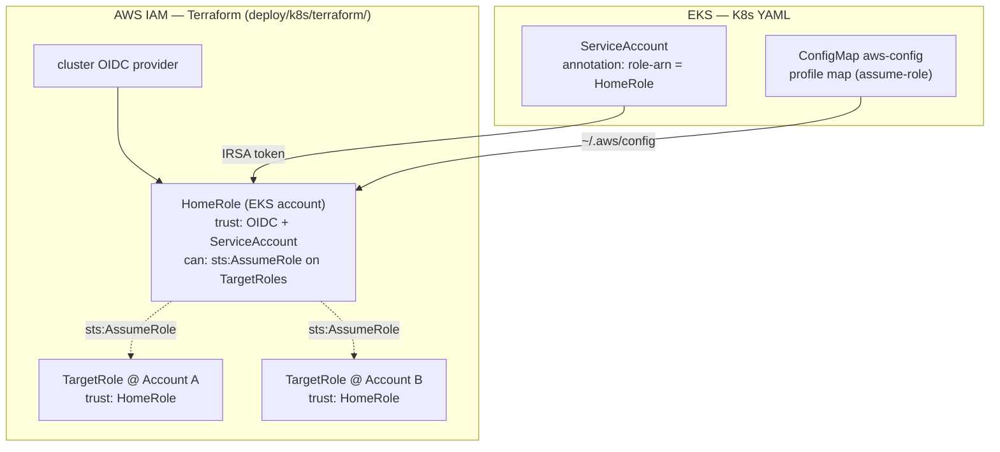

# AWS on Kubernetes: ambient single-account → multi-account hub-and-spoke

The AWS fetchers resolve credentials through the **AWS CLI's own credential
chain**. `profile` and `region` are optional manifest fields:

- **Omit them** → the fetcher uses the *ambient* identity/region of wherever the
  Pod runs ("collect the account I'm deployed into"). The smooth single-account path.
- **Set a `profile:` per target** → fanout: the fetcher assumes that account's role
  and collects it. One deployment, N accounts.

No fetcher reads credentials directly and none of this is fetcher code — it's the
manifest (`profile`/`region`), `~/.aws/config` (the profile map), and IAM.

---

## A. Single account, local (kind / Docker Desktop)

The fetchers need an identity in the Pod. Locally there's no IRSA, so mount a
credentials file.

```bash
# 1. Re-auth on the host, then capture creds into a [default] profile.
aws sso login    # or `aws configure` for static keys — however you auth to the host
printf '[default]\naws_access_key_id = %s\naws_secret_access_key = %s\naws_session_token = %s\n' \
  "$(aws configure get aws_access_key_id)" \
  "$(aws configure get aws_secret_access_key)" \
  "$(aws configure get aws_session_token)" > /tmp/aws-credentials
kubectl create secret generic aws-cli --from-file=credentials=/tmp/aws-credentials && rm /tmp/aws-credentials

# 2. Upload token + the manifest.
kubectl create secret generic paramify-upload --from-literal=PARAMIFY_UPLOAD_API_TOKEN=<token>
kubectl create configmap aws-manifest --from-file=aws_ambient.yaml=examples/aws_ambient.yaml
```

In [`cronjob-aws.yaml`](cronjob-aws.yaml) uncomment the **LOCAL ONLY** `aws-cli`
volume + mount (`/root/.aws/credentials`), then:

```bash
kubectl apply -f deploy/k8s/cronjob-aws.yaml
kubectl create job --from=cronjob/paramify-aws test-1
kubectl logs -f job/test-1
```

The `[default]` profile + ambient (no-profile) manifest targets means the CLI uses
those creds directly. The evidence is named `aws_<name>_ambient[_<region>].json`,
with the real `account_id` in the metadata.

> Want to verify the tool itself first, no cluster? From the repo root:
> `aws sso login && paramify run examples/aws_ambient.yaml` — the AWS category
> passthrough lets your ambient creds through, so it collects this account.

---

## B. Multi-account on EKS (hub-and-spoke via IRSA + assume-role)

One deployment reaches into N accounts. The Pod has a single **HomeRole** (via
IRSA); each target account has a read-only **TargetRole** that trusts HomeRole;
the CLI assumes each in turn.



### Steps

1. **Provision IAM** — [`terraform/`](terraform/): creates HomeRole (IRSA trust)
   + a read-only role per target account. Outputs `home_role_arn` and
   `target_role_arns`.
2. **Annotate the ServiceAccount** — paste `home_role_arn` into the
   `eks.amazonaws.com/role-arn` annotation (PROD SWAP #1) in
   [`cronjob-aws.yaml`](cronjob-aws.yaml). Drop the LOCAL `aws-cli` mount.
3. **Profile map** — fill [`aws-config.configmap.yaml`](aws-config.configmap.yaml):
   `[profile home]` = HomeRole + the IRSA token file; one `[profile <name>]` per
   account = its TargetRole, `source_profile = home`. Apply it.
4. **Manifest** — give each fetcher a `profile:` per account (see the shipped
   sample [`../../examples/multi_region_aws.yaml`](../../examples/multi_region_aws.yaml),
   or your own in `manifests/`), and point the CronJob's ConfigMap + `args` at it
   instead of `aws_ambient.yaml`.
5. **Image** — point at your registry (PROD SWAP #2), unsuspend the CronJob.

### What the CLI actually does (per target)

The fetcher runs `aws ...` with `AWS_PROFILE=acct-prod` (set by the runner from
the target). The CLI:

1. reads `~/.aws/config` → `acct-prod` = assume `TargetRole`, `source_profile = home`;
2. resolves `home` → reads the **IRSA web-identity token** (a signed JWT) and calls
   `sts:AssumeRoleWithWebIdentity` → temp creds for **HomeRole**;
3. signs `sts:AssumeRole(TargetRole)` with those → temp creds for **Account A**;
4. makes the describe/list calls with the Account-A creds.

The temp creds are minted by **STS** and live only for that one short-lived Pod.
The token file is an *identity assertion*, not credentials — the CLI trades it at
STS. IRSA injects the token file; you provide `~/.aws/config`.

---

## The two prod changes (recap)

Both flagged inline in [`cronjob-aws.yaml`](cronjob-aws.yaml):
1. **PROD SWAP #1** — replace the local `aws-cli` credentials Secret with the
   IRSA-annotated ServiceAccount (HomeRole). No static keys in the cluster.
2. **PROD SWAP #2** — local image → registry image.

## Troubleshooting

| Symptom | Fix |
|---|---|
| `Unable to locate credentials` (local) | Re-auth (`aws sso login`) and recreate the `aws-cli` Secret; uncomment the LOCAL mount. |
| `Not authorized to perform sts:AssumeRoleWithWebIdentity` | HomeRole trust policy doesn't match this namespace/ServiceAccount — check the Terraform `k8s_namespace`/`k8s_service_account`. |
| `AccessDenied … sts:AssumeRole … TargetRole` | TargetRole trust policy doesn't allow HomeRole, or HomeRole lacks `sts:AssumeRole` on it — re-apply Terraform. |
| `profile (acct-x) could not be found` | The manifest names a `profile:` with no matching `[profile acct-x]` in the aws-config ConfigMap. |
| `You must specify a region` | A regional fetcher with no region — add `region:` to the target or set `AWS_REGION` (it's set in `cronjob-aws.yaml`). |
