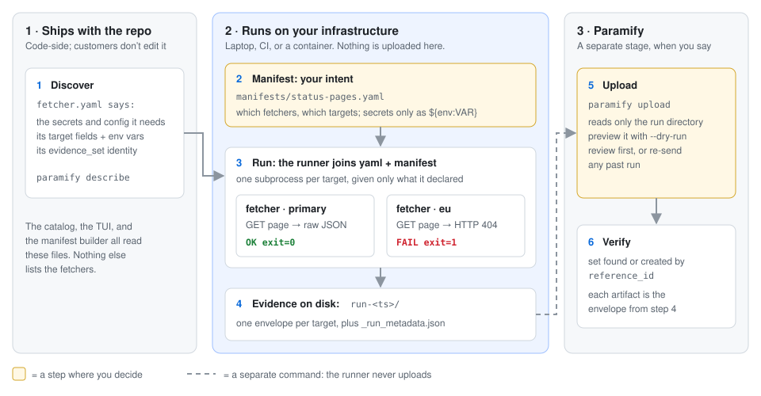
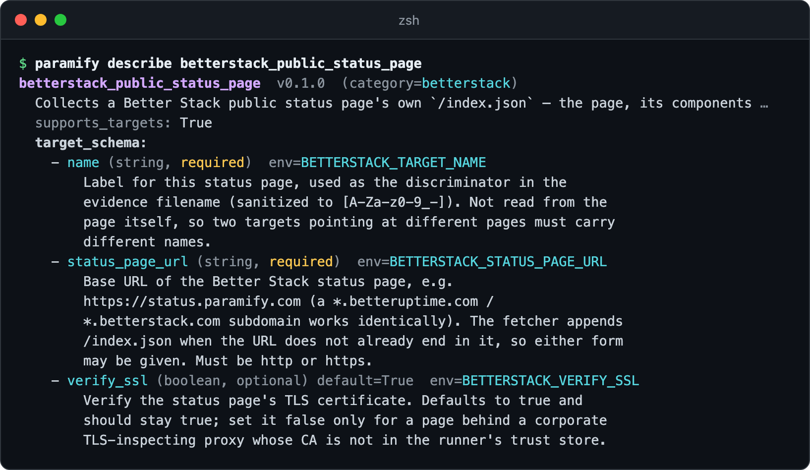
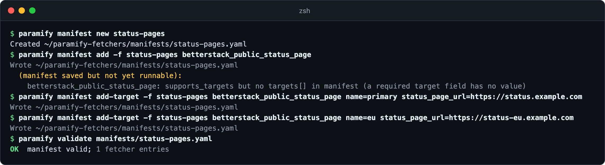
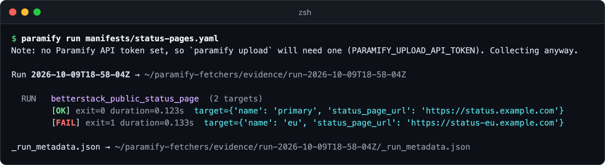
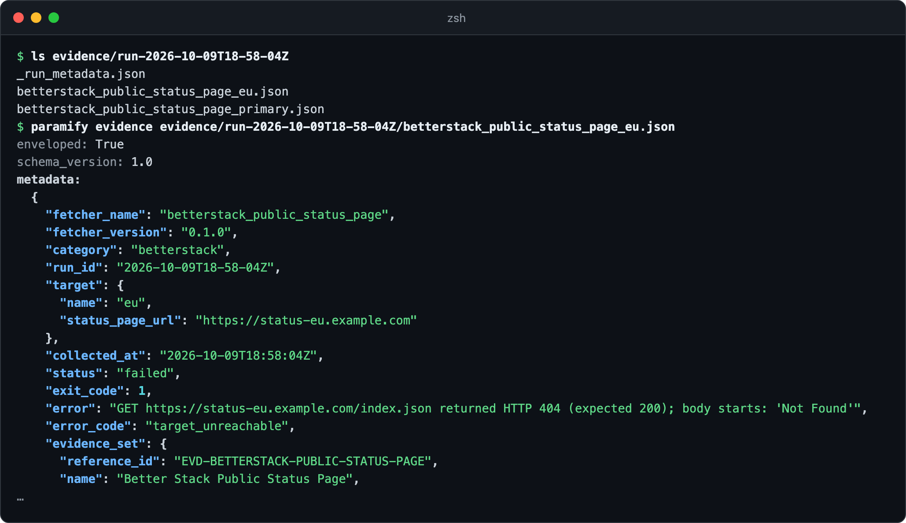
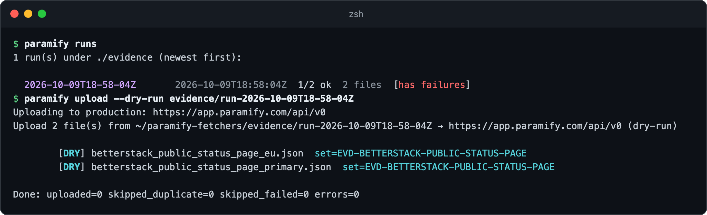
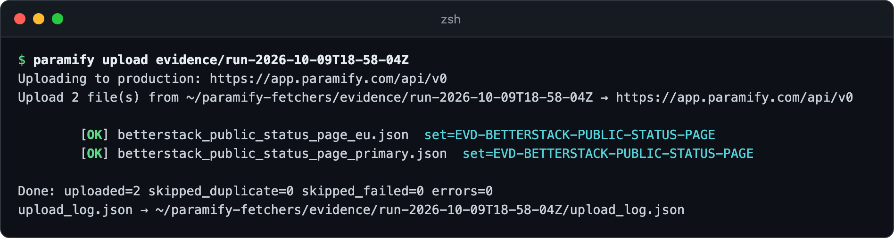
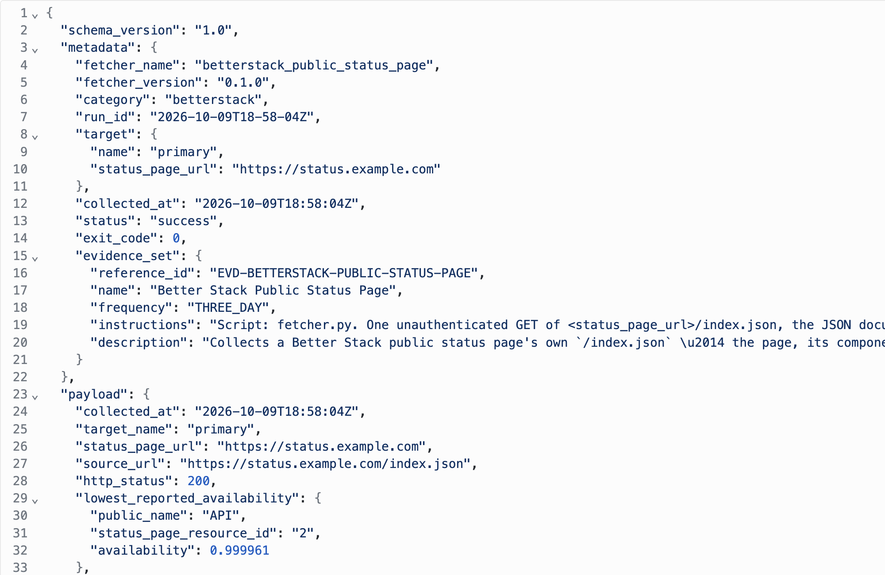

# Following one run through the framework

This guide follows one run from start to finish: find out what a fetcher
needs, write a manifest, run it, read what lands on disk, and upload it as a
separate step. Each step links to the decision behind it in the
[design notes](design.md). [The TUI](../README.md#the-tui) and the `--json`
commands an agent uses do the same things, because all three call one facade
([why](design.md#one-facade-one-cli-three-front-ends)). For a tour of the code
itself, see the [onboarding tutorial](onboarding/README.md).



**You need:** [the repo installed](../README.md#install) · a Paramify API key, for the last step only

The running example is `betterstack_public_status_page`, which reads a public
status page and needs no credentials, run against two pages. The pictures come
from a sandbox: a local server stood in for both pages, with `eu` returning 404
on purpose, and the URLs are shown as `example.com`.

---

## 1. Ask what a fetcher needs

`paramify describe` reads the fetcher's own `fetcher.yaml`. No hand-kept
catalog can drift from it ([why](design.md#fetcher-schema-fetcheryaml)). This
fetcher fans out, and each target field names the environment variable the
runner will set.



<details><summary>Copy the command</summary>

```bash
paramify describe betterstack_public_status_page
```
</details>

## 2. Write your intent in a manifest

The manifest is yours: which fetchers to run, against which targets. The
`fetcher.yaml` stays ours, and the runner joins the two
([why](design.md#why-this-split-matters)). Targets sit under the fetcher, one
per page ([why](design.md#fanout-many-targets-one-fetcher)). The builder checks
each edit and says what's still missing:



<details><summary>Copy the commands</summary>

```bash
paramify manifest new status-pages
paramify manifest add -f status-pages betterstack_public_status_page
paramify manifest add-target -f status-pages betterstack_public_status_page name=primary status_page_url=https://status.example.com
paramify manifest add-target -f status-pages betterstack_public_status_page name=eu status_page_url=https://status-eu.example.com
paramify validate manifests/status-pages.yaml
```
</details>

The result holds no secret values, so it's safe to commit. A fetcher that
needs a secret gets a `${env:VAR}` reference here
([secret references](run_manifest_reference.md#secret-references)).
**`.gitignore` ignores `manifests/*`** despite its own comment, so commit it
with `git add -f`.

```yaml
run:
  output_dir: ./evidence
  fetchers:
  - use: betterstack_public_status_page
    targets:
    - name: primary
      status_page_url: https://status.example.com
    - name: eu
      status_page_url: https://status-eu.example.com
```

Your AI agent can do this step with the `wire-manifest` skill
([AI agent](../README.md#drive-it-with-an-ai-agent)).

## 3. Run it

The runner starts each target as its own subprocess. It passes only a few
basics like `PATH`, plus what that fetcher declared
([why](design.md#execution-and-the-run-directory)). The runner never uploads,
so a missing API token is only a note:



<details><summary>Copy the command</summary>

```bash
paramify run manifests/status-pages.yaml
```
</details>

**One failed target doesn't stop the others**, but it makes the run exit 1
([exit codes](run_manifest_reference.md#run-exit-codes)).

## 4. Read the evidence on disk

Each target gets its own JSON file, next to `_run_metadata.json`, the run's
index. Files on disk are the only link between stages
([why](design.md#output-format-json-files-on-disk)). The runner wraps each one
in an envelope: it writes `metadata`, and the fetcher writes `payload`
([field reference](envelope_design.md#field-reference-metadata)). The failed
target's file says why:



<details><summary>Copy the commands</summary>

```bash
ls evidence/run-<timestamp>
paramify evidence evidence/run-<timestamp>/betterstack_public_status_page_eu.json
```
</details>

## 5. Preview the upload

Upload is its own command. It reads only the run directory, so you can review
a run first, or send an older one again
([why](design.md#uploaders-as-a-separate-stage)). `--dry-run` makes no API
calls:



<details><summary>Copy the commands</summary>

```bash
paramify runs
paramify upload --dry-run evidence/run-<timestamp>
```
</details>

**The failed target's file uploads too**, so Paramify records the failure. To
leave failed files out, set `skip_failed` in an
[upload config](../uploaders/paramify_evidence/README.md#config---config-optional).

## 6. Send it and check Paramify

Set up an [API key](../uploaders/paramify_evidence/README.md#paramify-api-key),
then drop `--dry-run`. The uploader finds or creates the evidence set by its
`reference_id` and attaches each file as an artifact
([identity model](uploader_design.md#the-evidence-set-identity-model-shared)).



<details><summary>Copy the command</summary>

```bash
paramify upload evidence/run-<timestamp>
```
</details>

In Paramify, go to **Implementation → Evidence Sets** and open *Better Stack Public
Status Page*. On the **Artifacts** tab, click the *primary* artifact. Its JSON
is the whole envelope, `metadata` and `payload` intact.



To run all of this on a schedule, see [the container bundle](../deploy/README.md).

---

## Troubleshooting

| Symptom | Fix |
|---|---|
| `no such manifest: manifest.yaml` | `paramify manifest` edits `./manifest.yaml` unless you pass `-f <name>`. |
| `validate` says OK, but the run shows `exit=255` and that target has no file | The runner couldn't start it, often because a target lacks a required field: `validate` checks that targets exist, not what's in each one. The reason is under `stderr_tail` in the [run's index](#4-read-the-evidence-on-disk). Fix the target with `paramify manifest set-target`. |
| A fetcher ignores a variable you exported | The runner drops it ([step 3](#3-run-it)). Set it as config in the manifest if the fetcher declares it, or let it through with `paramify manifest set-passthrough` ([why](design.md#config-vs-secrets-concretely)). |
| An invocation shows `exit=124` | The runner killed it at its timeout: 600 seconds unless its `fetcher.yaml` sets `runtime.timeout`. |
| `paramify upload` sends the wrong run | With no argument it takes the newest run that collected evidence. Name the run directory, as in [step 5](#5-preview-the-upload). |

**More detail:** [why fetchers run on your side](design.md#where-fetchers-run-customer-infrastructure) ·
[the fetcher contract](design.md#the-fetcher-contract) ·
[comparators](design.md#layer-2--comparators) ·
[what's built and deferred](design.md#current-state-of-the-work) ·
[open questions](design.md#open-questions)
