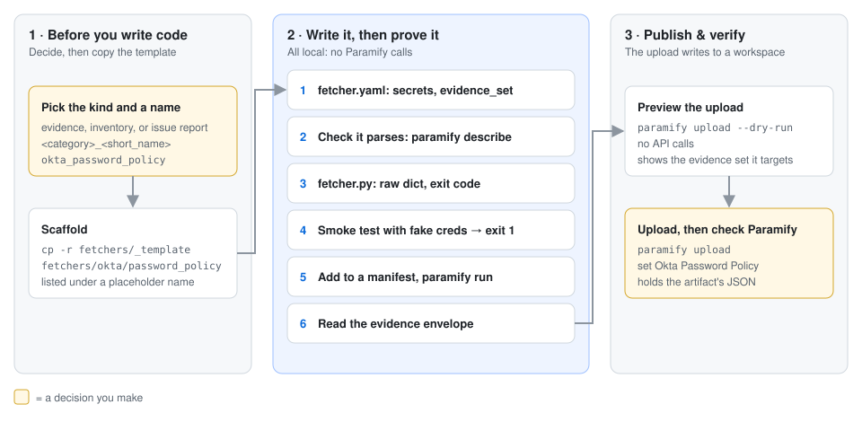
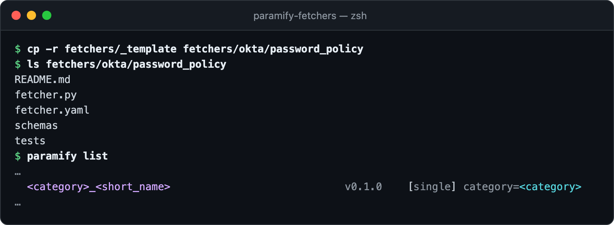
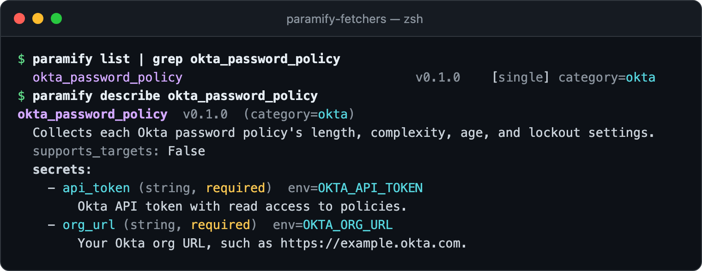
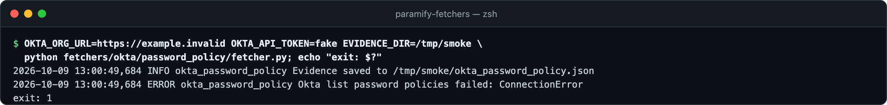
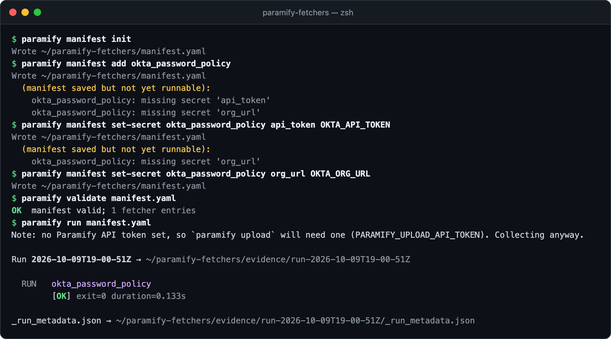
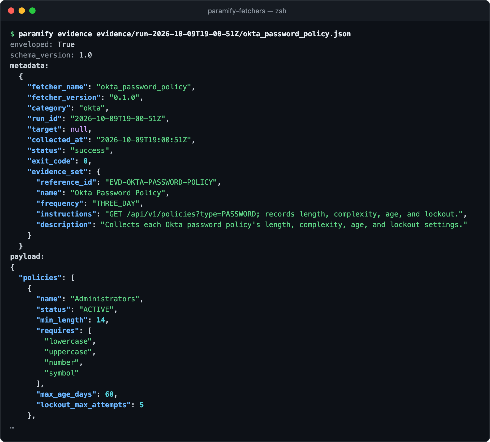
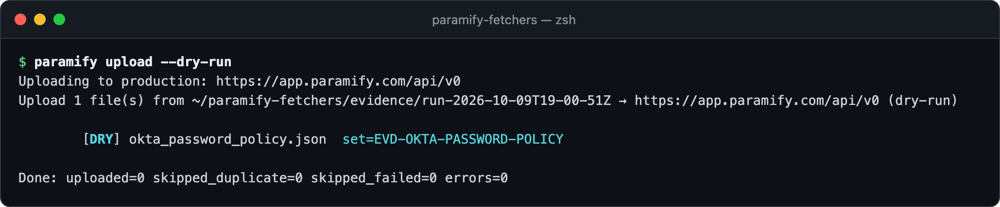
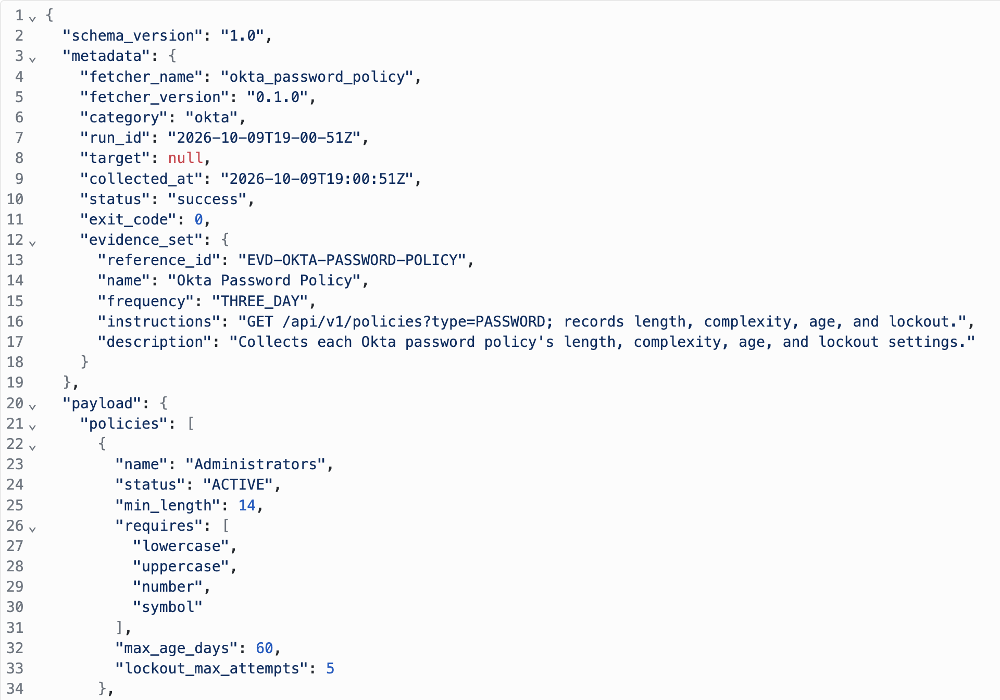

# Writing a new evidence fetcher

This walks through one evidence fetcher from scratch:
`okta_password_policy`, which records each Okta password policy's length,
complexity, age, and lockout settings. You copy the template, fill in
`fetcher.yaml` and `fetcher.py`, prove the wiring with fake credentials, then
run it and read the evidence. Porting a script you already have? Use the
[porting playbook](porting_playbook.md) instead.

**Or hand it to your AI agent:** the `create-fetcher` skill runs this flow
from a short interview ([agent setup](../README.md#drive-it-with-an-ai-agent)).



**You need:** [the repo installed](../README.md#install) · a read-only
credential for the tool (here, an [Okta API token](../fetchers/okta/README.md)) ·
an existing category, or [category setup](authoring_a_fetcher.md#per-category-setup-first-fetcher-in-a-new-category) first

---

## 1. Copy the template

This guide builds an evidence fetcher, which asserts a state. For scan results
or an asset list, [pick another kind](authoring_a_fetcher.md#which-kind-are-you-writing)
and its template. Discovery finds the copy at once, under the template's
placeholder name:



<details><summary>Copy the commands</summary>

```bash
cp -r fetchers/_template fetchers/<category>/<short_name>
ls fetchers/<category>/<short_name>
paramify list
```
</details>

## 2. Fill in `fetcher.yaml`

Replace every placeholder. Declare one `secrets` entry per environment
variable the fetcher reads: the runner drops any it doesn't know about
([input contract](fetcher_contract.md#input)). **Add an `evidence_set` block**,
which the template leaves out ([how upload uses it](uploader_design.md#the-evidence-set-identity-model-shared)).
To run once per region or project, add [fanout](authoring_a_fetcher.md#fanout-when-one-fetcher-should-run-against-n-targets).

```yaml
name: okta_password_policy                # <category>_<short_name>, globally unique
version: 0.1.0
description: Collects each Okta password policy's length, complexity, age, and lockout settings.
category: okta

supports_targets: false                   # true to run once per target (fanout)

runtime:
  type: python
  entry: fetcher.py

output:
  type: json
  path: okta_password_policy.json         # inside EVIDENCE_DIR

secrets:
  - name: api_token
    env: OKTA_API_TOKEN
    description: Okta API token with read access to policies.
  - name: org_url
    env: OKTA_ORG_URL
    description: Your Okta org URL, such as https://example.okta.com.

evidence_set:
  reference_id: EVD-OKTA-PASSWORD-POLICY
  name: Okta Password Policy
  instructions: GET /api/v1/policies?type=PASSWORD; records length, complexity, age, and lockout.
```

Check that it parses. `describe` shows the secrets the runner will ask for:



<details><summary>Copy the commands</summary>

```bash
paramify list | grep <category>_<short_name>
paramify describe <category>_<short_name>
```
</details>

## 3. Write `fetcher.py` and smoke-test it

Keep the template's shape. Read secrets from the environment, write a raw
dict to `EVIDENCE_DIR` (the runner adds the envelope), and log one
*Evidence saved* line. When a call fails, record it in the payload's
`metadata`, call `report_failure`, and return 1
([why](authoring_a_fetcher.md#detecting-collection-failures)). Bash works too
([`fetcher.sh` notes](authoring_a_fetcher.md#fetchersh-bash)).

<details><summary>The example's <code>fetcher.py</code></summary>

```python
#!/usr/bin/env python3
"""Okta password policy settings: length, complexity, age, and lockout."""

import json
import logging
import os
import sys
from pathlib import Path

import requests
from dotenv import load_dotenv

SCRIPT_DIR = Path(__file__).resolve().parent
sys.path.insert(0, str(SCRIPT_DIR.parents[1] / "_lib"))
from fetcher_status import report_failure  # noqa: E402

logger = logging.getLogger("okta_password_policy")
CODES = {401: "auth_failed", 403: "not_authorized", 429: "rate_limited"}
FLAGS = {"minLowerCase": "lowercase", "minUpperCase": "uppercase", "minNumber": "number", "minSymbol": "symbol"}


def summarize(policy: dict) -> dict:
    pw = policy.get("settings", {}).get("password", {})
    cx = pw.get("complexity", {})
    return {
        "name": policy.get("name"),
        "status": policy.get("status"),
        "min_length": cx.get("minLength"),
        "requires": [label for key, label in FLAGS.items() if cx.get(key)],
        "max_age_days": pw.get("age", {}).get("maxAgeDays"),
        "lockout_max_attempts": pw.get("lockout", {}).get("maxAttempts"),
    }


def main() -> int:
    logging.basicConfig(
        level=os.environ.get("LOG_LEVEL", "INFO"),
        format="%(asctime)s %(levelname)s %(name)s %(message)s",
    )
    load_dotenv()
    out_dir = Path(os.environ.get("EVIDENCE_DIR", "./evidence"))
    out_dir.mkdir(parents=True, exist_ok=True)

    url = os.environ["OKTA_ORG_URL"].rstrip("/") + "/api/v1/policies"
    headers = {"Authorization": f"SSWS {os.environ['OKTA_API_TOKEN']}", "Accept": "application/json"}
    params = {"type": "PASSWORD"}
    policies, failures, code = [], [], None

    try:
        while url:  # Okta pages with Link: rel="next"
            resp = requests.get(url, headers=headers, params=params, timeout=30)
            resp.raise_for_status()
            policies += [summarize(p) for p in resp.json()]
            url, params = resp.links.get("next", {}).get("url"), None
    except requests.RequestException as e:
        code = CODES.get(getattr(e.response, "status_code", None), "target_unreachable")
        failures.append({"operation": "list password policies", "type": type(e).__name__, "message": str(e)})

    evidence = {
        "policies": policies,
        "metadata": {"partial_failure": bool(failures), "api_failures": failures},
    }
    path = out_dir / "okta_password_policy.json"
    path.write_text(json.dumps(evidence, indent=2))
    logger.info("Evidence saved to %s", path)

    if failures:
        report_failure(f"Okta {failures[0]['operation']} failed: {failures[0]['type']}", code)
        return 1
    return 0


if __name__ == "__main__":
    sys.exit(main())
```
</details>

Run it with fake credentials. It should save a file, fail at the network, and
exit 1:



<details><summary>Copy the command</summary>

```bash
<URL_VAR>=https://example.invalid <TOKEN_VAR>=fake EVIDENCE_DIR=/tmp/smoke \
  python fetchers/<category>/<short_name>/fetcher.py; echo "exit: $?"
```
</details>

**Exit 0 here is a bug:** the fetcher is swallowing a failed call.

## 4. Run it through the runner

Export your real credentials, then add the fetcher to a manifest and run it.
After each edit, the builder lists the secrets still missing
([manifest commands](../README.md#building-a-manifest)). Your agent's
`wire-manifest` skill can do this step.



<details><summary>Copy the commands</summary>

```bash
paramify manifest init
paramify manifest add <category>_<short_name>
paramify manifest set-secret <category>_<short_name> <secret name> <ENV_VAR>   # once per secret
paramify validate manifest.yaml
paramify run manifest.yaml
```
</details>

## 5. Read the evidence

The runner wrapped your dict. Its `metadata` holds the run status and your
`evidence_set`, and `payload` is exactly what `fetcher.py` wrote
([envelope fields](envelope_design.md#field-reference-metadata)). Check the
payload holds real values, not empty lists.



<details><summary>Copy the command</summary>

```bash
paramify evidence evidence/run-<timestamp>/<category>_<short_name>.json
```
</details>

## 6. Upload it and check Paramify

Preview first. `--dry-run` makes no API calls and shows the evidence set each
file goes to. Then [upload the run](../README.md#collect-then-upload).



<details><summary>Copy the command</summary>

```bash
paramify upload --dry-run
```
</details>

In Paramify, go to **Implementation → Evidence Sets** and open *Okta Password
Policy*. On the **Artifacts** tab, click the artifact's name. Its JSON is the
file from step 5.



**Next:** [write validators for it](suggest_validator_guide.md) ·
[publish its script](../README.md#show-how-evidence-is-generated-optional)

---

## Troubleshooting

| Symptom | Fix |
|---|---|
| `paramify list` fails with `schema validation failed` | Fix the field it names in `fetcher.yaml` ([required fields](fetcher_contract.md#required)). |
| A direct run works, but `paramify run` shows `[FAIL]` and `_run_metadata.json` ends in `KeyError` | The fetcher reads a variable it doesn't declare. Add it under `secrets`. |
| `Secret reference ${env:…} could not be resolved` | Export that variable where you run. `paramify doctor manifest.yaml` lists every missing one. |
| The preview shows `[FAIL]` with `missing/incomplete evidence_set` | Add `evidence_set` with `reference_id` and `name` ([step 2](#2-fill-in-fetcheryaml)), then run again. |
| A new category's fetcher hits `ImportError` or `command not found`, though `paramify doctor` was clean | List its tools and packages under `requires:` in `fetchers/_categories/<category>.yaml`. The category setup steps leave this out. |

**More detail:** [authoring reference](authoring_a_fetcher.md) ·
[what you don't need to do](authoring_a_fetcher.md#what-you-dont-need-to-do) ·
[reference fetchers](authoring_a_fetcher.md#reference-fetchers) ·
[fetcher contract](fetcher_contract.md) ·
[the create-fetcher skill](../.claude/skills/create-fetcher/SKILL.md)
