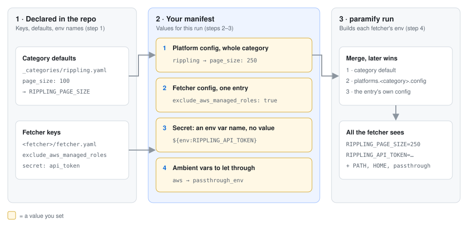
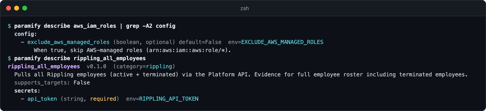
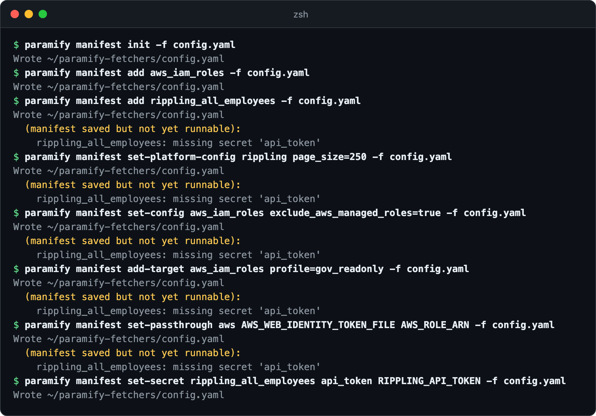
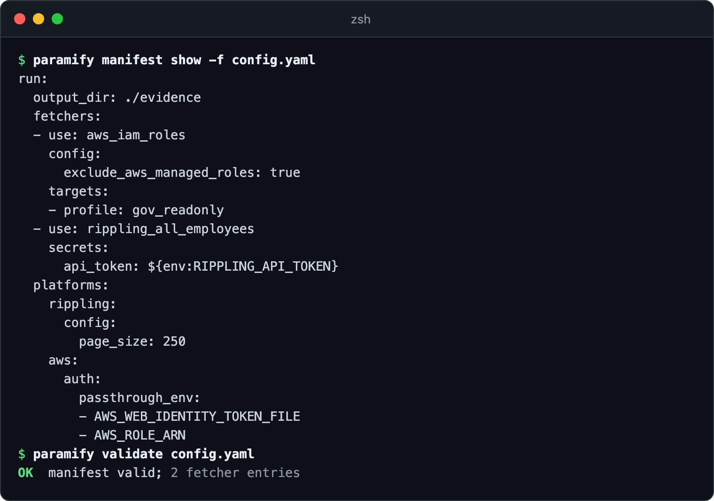
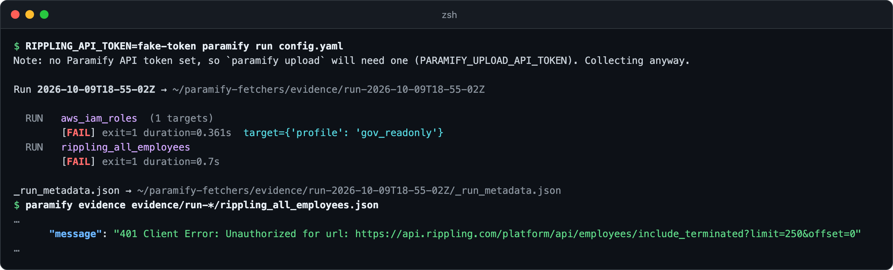

# Giving a fetcher its config and secrets

A fetcher doesn't inherit your shell's environment. The runner injects its
config and secrets from your manifest
([why](config_injection_design.md)). This guide builds
[`examples/with_platform_config.yaml`](../examples/with_platform_config.yaml)
and runs it.



**You need:** [the repo installed](../README.md#install)

---

## 1. Look up the keys

`describe` lists a fetcher's config and secrets with their env vars. Platform
keys and defaults live in category files, like
[`rippling.yaml`](../fetchers/_categories/rippling.yaml).



<details><summary>Copy the commands</summary>

```bash
paramify describe aws_iam_roles | grep -A2 config
paramify describe rippling_all_employees
```
</details>

## 2. Set the values

Platform config covers a category. An entry's `config` overrides it
([merge order](config_injection_design.md#runner-behavior)). `set-secret`
stores an env var name, never the value. AWS already passes both passthrough
variables, so `set-passthrough` here only shows the syntax.



<details><summary>Copy the commands</summary>

```bash
paramify manifest init -f config.yaml
paramify manifest add aws_iam_roles -f config.yaml
paramify manifest add rippling_all_employees -f config.yaml
paramify manifest set-platform-config rippling page_size=250 -f config.yaml
paramify manifest set-config aws_iam_roles exclude_aws_managed_roles=true -f config.yaml
paramify manifest add-target aws_iam_roles profile=gov_readonly -f config.yaml
paramify manifest set-passthrough aws AWS_WEB_IDENTITY_TOKEN_FILE AWS_ROLE_ARN -f config.yaml
paramify manifest set-secret rippling_all_employees api_token RIPPLING_API_TOKEN -f config.yaml
```
</details>

**Key names aren't checked.** A misspelled key is saved, passes `validate`,
and never reaches the fetcher.

## 3. Check it

It matches the worked example.



<details><summary>Copy the commands</summary>

```bash
paramify manifest show -f config.yaml
paramify validate config.yaml
```
</details>

## 4. Run it

Both entries fail with a fake token, but Rippling's evidence shows
`limit=250`, not the default 100.



<details><summary>Copy the commands</summary>

```bash
RIPPLING_API_TOKEN=fake-token paramify run config.yaml
paramify evidence evidence/run-<timestamp>/rippling_all_employees.json
```
</details>

---

## Troubleshooting

| Symptom | Fix |
|---|---|
| `Secret reference ${env:…} could not be resolved` | Export that variable in the shell that runs `paramify`. |
| `NOTE target selects AWS_PROFILE; ignored ambient credentials …` | Expected: a target's `profile:` overrides static AWS keys. Remove it to use them. |

**More detail:** [why manifest values](config_injection_design.md#principle-unchanged) ·
[where keys are declared](config_injection_design.md#two-homes-both-shipped) ·
[platform block reference](run_manifest_reference.md#platform-block-runplatforms)
