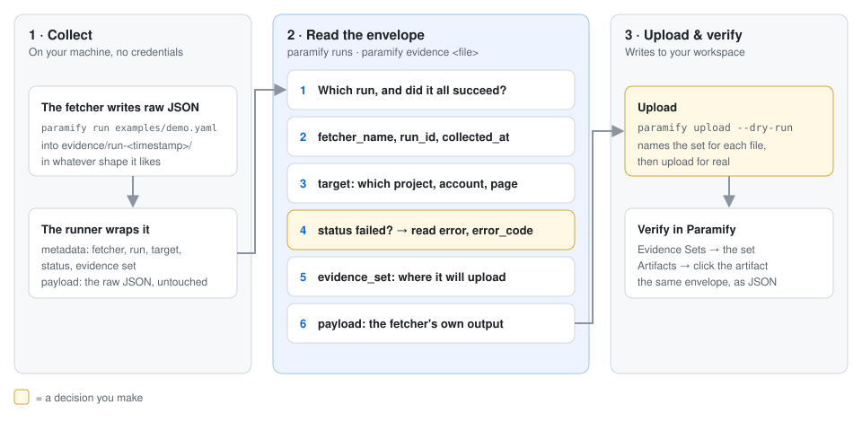
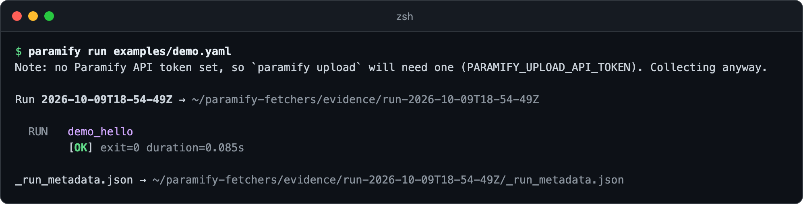
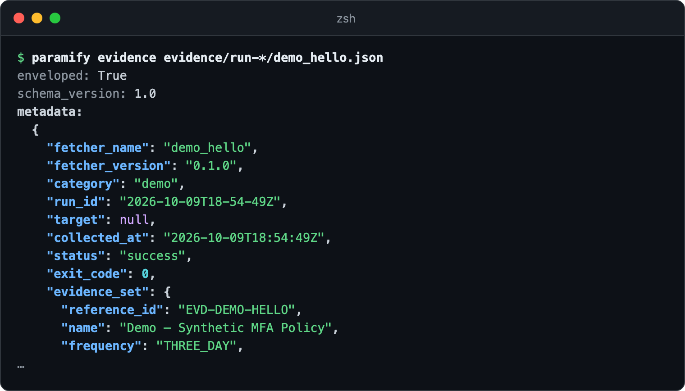
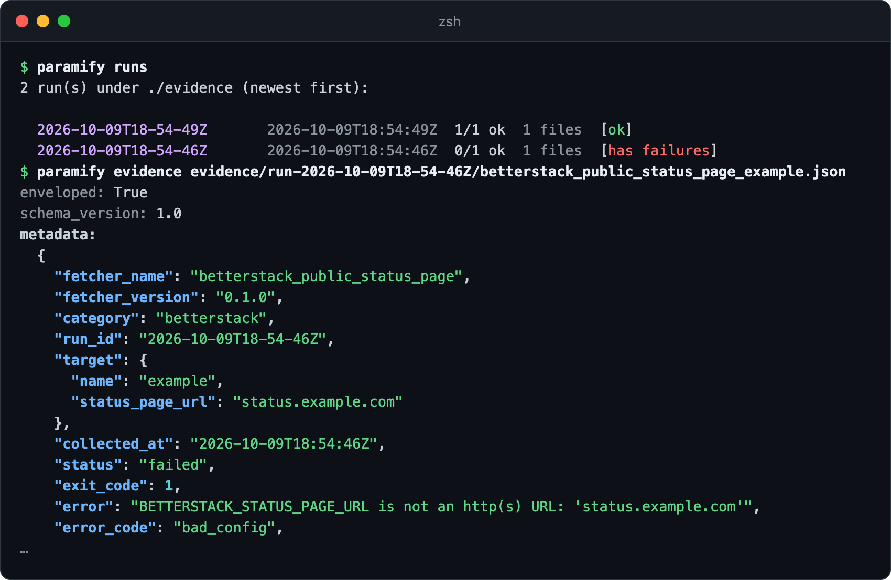
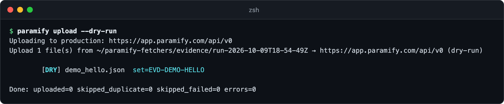
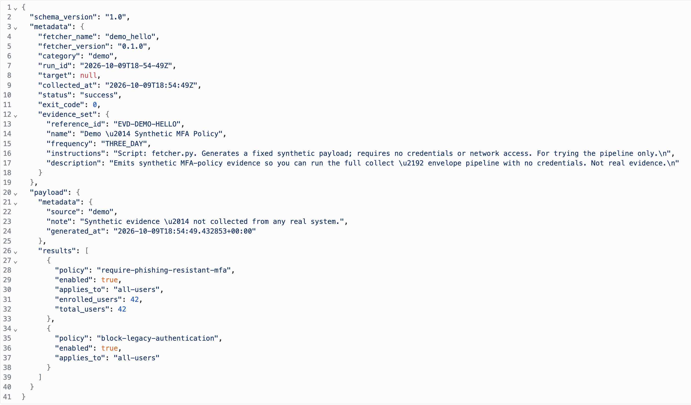

# Reading an evidence envelope

The runner wraps every evidence file in an envelope. `metadata` records which
fetcher ran, when, against what, and whether it worked. `payload` is the
fetcher's own output, untouched ([why](envelope_design.md#why)). Here you run a
credential-free demo fetcher, read its envelope, spot a failed one, and find
the same file in Paramify.



**You need:** [the repo installed](../README.md#install)

---

## 1. Run the demo fetcher

`demo_hello` writes synthetic evidence with no credentials or network access.



<details><summary>Copy the command</summary>

```bash
paramify run examples/demo.yaml
```
</details>

## 2. Read its envelope

`paramify evidence` prints the `metadata` the runner added, then the `payload`
(cut off here).



<details><summary>Copy the command</summary>

```bash
paramify evidence evidence/run-*/demo_hello.json
```
</details>

The keys worth checking ([every field](envelope_design.md#field-reference-metadata)):

| Key | Tells you |
|---|---|
| `status`, `exit_code` | Whether collection worked |
| `run_id`, `collected_at` | Which run, and when |
| `target` | The project, account, or page a fan-out fetcher ran against; `null` otherwise |
| `evidence_set` | The Paramify evidence set it uploads to |

## 3. Spot a failed collection

`paramify runs` flags a run with failures, but `paramify run` only prints
`FAIL`, so open the file. It's still enveloped, with `status: failed`, the
reason in `error`, and often an `error_code`, which the field reference doesn't
list yet. Here, a status-page fetcher's URL lacks `https://`.



<details><summary>Copy the commands</summary>

```bash
paramify runs
paramify evidence evidence/run-<run_id>/<file>.json
```
</details>

## 4. Preview the upload

`--dry-run` names the evidence set each file goes to, without calling Paramify.
Drop the flag to upload ([upload details](../README.md#collect-then-upload)).
The demo creates a *Demo — Synthetic MFA Policy* set in your workspace.



<details><summary>Copy the command</summary>

```bash
paramify upload --dry-run
```
</details>

## 5. Find it in Paramify

Go to **Implementation → Evidence Sets** and open *Demo — Synthetic MFA Policy*.
On the **Artifacts** tab, click the artifact's name. Its JSON is the whole
envelope from step 2, because that's what the uploader sends by default
([`artifact_payload`](../uploaders/paramify_evidence/README.md#config---config-optional)).



---

## Troubleshooting

| Symptom | Fix |
|---|---|
| A fetcher shows `FAIL` but wrote no file | It failed before writing, so there's no envelope. Read its `stderr_tail` in the run's `_run_metadata.json`. |
| A failed file was uploaded | That's the default, and the artifact's note records `status=failed`. To skip them, set `skip_failed: true` in the [upload config](../uploaders/paramify_evidence/README.md#config---config-optional). |
| Upload says `missing/incomplete evidence_set` | The fetcher's `fetcher.yaml` has no `evidence_set` block. [Add one](authoring_a_fetcher.md#fetcheryaml). |
| Upload says `not envelope-wrapped`, or the file shows `enveloped: False` | The file predates the envelope or wasn't written by the runner. Collect it again. |
| `Got unexpected extra argument(s)` on a `run-*` path | The glob matched more than one run. Name the run directory. |

**More detail:** [why the runner wraps it](envelope_design.md#where-its-applied-the-runner-wraps-it) ·
[edge cases and secrets in `error`](envelope_design.md#edge-cases) ·
[the schema](../framework/schemas/envelope_schema.json) ·
[how evidence maps to Paramify](../uploaders/paramify_evidence/README.md#how-evidence-maps-to-paramify)
