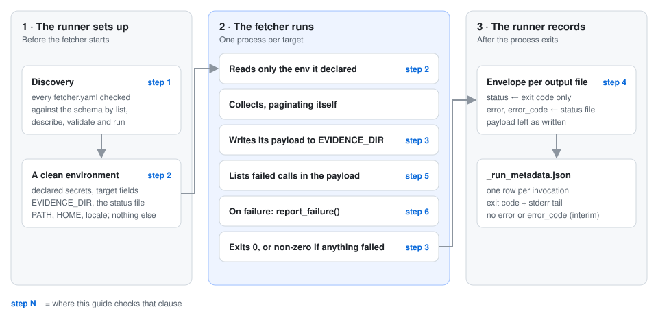
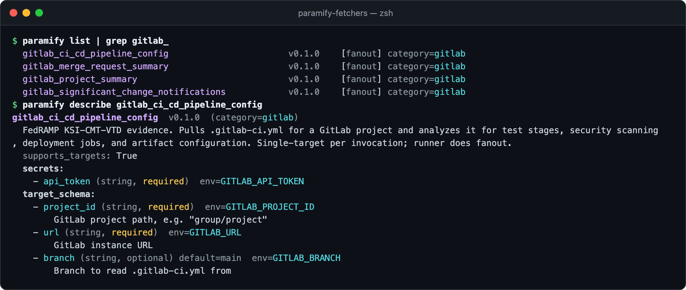
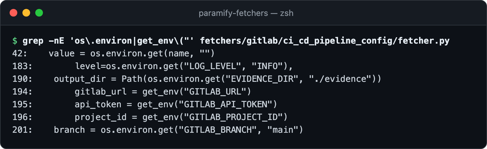
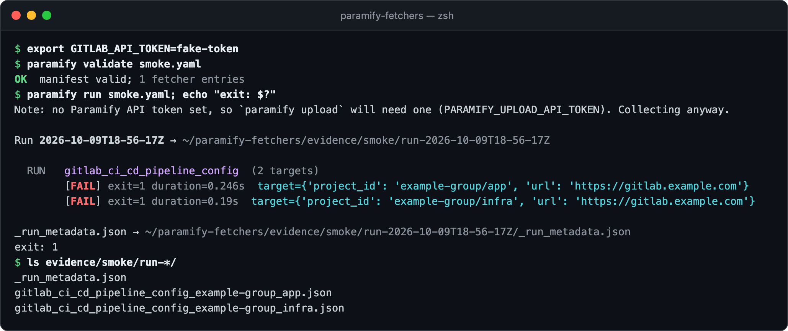
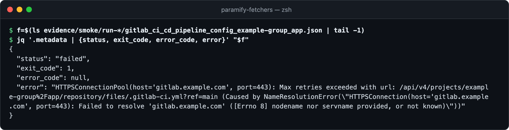
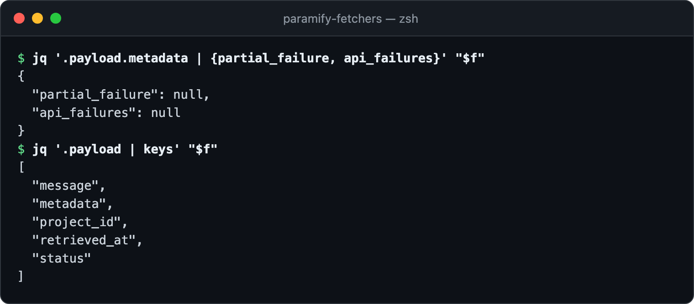
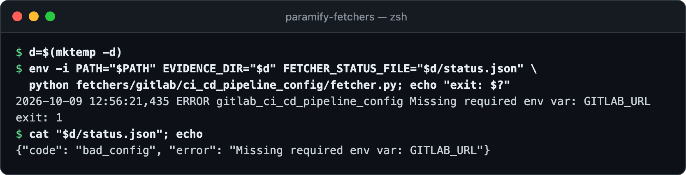

# Checking a fetcher against the contract

The [fetcher contract](fetcher_contract.md) is what the runner expects of every
fetcher: a schema-valid `fetcher.yaml`, only the env vars it declares, an exit
code that means something, and a reason when it fails. These six checks test an
existing fetcher against it with fake credentials, so nothing leaves your machine
but a DNS lookup. The example is `gitlab_ci_cd_pipeline_config`, the contract's
[fanout reference](fetcher_contract.md#reference-fetchers). To write a fetcher,
start with [authoring a fetcher](authoring_a_fetcher.md).



**You need:** [the repo installed](../README.md#install) · `jq` · no credentials

Inventory and issue-report fetchers add clauses of their own
([collection kinds](fetcher_contract.md#collection-kinds)).

---

## 1. It passes the schema

`paramify list` checks every `fetcher.yaml` against the
[schema](../framework/schemas/fetcher_schema.json) as it discovers them
([what's enforced](fetcher_contract.md#schema-level-enforcement)). `describe`
then shows how the runner read yours. Check that the secrets, target fields, and
env var names are the ones you meant.



<details><summary>Copy the commands</summary>

```bash
paramify list | grep gitlab_
paramify describe gitlab_ci_cd_pipeline_config
```
</details>

## 2. It reads only what it declares

The runner sets the env vars `describe` lists, `EVIDENCE_DIR`,
`FETCHER_STATUS_FILE`, and a [minimal inherited set](fetcher_contract.md#input),
and nothing else. A category with `passthrough_env` or `config_schema` in
`fetchers/_categories/` adds its own; GitLab's has neither. Compare that with what
the entry script reads:



<details><summary>Copy the command</summary>

```bash
grep -nE 'os\.environ|get_env\("' fetchers/gitlab/ci_cd_pipeline_config/fetcher.py
```
</details>

Every read is declared or set by the runner except `LOG_LEVEL`, which never
arrives, so under the runner this fetcher always logs at `INFO`. Grep any
`_shared/` module a script imports the same way
([why](fetcher_contract.md#behavior)).

## 3. Run it with fake credentials

Save a manifest with two targets and a fake token
([fanout example](run_manifest_reference.md#fanout-example)), for example as
`smoke.yaml` at the repo root. Your AI agent can write it with the
`wire-manifest` skill ([AI agent](../README.md#drive-it-with-an-ai-agent)).

```yaml
run:
  output_dir: ./evidence/smoke
  fetchers:
    - use: gitlab_ci_cd_pipeline_config
      targets:
        - project_id: example-group/app
          url: https://gitlab.example.com
          secrets:
            api_token: ${env:GITLAB_API_TOKEN}
        - project_id: example-group/infra
          url: https://gitlab.example.com
          secrets:
            api_token: ${env:GITLAB_API_TOKEN}
```



<details><summary>Copy the commands</summary>

```bash
export GITLAB_API_TOKEN=fake-token
paramify validate smoke.yaml
paramify run smoke.yaml; echo "exit: $?"
ls evidence/smoke/run-*/
```
</details>

Each target ran as its own process, failed on its own with exit 1, and wrote
its own file ([fanout](fetcher_contract.md#fanout)). Failing at the network is
the pass condition: the env reached the fetcher
([acceptable outcomes](porting_playbook.md#6-smoke-test-the-wiring-with-fake-creds)).
**`paramify run` doesn't print why a target failed.** The envelope does.

## 4. Read the envelope

The runner wraps each file in an envelope. `status` comes from the exit code
alone, and `error` is the reason the fetcher wrote to its status file
([failure reporting](fetcher_contract.md#output)).



<details><summary>Copy the commands</summary>

```bash
f=$(ls evidence/smoke/run-*/gitlab_ci_cd_pipeline_config_example-group_app.json | tail -1)
jq '.metadata | {status, exit_code, error_code, error}' "$f"
```
</details>

`error` is the bare reason, with no log timestamps or `Evidence saved` line, so
it came from the status file rather than the stderr fallback. `error_code` is
null because the fetcher passes no `code` for network failures. That's allowed,
but `target_unreachable` would fit.

## 5. Check the payload's failure ledger

When calls failed but the fetcher still wrote evidence, the contract asks for
`partial_failure` and `api_failures[]` in the payload's own `metadata`, where a
validator can read them ([payload ledger](fetcher_contract.md#output)). With the
same `$f`:



<details><summary>Copy the commands</summary>

```bash
jq '.payload.metadata | {partial_failure, api_failures}' "$f"
jq '.payload | keys' "$f"
```
</details>

This fetcher doesn't write the ledger. It records the failure as a top-level
`status` and `message` instead. For the shape to copy, see `build_payload` in
[`azure_common.py`](../fetchers/azure/_shared/azure_common.py).

## 6. Check the status file directly

The runner deletes the status file after each invocation, so run the entry script
by hand to see it. An empty environment trips the fetcher's config check:



<details><summary>Copy the commands</summary>

```bash
d=$(mktemp -d)
env -i PATH="$PATH" EVIDENCE_DIR="$d" FETCHER_STATUS_FILE="$d/status.json" \
  python fetchers/gitlab/ci_cd_pipeline_config/fetcher.py; echo "exit: $?"
cat "$d/status.json"; echo
```
</details>

One `report_failure` call logged the reason as the last stderr line and wrote
`{code, error}`, then the script exited 1. That's the whole failure path
([shared helper](fetcher_contract.md#output)).

---

## Troubleshooting

| Symptom | Fix |
|---|---|
| Any `paramify` command ends in a traceback with `schema validation failed:` | That `fetcher.yaml` breaks the schema. Discovery stops at the first bad file, so no fetcher works until you fix the field it names. |
| `describe` says `Unknown fetcher` | Use the `name:` from `fetcher.yaml`. Discovery also skips a directory whose name starts with `_` or that has no `fetcher.yaml`. |
| The smoke run fails on a missing env var (`Missing required env var` here) | A declared env var name doesn't match what the script reads. Compare them as in [step 2](#2-it-reads-only-what-it-declares). |
| The smoke run exits 0 | The fetcher swallows failures ([exit code convention](porting_playbook.md#exit-code-convention)). |
| A target shows `exit=255` | The runner couldn't set that target up (for example, its token variable is unset) and never started the fetcher. The reason is under `stderr_tail` in the run's `_run_metadata.json`. |
| `error` holds log lines (timestamps, `Evidence saved to …`) | The fetcher exited non-zero without calling `report_failure`, so the runner fell back to the stderr tail ([why](fetcher_contract.md#output)). |
| Exit 124 | The runner killed the fetcher at its `runtime.timeout` (default 600 seconds). Raise it in `fetcher.yaml`. |
| Step 6 reaches the network instead of failing with `bad_config` | A `.env` at the repo root sets the `GITLAB_` variables. The script's `load_dotenv()` reads it whatever the runner passed ([interim clause](fetcher_contract.md#interim-clauses-v0x)). |
| A `dropping unrecognized status code` warning | `report_failure` accepts only the seven codes the [contract lists](fetcher_contract.md#output). |

**More detail:** [why the contract looks like this](design.md#the-fetcher-contract) ·
[interim clauses](fetcher_contract.md#interim-clauses-v0x) ·
[envelope fields](envelope_design.md#field-reference-metadata) ·
[reference fetchers](fetcher_contract.md#reference-fetchers)
