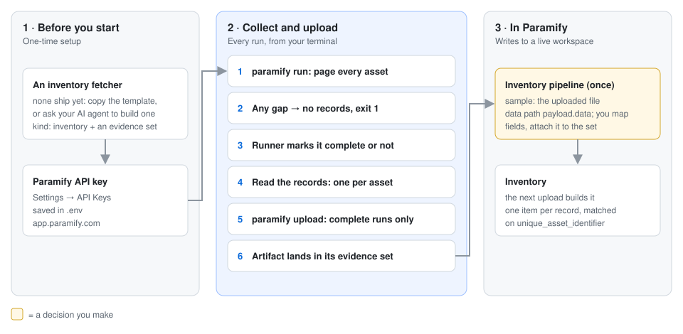
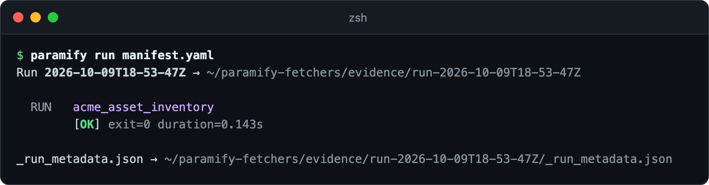
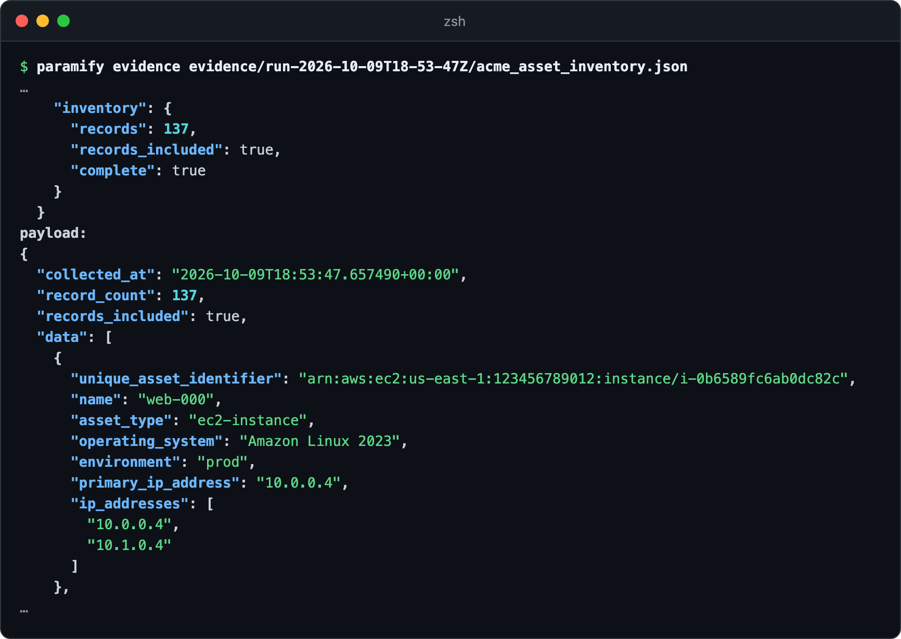
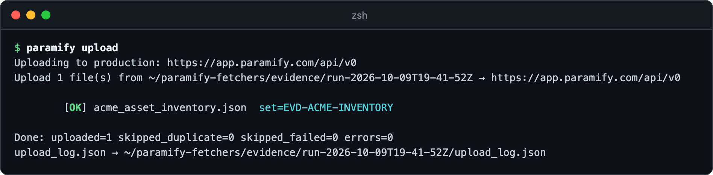
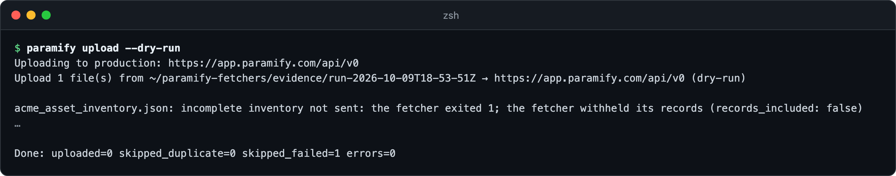
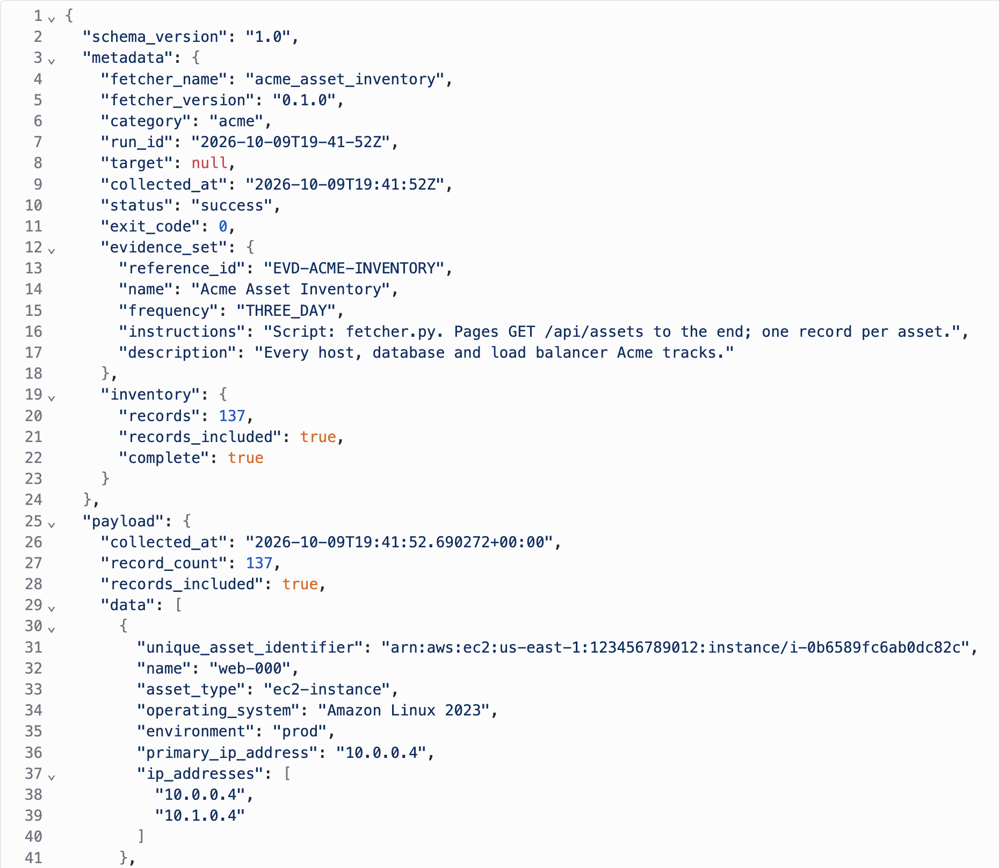

# Running an inventory fetcher

An inventory fetcher lists every asset of one kind, one record each. Upload
it, and a Paramify inventory pipeline turns each record into an Inventory item.



**You need:** [the repo installed](../README.md#install) ·
[an API key](../uploaders/paramify_evidence/README.md#paramify-api-key) ·
an inventory fetcher (none ship yet: [copy the template](inventory_fetchers.md#writing-one)
or ask [your AI agent](../README.md#drive-it-with-an-ai-agent)). The example is
`acme_asset_inventory`.

---

## 1. Run it

[Add it to a manifest](../README.md#building-a-manifest), then run it.



<details><summary>Copy the command</summary>

```bash
paramify run manifest.yaml
```
</details>

## 2. Check the records

The runner's verdict must read `complete`: *true*. Each record under
`payload.data` has a stable, unique ID
([contract](inventory_fetchers.md#the-payload-contract)).



<details><summary>Copy the command</summary>

```bash
paramify evidence evidence/run-<timestamp>/acme_asset_inventory.json
```
</details>

## 3. Upload it



<details><summary>Copy the command</summary>

```bash
paramify upload
```
</details>

**A run that missed anything is never sent**
([why](inventory_fetchers.md#why-it-is-all-or-nothing)), as here after a rate limit:



<details><summary>Copy the command</summary>

```bash
paramify upload --dry-run
```
</details>

## 4. Set up the pipeline (once)

On the set's **Artifacts** tab, click the artifact. The pipeline reads this JSON.



On the set's **Pipelines** tab, click **Manage Selection** → **+ Pipeline**
and create an *Inventory* pipeline. Give it that file as its sample, **Data
path** `payload.data`, and `unique_asset_identifier` as **Unique ID**.

## 5. Check the Inventory

Run and upload again, then open **Monitoring → Inventory**.

---

## Troubleshooting

| Symptom | Fix |
|---|---|
| `the payload breaks the inventory contract` | A record lacks an ID, or two share one (see `problems`). |
| `it holds no records` | Check the credential's scope and any filters. |
| The pipeline finds no records | Your uploader config sets `artifact_payload: payload`. Use data path `data`. |
| A list field can't be mapped | Map its scalar copy, such as `primary_ip_address`. |

**More detail:** [why all or nothing](inventory_fetchers.md#why-it-is-all-or-nothing) ·
[payload contract](inventory_fetchers.md#the-payload-contract) ·
[what the runner adds](inventory_fetchers.md#what-the-framework-adds)
