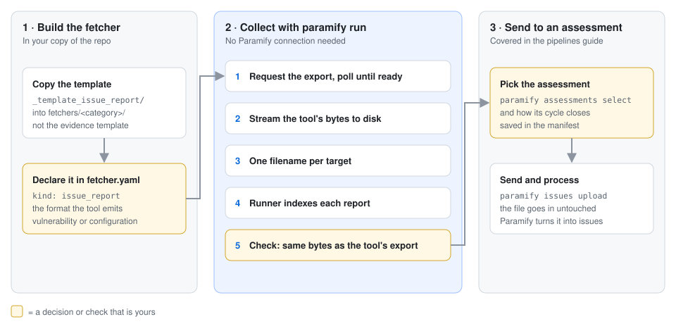
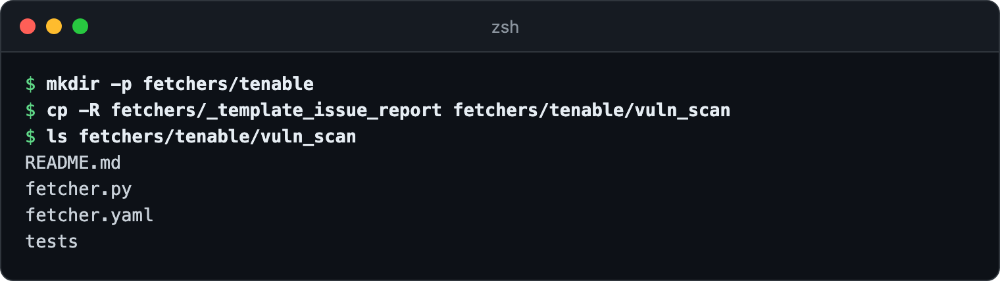
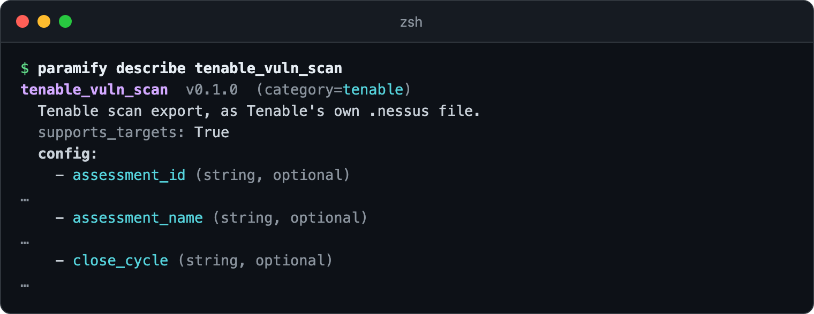
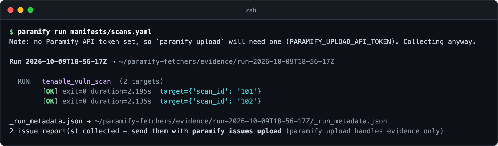
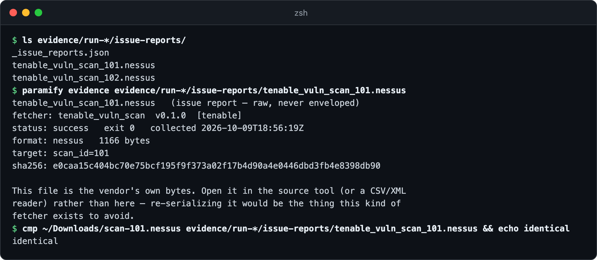
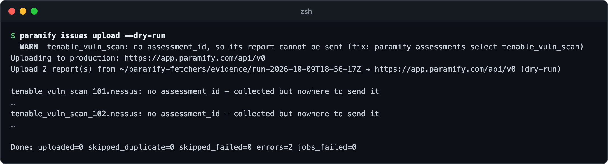

# Writing an issue-report fetcher

An issue-report fetcher hands Paramify a report your scanner already produced,
such as a Nessus export or a Wiz CSV, byte for byte. The assessment's pipeline in
Paramify parses it into issues
([how intake works](https://support.paramify.com/hc/en-us/articles/41294208918291-Manage-Vulnerability-and-Configuration-Scans)).
This guide builds one from the template, runs it against two scans, and reads what
lands in the run directory. If you're asserting a configuration state instead,
write an evidence fetcher ([which kind](issue_report_fetchers.md#issue-report-fetchers)).



**You need:** [the repo installed](../README.md#install) ·
an API credential that can export the tool's reports ·
for the last step, [an assessment with a file intake preset](pipelines.md#before-you-start)

---

## 1. Copy the template

The running example is `tenable_vuln_scan`, a Tenable scan export. It isn't in
the repo, and the pictures run it against a local stand-in for Tenable's API with
synthetic scans. Copy the issue-report template, not the evidence one
([what differs](issue_report_fetchers.md#writing-one)). For a new category, also
add an empty `fetchers/_categories/tenable.yaml`
([per-category setup](authoring_a_fetcher.md#per-category-setup-first-fetcher-in-a-new-category)).



<details><summary>Copy the commands</summary>

```bash
mkdir -p fetchers/tenable
cp -R fetchers/_template_issue_report fetchers/tenable/vuln_scan
ls fetchers/tenable/vuln_scan
```
</details>

Your AI agent can do steps 1–3: the `create-fetcher` skill routes a findings tool
to this template ([agent skills](../README.md#drive-it-with-an-ai-agent)).

## 2. Declare it in `fetcher.yaml`

Replace the placeholders. Three entries make it an issue report
([why](issue_report_fetchers.md#writing-one)):

- `kind: issue_report`.
- `output.type` is the format the tool emits: `csv`, `json`, `xml`, or `nessus`.
  `output.path` is a bare filename with the tool's extension.
- `issue_report.assessment_type` is `VULNERABILITY` or `CONFIGURATION`. It filters
  the assessment picker later.

Leave out `evidence_set` and `validators`.

```yaml
name: tenable_vuln_scan
version: 0.1.0
description: Tenable scan export, as Tenable's own .nessus file.
category: tenable

kind: issue_report

supports_targets: true

runtime:
  type: python
  entry: fetcher.py

output:
  type: nessus
  path: tenable_vuln_scan.nessus

secrets:
  - name: access_key
    env: TENABLE_ACCESS_KEY
    description: Tenable API access key with scan-export permission.
  - name: secret_key
    env: TENABLE_SECRET_KEY
    description: The matching secret key.

target_schema:
  scan_id:
    type: string
    required: true
    env: TENABLE_SCAN_ID
    description: The Tenable scan to export.

issue_report:
  assessment_type: VULNERABILITY
  title: Monthly Nessus Scan
```

Check that discovery finds it. The framework adds `assessment_id`,
`assessment_name`, and `close_cycle` to its config, so you never declare them.



<details><summary>Copy the command</summary>

```bash
paramify describe tenable_vuln_scan
```
</details>

## 3. Stream the tool's bytes

**The file on disk must be the tool's own bytes**
([why](issue_report_fetchers.md#the-one-rule)). Swap the template's request for
the tool's export call, poll until the export is ready, then stream it to disk.
Never parse and rewrite it: no `json.dump`, no `csv.writer`.

```python
# target_suffix(), from the template: read your target's env var
value = os.environ.get("TENABLE_SCAN_ID", "").strip()

# main(), once the export is ready
output_path = output_dir / f"tenable_vuln_scan{target_suffix()}.nessus"
resp = requests.get(f"{export_url}/download", headers=auth, timeout=_TIMEOUT, stream=True)
resp.raise_for_status()
with output_path.open("wb") as fh:
    for chunk in resp.iter_content(chunk_size=1024 * 1024):
        if chunk:
            fh.write(chunk)
```

**One filename per invocation.** Every target writes into the same directory, so
the name must carry the target or each target overwrites the last
([why](issue_report_fetchers.md#one-filename-per-invocation)). Keep the template's
empty-file check: Paramify reads an empty report as "no findings" and resolves
every open issue.

## 4. Run it

Add it to a manifest with one target per scan
([building a manifest](../README.md#building-a-manifest)), then run it. No
Paramify connection is needed. The runner points `EVIDENCE_DIR` at the run's
`issue-reports/` directory.

```yaml
# manifests/scans.yaml
run:
  output_dir: ./evidence
  fetchers:
    - use: tenable_vuln_scan
      secrets:
        access_key: ${env:TENABLE_ACCESS_KEY}
        secret_key: ${env:TENABLE_SECRET_KEY}
      targets:
        - scan_id: "101"
        - scan_id: "102"
```



<details><summary>Copy the command</summary>

```bash
paramify run manifests/scans.yaml
```
</details>

**Check the count.** Two targets should give `2 issue report(s) collected`. Fewer
means two targets wrote the same filename.

## 5. Check the report and its index

Each report sits beside `_issue_reports.json`, the sidecar index the uploader reads
instead of the files ([sidecar fields](issue_report_fetchers.md#the-sidecar-index)).
`paramify evidence` shows one report's record. Then check the one rule: the file
should match the same scan exported from the tool's UI.



<details><summary>Copy the commands</summary>

```bash
ls evidence/run-*/issue-reports/
paramify evidence evidence/run-*/issue-reports/tenable_vuln_scan_101.nessus
cmp <the same scan, exported from the tool's UI> evidence/run-*/issue-reports/tenable_vuln_scan_101.nessus && echo identical
```
</details>

## 6. Send it to an assessment

A dry run makes no API calls. It shows both reports collected, with nowhere to go
yet.



<details><summary>Copy the command</summary>

```bash
paramify issues upload --dry-run
```
</details>

Next, [pick the assessment and close policy](pipelines.md#2-point-each-fetcher-at-an-assessment),
then [send the reports](pipelines.md#3-run-it-then-send-the-reports). Options and
errors are in the [uploader reference](../uploaders/paramify_issues/README.md).

---

## Troubleshooting

| Symptom | Fix |
|---|---|
| `paramify` commands fail with `schema validation failed` on your `fetcher.yaml` | `output.type` isn't `csv`, `json`, `xml`, or `nessus`, or the file declares both `issue_report` and `evidence_set`. |
| `paramify validate` shows `ERROR` for `no assessment_id set` and `no close_cycle set` | Expected until step 6. `paramify run` collects anyway. |
| `paramify upload` says `No run under ./evidence that collected evidence` | It sends evidence only. Use `paramify issues upload`. |
| The upload summary shows `skipped_failed` | That collection failed, and a partial scan would resolve real issues, so it isn't sent. Fix the fetch and run again ([`skip_failed`](../uploaders/paramify_issues/README.md#configuration)). |

**More detail:** [evidence or issue report](issue_report_fetchers.md#issue-report-fetchers) ·
[what a run looks like](issue_report_fetchers.md#what-a-run-looks-like) ·
[choosing an assessment](issue_report_fetchers.md#pointing-it-at-an-assessment) ·
[where it lives in the code](issue_report_fetchers.md#where-this-lives-in-the-code) ·
[a shipped fanout example](../fetchers/wiz/stig_compliance_report/)
