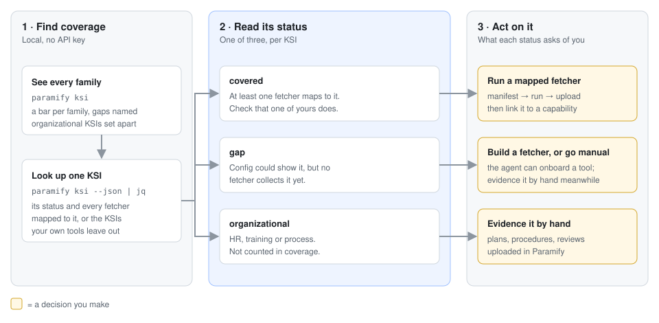
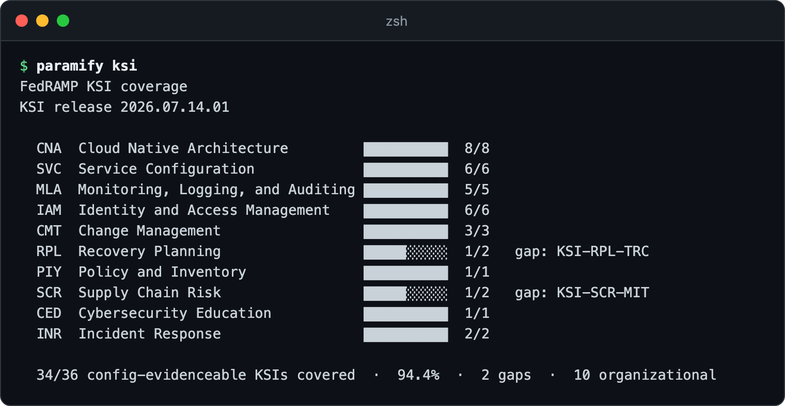
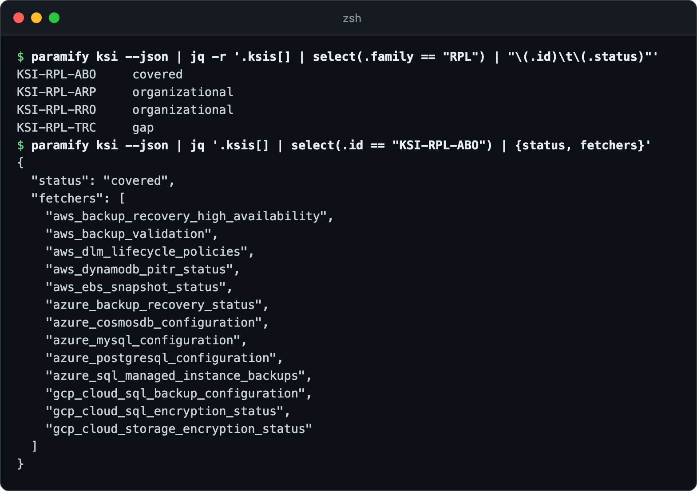
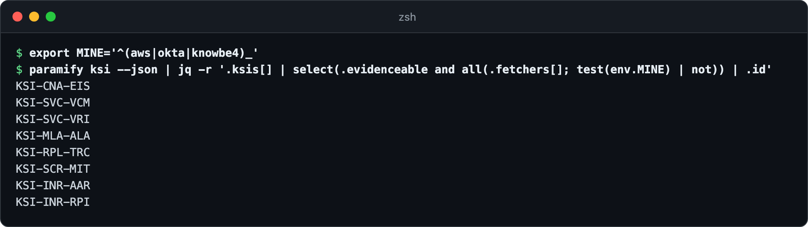
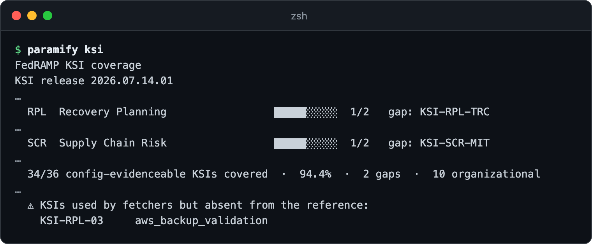

# Finding the fetchers for a FedRAMP KSI

Each fetcher lists the FedRAMP Key Security Indicators (KSIs) its evidence
speaks to. `paramify ksi` joins those lists against FedRAMP's 46 indicators. It
shows which fetchers cover an indicator, which indicators nothing covers yet,
and which no fetcher ever will. The running example is *KSI-RPL-ABO*, Aligning
Backups with Objectives.



**You need:** [the repo installed](../README.md#install) ·
[jq](https://jqlang.org) for the lookups

---

## 1. See coverage at a glance

`paramify ksi` draws a bar per family and names each uncovered indicator. The
percentage counts only indicators that configuration can show. The 10
*organizational* ones are set aside
([how that's judged](../framework/reference/ksis.yaml)).



<details><summary>Copy the command</summary>

```bash
paramify ksi
```
</details>

## 2. Look up one KSI

`--json` carries each indicator's status and the fetchers mapped to it. List
the family first, then pull the indicator you want:



<details><summary>Copy the commands</summary>

```bash
paramify ksi --json | jq -r '.ksis[] | select(.family == "RPL") | "\(.id)\t\(.status)"'
paramify ksi --json | jq '.ksis[] | select(.id == "KSI-RPL-ABO") | {status, fetchers}'
```
</details>

| Status | Means | What you do |
|---|---|---|
| *covered* | At least one fetcher lists it | Run one of them ([step 4](#4-collect-the-evidence)) |
| *gap* | Configuration could show it, but no fetcher collects it yet | Build one ([step 5](#5-declare-a-fetchers-ksis)), or evidence it by hand |
| *organizational* | HR, training or process, not configuration | Evidence it by hand in Paramify |

**A mapping is a lead, not proof.** It says the evidence speaks to the
indicator, not that it satisfies it ([why](ksi_mapping.md#fetcher--ksi-mapping)).

## 3. Find what your tools leave out

Coverage is for the whole repo, but you run only your tools' fetchers. Set
`MINE` to their name prefixes (here AWS, Okta and KnowBe4) and list the
indicators none of them cover:



<details><summary>Copy the commands</summary>

```bash
export MINE='^(<your tool>|<another tool>)_'
paramify ksi --json | jq -r '.ksis[] | select(.evidenceable and all(.fetchers[]; test(env.MINE) | not)) | .id'
```
</details>

*KSI-RPL-TRC* and *KSI-SCR-MIT* are gaps for everyone, as step 1 showed. For
each of the rest, the step 2 lookup shows which other tool's fetcher covers it.

## 4. Collect the evidence

Pick a fetcher from step 2, such as `aws_backup_validation`.
[Add it to a manifest](../README.md#building-a-manifest), then
[run and upload it](../README.md#collect-then-upload). Paramify never receives
`ksis`: there, evidence reaches a KSI through a solution capability attached to
it ([associate the evidence set](https://support.paramify.com/hc/en-us/articles/55867837610003-Setup-Validators)).

## 5. Declare a fetcher's KSIs

If you write fetchers, list the indicators the evidence plainly shows under
`ksis` in `fetcher.yaml` ([the field](fetcher_contract.md#optional)), using IDs
from [the KSI reference](../framework/reference/ksis.yaml):

```yaml
ksis:
  - KSI-RPL-ABO
```

Then run `paramify ksi` again. **A wrong ID fails nothing**: it adds a warning
at the bottom, and CI doesn't check for it. Here a sandbox copy of
`aws_backup_validation` still says `KSI-RPL-03`, its ID before FedRAMP's 2026
re-key:



Then [regenerate the mapping doc](ksi_mapping.md#fetcher--ksi-mapping). To
close a gap, the agent's `create-fetcher` or `onboard-platform` skill can build
the fetcher ([AI agent section](../README.md#drive-it-with-an-ai-agent)).

---

## Troubleshooting

| Symptom | Fix |
|---|---|
| `paramify ksi` and [the mapping doc](ksi_mapping.md) give different numbers | The doc is generated and can lag behind merged fetchers. `paramify ksi` reads the fetchers in your checkout, so trust it. |
| A filter on `status == "organizational"` finds 9, not 10 | An organizational KSI that a fetcher maps to (*KSI-PIY-RSD*) reports *covered*. Filter on `.evidenceable` instead. |
| A fetcher you expected isn't under any KSI | It has no `ksis`. A few fetchers deliberately don't ([the list](ksi_mapping.md#unmapped)). |
| `jq: command not found` | Install jq, or read the [per-fetcher view](ksi_mapping.md#by-fetcher). |
| `RuntimeError: Could not locate repo root` | Run `paramify` from inside your clone of the repo. |

**More detail:** [what a mapping claims](ksi_mapping.md#fetcher--ksi-mapping) ·
[statements and NIST controls](ksi_mapping.md#indicators-and-what-covers-them) ·
[open gaps](ksi_mapping.md#open-gaps) ·
[how organizational is judged](../framework/reference/ksis.yaml) ·
[the 2026 re-key](../CHANGELOG.md#050-beta---2026-09-02)
