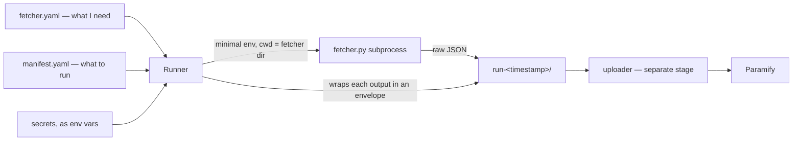

# Paramify Fetchers, Part 1: Follow one fetcher from YAML to envelope

Somewhere right now, a security engineer is screenshotting an admin console because an auditor asked them to prove every employee account belongs to a current employee. Next quarter, another auditor will ask again, and they'll screenshot it again. This repo exists to delete that ritual: small scripts called **fetchers** pull evidence from the tools a customer already runs — Okta, AWS, GitLab, Rippling — and write it to disk as JSON, where a separate uploader ships it to Paramify.

You're joining this codebase, and it has 107 fetchers. The wrong way in is reading all of them. The right way in is following *one* — from its YAML self-description, through the runner that executes it, to the enveloped evidence file it leaves on disk — until you could explain each handoff to the next new dev.

By the end of this part, you'll have the `paramify` CLI installed, a complete collection run sitting in a `run-<timestamp>/` directory, and a working mental model of the four pieces and the contract that binds them. You will not need credentials for any of it — we run the whole pipeline against a fake API token on purpose, because the wiring is the lesson, not the data.

## What you'll build

A traced, inspected run. You'll install the CLI from this repo, build a scratch manifest containing exactly one fetcher (`rippling_current_employees`, the simplest one here), execute it through the real runner with a fake credential, and then read what it left behind: an evidence file wrapped in the standard envelope, a `_run_metadata.json` run index, and a failure honestly recorded in three different places. Along the way you'll meet the discovery mechanism, the environment whitelist, and the one mistake the contract exists to prevent.

## Prerequisites

- **Python 3.10+** — `pyproject.toml` requires `>=3.10`; this guide was written and verified against Python 3.14.5.
- A clone of `paramify-fetchers`, on `main`.
- A virtualenv. Commands below assume it's activated.
- **No credentials.** Deliberately. Everything in this part runs with `RIPPLING_API_TOKEN=fake`.
- Comfort reading Python and YAML.

## The four pieces

The architecture is four pieces kept deliberately separate:

- A **fetcher** — a small script (`fetcher.py` or `fetcher.sh`) that collects from *one* source and writes JSON. It reads everything it needs from environment variables and writes only to `EVIDENCE_DIR`.
- **`fetcher.yaml`** — the fetcher's self-description: what it's called, what secrets and config it needs, what file it outputs. Ships with the code; customers never edit it.
- A **run manifest** — the customer's intent: which fetchers to run, with what config, against what targets. Lives in the customer's environment.
- The **runner** — reads the YAMLs and a manifest, resolves secrets and config into environment variables, and executes each fetcher as a subprocess.

Collection and upload are separate stages: the runner only collects, and a separate uploader (`uploaders/paramify_evidence/`) pushes a finished run directory to Paramify. Fetchers never talk to Paramify — they run on *customer* infrastructure, and the chain of custody runs strictly one direction:



> [!ASIDE]
> For an interactive step-through of this pipeline — each stage highlighted with what it reads, does, and produces — open [`docs/diagrams/run-pipeline.html`](../../diagrams/run-pipeline.html) in your browser.

The contract is abstract until you've watched it execute. Install the CLI and let's count what it discovers.

## Install the CLI and count the catalog

From the repo root, with your virtualenv active:

```bash
pip install -e .
paramify list
```

The editable install registers one console command, `paramify` (`pyproject.toml`, `[project.scripts]`), and `list` should report:

```
Discovered 107 fetchers:

  aws_auto_scaling_high_availability                 v0.1.0    [fanout] category=aws
  aws_backup_recovery_high_availability              v0.1.0    [fanout] category=aws
  ...
  k8s_eks_pod_inventory                              v0.1.0    [single] category=k8s
```

Where does that list come from? Discovery (`framework/config_loader.py`) walks `fetchers/<category>/<short_name>/` looking for `fetcher.yaml` files, validates each against `framework/schemas/fetcher_schema.json`, and refuses duplicates by name. Every front-end — the CLI, its `--json` mode, the `paramify tui` terminal UI — goes through one facade, `framework/api.py`, so they can't disagree about what exists.

> [!ASIDE]
> If you count `fetcher.yaml` files on disk you'll get 108 and briefly question the README. Discovery skips any directory starting with `_` — `_template/`, `_categories/`, and per-category `_shared/` — so the one under `_template/` is invisible to the runner. The underscore *is* the off switch.

Now ask the catalog about the fetcher we'll be tracing:

```bash
paramify describe rippling_current_employees
```

```
rippling_current_employees  v0.1.0  (category=rippling)
  Pulls currently active Rippling employees via the Platform API. Evidence for the current employee roster.
  supports_targets: False
  secrets:
    - api_token (string, required)
```

One secret, no fan-out targets, one output file. That's the whole public surface — and everything the CLI just printed came from one 24-line YAML file. Let's read it.

## Anatomy of one fetcher: rippling_current_employees

Open `fetchers/rippling/current_employees/fetcher.yaml`:

```yaml
name: rippling_current_employees
version: 0.1.0
description: Pulls currently active Rippling employees via the Platform API. ...
category: rippling

supports_targets: false

runtime:
  type: python
  entry: fetcher.py

output:
  type: json
  path: rippling_current_employees.json

secrets:
- name: api_token
  env: RIPPLING_API_TOKEN
```

Read it as a set of promises. `name` is globally unique across the repo — category and short name joined, `rippling` + `current_employees`. `runtime` tells the runner *how* to execute (`python fetcher.py`, in this directory). `output.path` is the filename the script promises to write inside `EVIDENCE_DIR`. And `secrets` declares: this fetcher will read exactly one credential, from the env var `RIPPLING_API_TOKEN` — how that variable gets populated is explicitly not its problem.

Below those, the same file carries an `evidence_set` block (`reference_id: EVD-RIPPLING-CURRENT-EMPLOYEES` plus a display name and collection instructions). That's the fetcher's identity on the Paramify side — the uploader uses the `reference_id` as a stable get-or-create key, so re-uploading never duplicates an evidence set.

Notice what the YAML *doesn't* declare: the script also reads `RIPPLING_BASE_URL` and `RIPPLING_PAGE_SIZE`. Those are **platform config** — settings shared by every Rippling fetcher — and they live once in `fetchers/_categories/rippling.yaml` instead of being repeated per fetcher:

```yaml
config_schema:
  base_url:
    type: string
    default: https://api.rippling.com
    env: RIPPLING_BASE_URL
  page_size:
    type: integer
    default: 100
    env: RIPPLING_PAGE_SIZE
```

The runner injects these as env vars for any fetcher with `category: rippling`; a manifest's `platforms:` block can override them per run. Config flows one way — category defaults, then platform values from the manifest, then per-fetcher config, later values winning (`docs/config_injection_design.md`).

Now the script. Here's the tempting way to write a fetcher's error handling, and the reason this repo's README devotes its sternest paragraph to forbidding it:

```python
try:
    employees = fetch_current_employees(base_url, token, page_size)
except Exception:
    employees = []          # API's down — we'll catch them next run
# ...write the file, exit 0
```

This exits 0, writes a plausible-looking file containing zero employees, and nobody ever learns the API was down. The evidence pipeline keeps humming, green across the board, collecting nothing. Returning 0 with empty data is the one mistake that makes evidence untrustworthy — an outage disguised as an empty roster.

What `fetcher.py` actually does is carry a ledger. Failures are appended, never swallowed (`fetchers/rippling/current_employees/fetcher.py:69-83`):

```python
while True:
    try:
        payload = rippling_get(base_url, token, path,
                               params={"limit": page_size, "offset": offset})
    except requests.exceptions.RequestException as e:
        api_failures.append({"endpoint": path, "offset": offset,
                             "type": type(e).__name__, "message": str(e)})
        logger.warning("Pagination interrupted at offset=%d: %s", offset, e)
        break

    page = extract_records(payload)
    results.extend(page)
    if len(page) < page_size:
        break
    offset += page_size
```

And at the end of `main()`, the ledger decides the exit code (`fetcher.py:124-127`):

```python
if api_failures:
    logger.error("Encountered %d API failures during collection", len(api_failures))
    return 1
return 0
```

The evidence file is written *either way* — with the failures recorded inside it — but the exit code tells the runner, honestly, whether collection succeeded. Note also the texture of the script: every HTTP call has a 30-second timeout, status goes to `stderr` via `logging` (never `print()` — stdout is not the fetcher's channel), and the output lands at `EVIDENCE_DIR/rippling_current_employees.json`, exactly the path the YAML promised.

One sharp corner worth knowing about. What happens if Rippling returns a shape `extract_records` doesn't recognize — not a list, and a dict without any of the keys it probes (`results`, `data`, `employees`, `items`)? It returns `[]`, the loop reads that as a short final page and stops, no failure is recorded, and the fetcher exits 0 with `"count": 0`. A schema change upstream could reproduce the exact silent-empty-success the contract forbids. The v0.x ports accept this corner; exercise 5 asks you to close it.

That's the fetcher's side of the contract. The other side belongs to the runner — and it's stricter than you'd guess.

## What the runner does to your environment

The runner does not hand your shell environment to fetchers. It builds each subprocess a minimal one (`framework/runner/executor.py`):

- **Seven inherited vars**: `PATH`, `HOME`, `LANG`, `LC_ALL`, `LC_CTYPE`, `USER`, `TZ` — and only if actually present (`executor.py:33`).
- **Two it always sets**: `PYTHONUNBUFFERED=1` and `EVIDENCE_DIR`, pointed at the per-run output directory (`executor.py:112-113`).
- **Everything the fetcher declared**: secrets resolved from the manifest, config injected from the merged `config_schema`s.

Secrets in a manifest use exactly one reference form in v0.x — `${env:VAR_NAME}` — which the runner resolves from *its own* environment (`framework/secret_resolver.py:16`). This is the source-agnostic design from the README: the fetcher reads `RIPPLING_API_TOKEN`; whether that value originally came from a `.env` file, AWS Secrets Manager, Vault, or a CI secret block is invisible to it, because all of those already know how to set an environment variable.

> [!HEADS-UP]
> The whitelist cuts both ways. Every env var your fetcher reads **must** be declared — as a secret or as a config field — or the runner strips it, silently. The classic symptom: you export a knob in your shell, the fetcher behaves as if you hadn't, and you lose an hour before remembering this paragraph. Direct invocation (`python fetcher.py`) won't catch it, because there's no runner in the way; only a run through `paramify run` exercises the whitelist.

Two more facts about the execution sandbox. The subprocess's working directory is the *fetcher's own folder* — so a relative write path would pollute the repo, which is why the contract says write only under `EVIDENCE_DIR`. And every invocation has a wall-clock cap: 600 seconds by default (`executor.py:37`), overridable per fetcher via `runtime.timeout` — the two checkov fetchers raise it to 1800 because external-module downloads are slow — and a fetcher that blows its budget is killed and recorded with exit code **124**, the shell's own SIGTERM-on-timeout convention (`executor.py:40`).

You now know both sides of the contract. Time to watch them meet.

## A real run with fake credentials

First, prove the fetcher itself is wired correctly — no runner, no manifest, just the script and two env vars. This is the same smoke test the README prescribes for new fetchers:

```bash
RIPPLING_API_TOKEN=fake EVIDENCE_DIR=/tmp/verify \
  python fetchers/rippling/current_employees/fetcher.py
echo "exit: $?"
```

```
... WARNING rippling_current_employees Pagination interrupted at offset=0: 401 Client Error: Unauthorized for url: https://api.rippling.com/platform/api/employees?limit=100&offset=0
... INFO rippling_current_employees Evidence saved to /tmp/verify/rippling_current_employees.json
... ERROR rippling_current_employees Encountered 1 API failures during collection
exit: 1
```

Read that as a success. The 401 proves the token *arrived* and the script *reached the real API*; the non-zero exit proves the failure detection works. (An exit of 0 here would mean the error handling is broken — the smoke test exists to catch exactly that.) And notice `limit=100` in the URL: that's `page_size` flowing in from the category defaults.

Now the same fetcher through the runner. Build a scratch manifest with the CLI — each `manifest` subcommand edits the file in place and tells you what's still missing:

```bash
paramify manifest init -f /tmp/tour/manifest.yaml --output-dir /tmp/tour/evidence
paramify manifest add rippling_current_employees -f /tmp/tour/manifest.yaml
```

```
Wrote /tmp/tour/manifest.yaml
  (manifest saved but not yet runnable):
    rippling_current_employees: missing secret 'api_token'
```

The builder saved your work *and* told you why it won't run yet. Supply the missing piece — "secret `api_token` comes from the env var `RIPPLING_API_TOKEN`" — then validate:

```bash
paramify manifest set-secret rippling_current_employees api_token RIPPLING_API_TOKEN \
  -f /tmp/tour/manifest.yaml
paramify validate /tmp/tour/manifest.yaml
```

```
OK  manifest valid; 1 fetcher entries
```

> [!PREDICT]
> You're about to run this with `RIPPLING_API_TOKEN=fake`, and the fetcher will fail with a 401, exit 1. Before you run it: will there be an output file in the run directory at all? And if so, where does the failure get recorded?

```bash
RIPPLING_API_TOKEN=fake paramify run /tmp/tour/manifest.yaml
```

```
Run 2026-06-10T18-54-38Z → /tmp/tour/evidence/run-2026-06-10T18-54-38Z

  RUN   rippling_current_employees
        [FAIL] exit=1 duration=0.401s

_run_metadata.json → /tmp/tour/evidence/run-2026-06-10T18-54-38Z/_run_metadata.json
```

The run directory is named `run-<UTC timestamp>` (colons swapped for hyphens — colons are unwelcome in filenames). Look inside and you'll find the answer to the prediction: `rippling_current_employees.json` exists, *and* it no longer looks like what the fetcher wrote. The runner wrapped it.

This is the **evidence envelope** — the custody label on the bag. Every output file gets wrapped in `{schema_version, metadata, payload}` (`framework/envelope.py`, `schema_version: "1.0"`); the wrapping is idempotent, so an already-enveloped file is left alone. Here's the actual file from this run, trimmed:

```json
{
  "schema_version": "1.0",
  "metadata": {
    "fetcher_name": "rippling_current_employees",
    "fetcher_version": "0.1.0",
    "category": "rippling",
    "run_id": "2026-06-10T18-54-38Z",
    "target": null,
    "collected_at": "2026-06-10T18:54:38Z",
    "status": "failed",
    "exit_code": 1,
    "error": "...401 Client Error: Unauthorized for url: https://api.rippling.com/...",
    "evidence_set": {
      "reference_id": "EVD-RIPPLING-CURRENT-EMPLOYEES",
      "name": "Rippling Current Employees"
    }
  },
  "payload": {
    "source": "rippling",
    "count": 0,
    "api_failures": [ { "type": "HTTPError", "message": "401 Client Error: ..." } ],
    "results": []
  }
}
```

Count the places this failure is recorded: the fetcher's own `api_failures` ledger in the payload, the `status`/`exit_code` in the metadata, a tail of the fetcher's stderr in `error`, and the `[FAIL]` line in `_run_metadata.json`'s invocation list. Nothing about this outage is deniable — which is the entire point of an evidence pipeline. That's also the last chain-of-custody flourish I'll subject you to; from here on it's just JSON in directories.

The metaphor retired, one question remains: does the machine still pass its own tests on your machine?

## Checkpoint

**Run this to verify your work so far** (from the repo root, venv active):

```bash
python -m pytest tests -q
```

Expected output:

```
..............................                                           [100%]
30 passed in 2.73s
```

(Your timing will differ; the count shouldn't.) The suite includes a parity invariant worth knowing exists: it derives the set of `framework.api` calls the TUI makes by walking its source, and asserts the CLI exposes a command for every one — so the front-ends provably can't drift apart.

Also confirm your tour left the right artifacts:

```bash
ls /tmp/tour/evidence/run-*/
# _run_metadata.json   rippling_current_employees.json
```

**Likely errors:**

- If you see `command not found: paramify`, you probably skipped `pip install -e .` — or installed it in a different virtualenv than the one that's active.
- If you see `ModuleNotFoundError: No module named 'requests'`, you're running outside the venv (system Python doesn't have the project's dependencies).
- If `validate` reports `missing secret 'api_token'`, you probably skipped the `manifest set-secret` step — the manifest must say which env var supplies each declared secret.
- If `paramify run` exits 1 — that's not an error in this exercise. The fake token *should* fail, and a runner that reported it any other way would be broken. Success here looks like `[FAIL]` honestly reported.

## What's next

You've read the contract from both sides; in Part 2 you sign it. We'll copy `fetchers/_template/` into a new category, fill in a `fetcher.yaml` the discovery layer accepts, write the collection script with a failure ledger that can defend itself, and take it through the same smoke-test-then-runner gauntlet — the same path as `docs/porting_playbook.md`, but with the reasoning attached. The open question to carry there: of everything `rippling_current_employees` does, which parts were *contract* and which were merely *convention*?

Before the exercises, one question, two sentences, in your own words: why does the *runner* write the envelope, when the fetcher already knows everything about its own run? The answer that satisfies a skeptical colleague explains what would go wrong across 107 fetchers — and on customer infrastructure — if each script wrapped its own output.

## Exercises

1. **Prove the config pipeline.** Set `page_size` to 5 for the whole rippling platform in your scratch manifest (`paramify manifest set-platform-config rippling page_size=5 -f /tmp/tour/manifest.yaml`, or edit the `platforms:` block by hand), rerun with the fake token, and find the proof that your override reached the subprocess. (It's inside the envelope — look at the failed URL.)
2. **Make validation catch a lie.** Add a fetcher that doesn't exist (`paramify manifest add okta_flying_cars -f /tmp/tour/manifest.yaml`), then run `paramify validate`. Note which layer catches it and exactly what the error names — then remove it with `manifest remove`.
3. **Timeout audit.** Two fetchers in this repo override `runtime.timeout` to 1800 seconds. Find them with grep, and explain from their YAML comments why 600 wasn't enough. Then find what exit code their invocations would record if they still blew the budget.
4. **Two views of one file.** Run `paramify evidence` on your run's `rippling_current_employees.json` and compare it to `cat` of the same file. What does the normalizer separate for you, and why does the command also work on a pre-envelope (raw) evidence file?
5. **Close the sharp corner.** Write down an API response body that makes `extract_records` return `[]` so the fetcher exits 0 with `"count": 0` despite collecting nothing. Then propose the smallest guard in `main()` that turns that case into a recorded failure — without breaking the legitimately-empty-tenant case. (Hint: when is `count == 0` *trustworthy*?)

## Sources

This part was researched directly from the repository working tree (branch `main`, June 10, 2026); all command outputs shown were captured live from `paramify list`, `describe`, `manifest`, `validate`, `run`, the fake-credential smoke test, and `pytest`.

**Repository docs**

1. `README.md` — the four-piece architecture, the strictness rationale, and the smoke-test pattern.
2. `docs/design.md` / `docs/config_injection_design.md` — design rationale and the config/auth flow (referenced; read the originals for depth).

**Code read directly**

4. `fetchers/rippling/current_employees/fetcher.yaml` and `fetcher.py` — the controlling example: contract surface, pagination, and the `api_failures` ledger.
5. `fetchers/_categories/rippling.yaml` — platform-wide config (`base_url`, `page_size`) and its env injection.
6. `framework/runner/executor.py` — the 7-var env whitelist, `PYTHONUNBUFFERED`/`EVIDENCE_DIR` injection, the 600s default timeout, and exit code 124.
7. `framework/secret_resolver.py` — the `${env:VAR_NAME}` reference form.
8. `framework/api.py`, `framework/config_loader.py`, `framework/envelope.py`, `framework/schemas/fetcher_schema.json` — facade surface, discovery and `_`-skip rule, envelope wrapping (`schema_version: "1.0"`), and required vs. optional fetcher fields.
9. `examples/minimal_run.yaml` — the manifest shape for single and fan-out fetchers.
