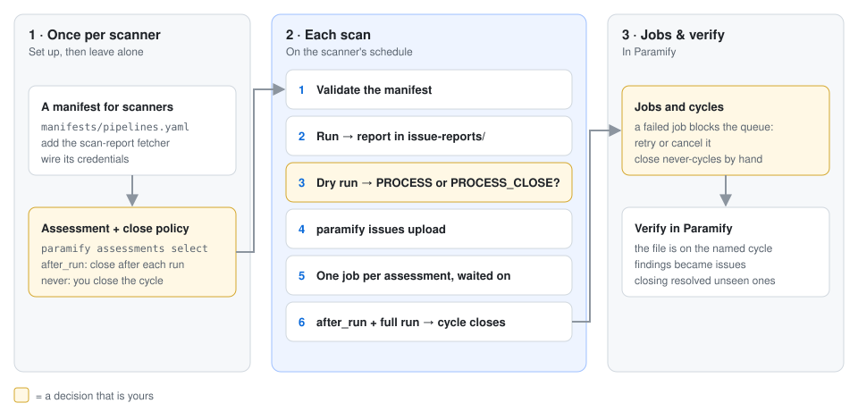
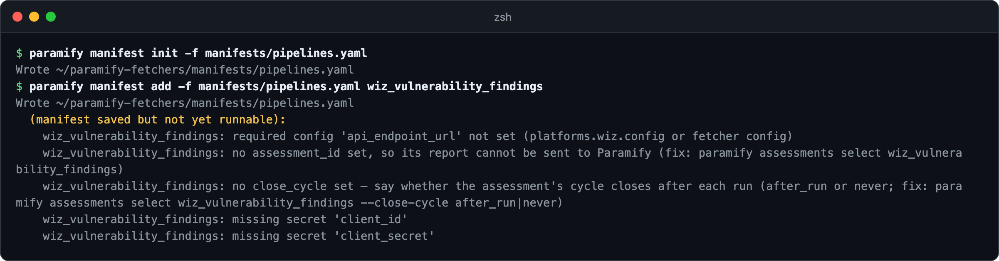
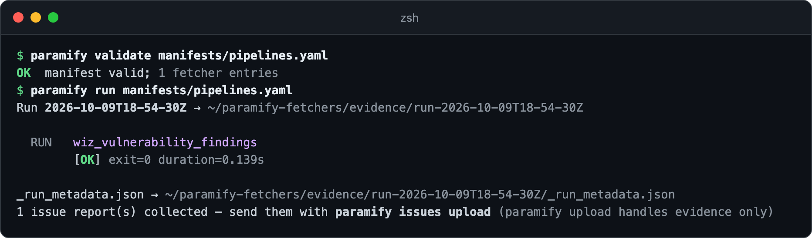
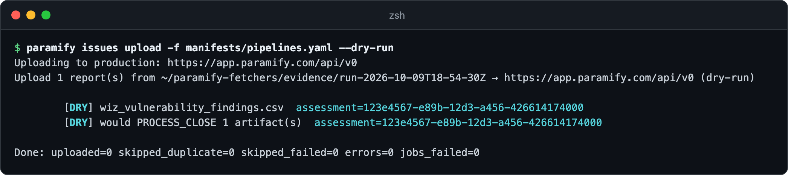

# Sending scan reports to Paramify with `paramify issues upload`

A scan-report fetcher collects the file a scanner already produces, such as a
Wiz CSV or a Nessus export. `paramify issues upload` sends it into an
assessment's pipeline in Paramify, which turns the findings into issues. You set
up a manifest and an assessment once, then run and send on the scanner's
schedule. The pictures use `wiz_vulnerability_findings`, with synthetic findings
from a stand-in for Wiz.



**You need:** [the repo installed](../README.md#install) ·
[an assessment](https://support.paramify.com/hc/en-us/articles/46555296641555-Create-an-Assessment-in-Paramify)
per scanner, with its [scan intake mapped](https://support.paramify.com/hc/en-us/articles/41294208918291-Manage-Vulnerability-and-Configuration-Scans) ·
[an API key](../uploaders/paramify_evidence/README.md#paramify-api-key) that
also has the **Pipelines** and **Pipeline Jobs** permissions

---

## 1. Give scan fetchers their own manifest

Scans run on their own schedule, so keep them apart from your evidence manifest
([why](pipelines.md#1-give-scan-fetchers-their-own-manifest)).



<details><summary>Copy the commands</summary>

```bash
paramify manifest init -f manifests/pipelines.yaml
paramify manifest add -f manifests/pipelines.yaml wiz_vulnerability_findings
```
</details>

Wire the scanner settings it lists ([Wiz settings](wiz_pipeline_fetchers.md#configuration)),
or [let your AI agent](../README.md#drive-it-with-an-ai-agent) do it with
`wire-manifest`. Step 2 covers the assessment lines.
[In the TUI](https://support.paramify.com/hc/en-us/articles/55867428958355-Setup-Fetchers),
that's `n`, then `a` on the **Manifest** tab.

## 2. Point it at an assessment

`paramify assessments select` lists assessments of the type the fetcher feeds,
then asks how the cycle closes. **Closing a cycle auto-closes every open issue the
cycle never saw**, so choose with care
([details](pipelines.md#2-point-each-fetcher-at-an-assessment)):

- `after_run`: one report per cycle, such as a monthly scan. The upload closes
  the cycle when every target in the run succeeded.
- `never`: several files fill one cycle. You close it ([step 5](#5-watch-jobs-and-close-cycles)).

<details><summary>Copy the command</summary>

```bash
paramify assessments select wiz_vulnerability_findings -f manifests/pipelines.yaml
```
</details>

It adds the last three keys below. **Set them before you run**: a run records
its assessment when it collects. In the TUI, press `A` on the **Manifest** tab
([recording](demo/pipeline-setup.gif)).

```yaml
run:
  output_dir: ./evidence
  fetchers:
  - use: wiz_vulnerability_findings
    secrets:
      client_id: ${env:WIZ_CLIENT_ID}
      client_secret: ${env:WIZ_CLIENT_SECRET}
    config:
      api_endpoint_url: https://api.us2.app.wiz.us/graphql
      assessment_id: 123e4567-e89b-12d3-a456-426614174000
      assessment_name: Example Vulnerability Assessment
      close_cycle: after_run
```

## 3. Run it

Check the manifest, then collect. The report lands in the run's
`issue-reports/` folder, untouched ([why](issue_report_fetchers.md#the-one-rule)).



<details><summary>Copy the commands</summary>

```bash
paramify validate manifests/pipelines.yaml
paramify run manifests/pipelines.yaml
```
</details>

## 4. Send the reports

Preview first. The second `[DRY]` line says what Paramify will be asked to do:
`PROCESS` leaves the cycle open, and `PROCESS_CLOSE` closes it.



Then send. Per assessment, the upload sends every file, processes them as one
job, and prints the cycle it landed on and the job's counts: issues *created*,
*updated*, *seen-closed*, and *auto-closed*. Sending a run again skips what
already went ([how](../uploaders/paramify_issues/README.md#re-running-is-safe-and-the-log-is-why)).

<details><summary>Copy the commands</summary>

```bash
paramify issues upload -f manifests/pipelines.yaml --dry-run
paramify issues upload -f manifests/pipelines.yaml
```
</details>

In the TUI, press `i` on the **Paramify** tab ([recording](demo/pipeline-send.gif)).

## 5. Watch jobs, and close cycles

Each assessment runs one job at a time, and **a failed job holds every job
behind it** until you retry or cancel it. Close a `never` assessment's cycle
once its last file is processed.

<details><summary>Copy the commands</summary>

```bash
paramify issues jobs
paramify issues close <assessment-id>
```
</details>

The TUI's keys are `j` and `C` on the **Paramify** tab ([recording](demo/pipeline-jobs.gif)).

## 6. Verify in Paramify

Open **Assessments → Vulnerability**, your assessment, then the cycle the upload named
([cycles](https://support.paramify.com/hc/en-us/articles/46555535314451-Create-a-Cycle-Within-an-Assessment-in-Paramify)).
The scan file is on it, and its findings are now issues, also under
**Monitoring → Issues**.

---

## Troubleshooting

| Symptom | Fix |
|---|---|
| `no assessment_id` | Do [step 2](#2-point-it-at-an-assessment), then run again. |
| `no close_cycle set` | Do [step 2](#2-point-it-at-an-assessment), then send again. The upload reads the policy from the manifest. |
| HTTP 400 on upload | Usually the assessment has no file intake preset. Set it up in Paramify, then send again. |
| HTTP 401 or 403 | The key lacks a pipeline permission. |
| HTTP 404 | The assessment is in another workspace, or was deleted. Do step 2 again. |
| `[WARN] N newer cycle(s) exist` | An older cycle is still open, and uploads land on the oldest ([why](pipelines.md#how-cycles-work)). Close the old cycles. |
| Job `FAILED`, or `blocked by failed job` | Fix the cause (often the preset's column mapping), then `paramify issues jobs --retry <job>` or `--cancel <job>`. |
| `close skipped: …` | The run was incomplete. Send the missing report, then close by hand. |

**More detail:** [how cycles work](pipelines.md#how-cycles-work) ·
[every error](pipelines.md#when-something-goes-wrong) ·
[uploader reference](../uploaders/paramify_issues/README.md) ·
[writing a scan fetcher](issue_report_fetchers.md)
