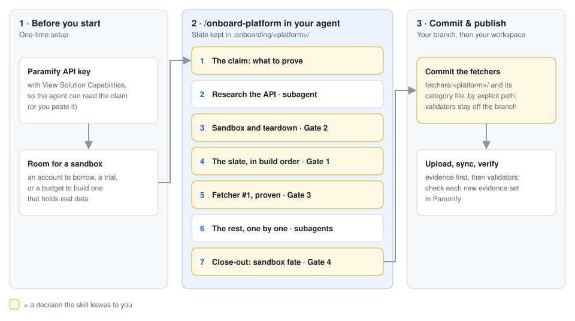
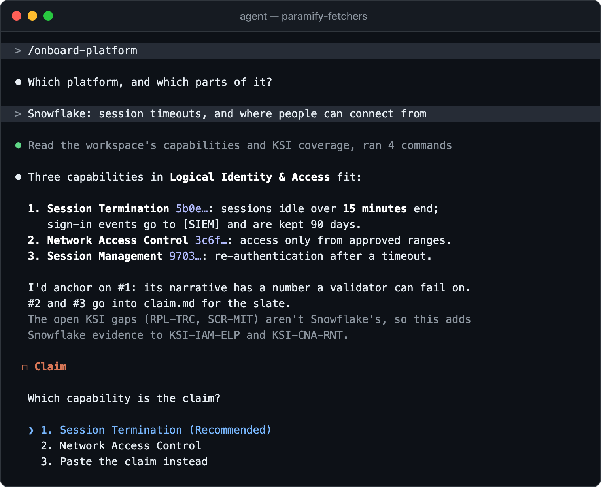
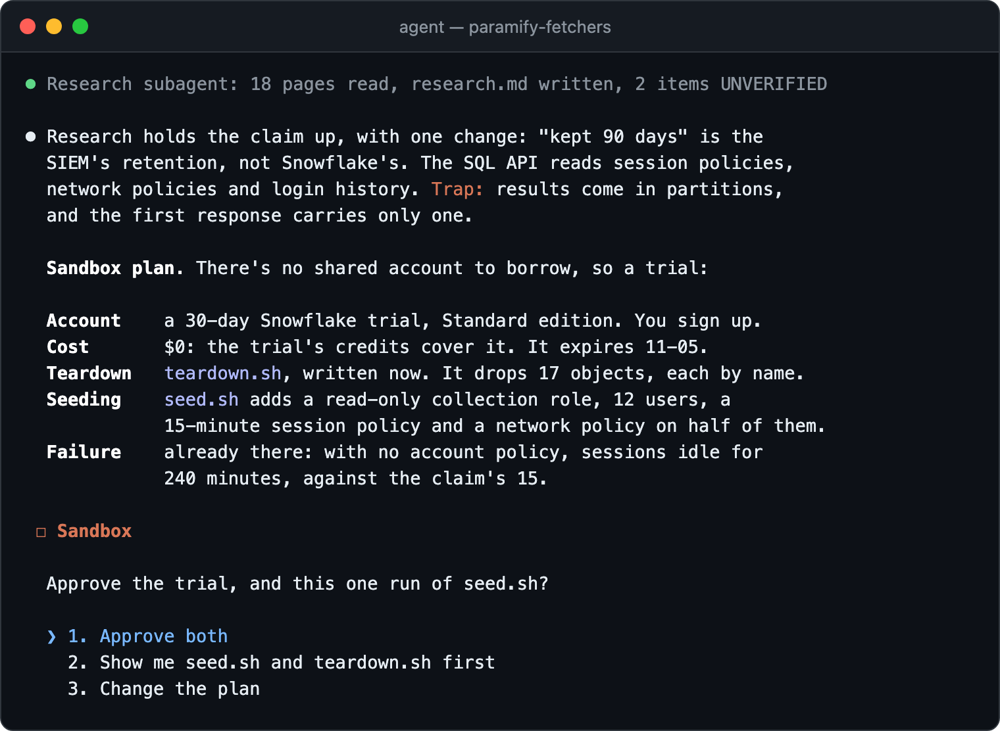
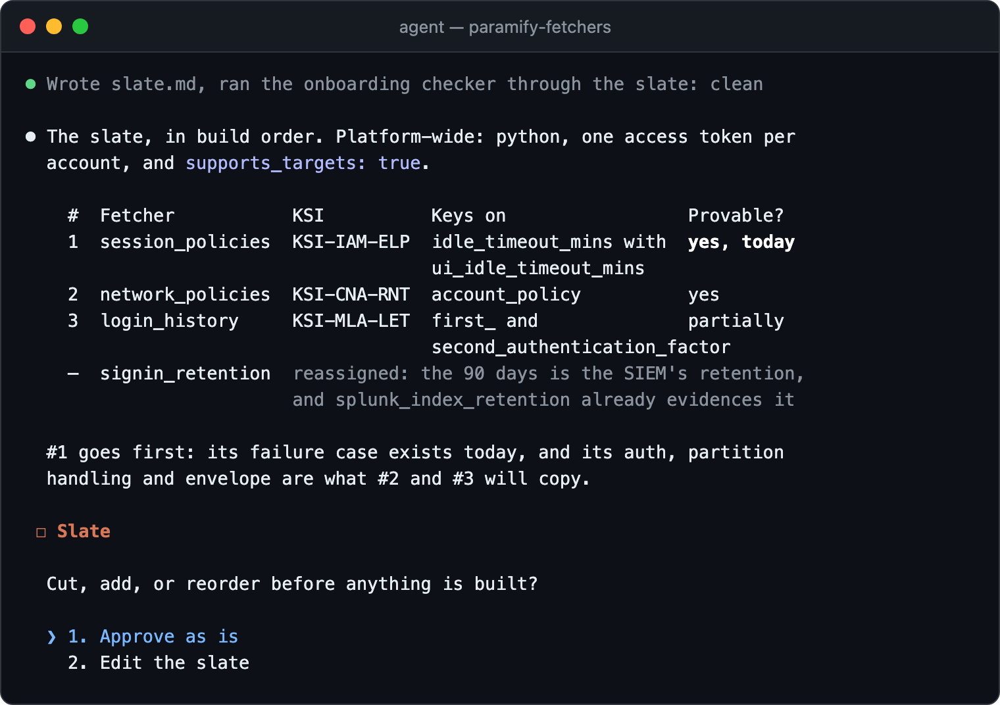
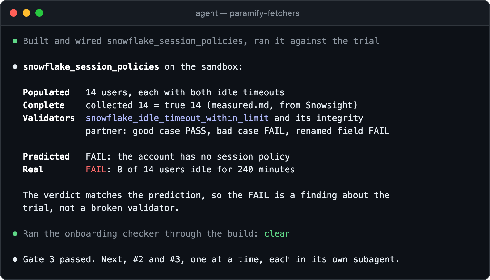
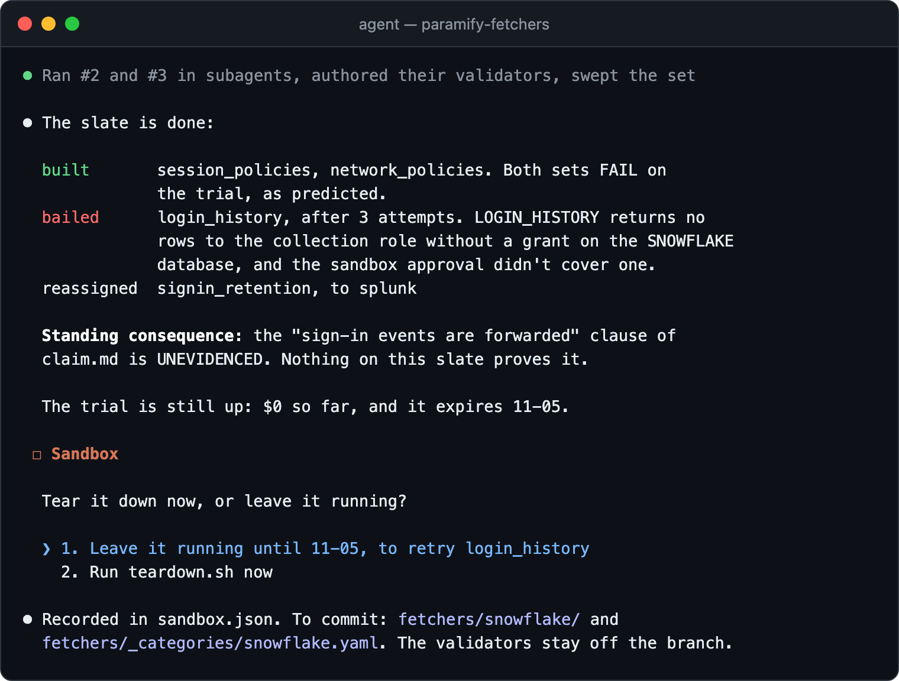
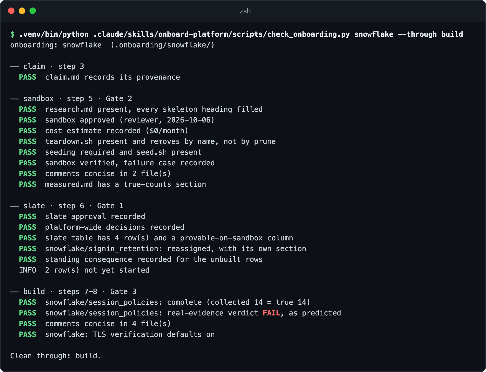
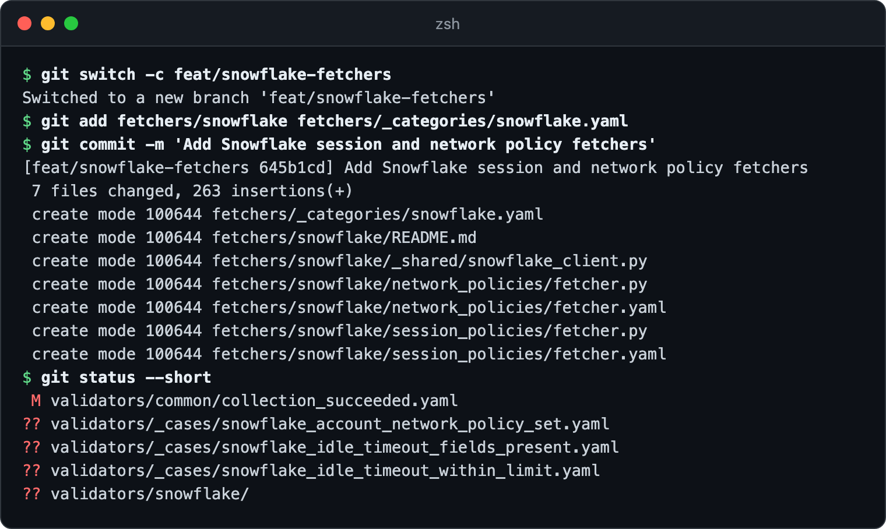

# Onboarding a new platform with `/onboard-platform`

`onboard-platform` takes a platform that has no fetchers yet and leaves you
with a slate of them, each proven against real data. Your AI agent researches
the platform's API, stands up a sandbox, and builds one fetcher end to end
before it builds the rest. You make the call at each gate. At the end you
commit the fetchers and publish their evidence and validators to Paramify.



**You need:** [the repo installed](../README.md#install) ·
[an AI agent, run from the repo root](../README.md#drive-it-with-an-ai-agent) ·
a Paramify API key with **View Solution Capabilities**
([key setup](suggest_validator_guide.md#1-get-a-paramify-api-key)) ·
somewhere to put a sandbox: an account to borrow, a trial, or a budget

Adding one more fetcher to a platform that already has some? Use
[`create-fetcher`](../.claude/skills/create-fetcher/SKILL.md) on its own.

---

## 1. Run the skill

In your AI agent, run `/onboard-platform`, or say *"we need Snowflake
coverage"*. The screenshots are an example session for Snowflake.

**Steps 1–3: you pick the claim.** Name the platform and the parts you care
about. The agent recommends the capability whose narrative carries a number,
because a validator needs something it can fail on. **Confirm it, or paste the
claim** if your workspace's capabilities carry no narrative
([why](platform_onboarding.md#where-the-claim-comes-from)).



**Steps 4–5: you approve the sandbox.** A subagent researches the API. The
agent then proposes the cheapest sandbox, with a cost, a teardown script
written before anything exists, and a failure case. **You approve the plan,
and every run of its seed script separately.**



**Step 6: you cut the slate.** Each row names the field its validator will key
on and whether this sandbox can prove it. A row that won't be built is marked
bailed, parked, cut, or reassigned
([what each means](../.claude/skills/onboard-platform/SKILL.md#a-row-that-isnt-built-is-one-of-four-things)).
**Nothing is built until you approve it.**



**Step 7: you check the proof.** Fetcher #1 must collect the same number of
objects as an independent count, and its validator must have been proven to
fail. The agent predicts the real verdict before scoring it. **A surprise in
either direction gets resolved before any sibling is built**
([why one first](platform_onboarding.md#the-gates)).



**Steps 8–10 and close-out: you decide the sandbox's fate.** Subagents build
the rest one at a time and author their validators. The agent reports what
wasn't built and any clause of the claim nothing evidences. **The onboarding
isn't done until you say whether the sandbox stays up.**



---

## 2. Check a gate yourself

The agent keeps its state in `.onboarding/<platform>/`, which is gitignored
([what's in it](platform_onboarding.md#state-on-disk)), and runs a checker over
it at every gate. Run it yourself before you let the slate fan out.
`--through` stops at a gate's stage. The last line names the first blocked
stage, which is also where a later session resumes.



<details><summary>Copy the command</summary>

```bash
.venv/bin/python .claude/skills/onboard-platform/scripts/check_onboarding.py <platform> --through build
```
</details>

It checks that each decision was recorded, not that it was right. Read the
files too. Without `--through`, it checks every stage, and a finished
onboarding reads *Clean through: close.*

## 3. Commit the fetchers, not the validators

In the public repo, commit only `fetchers/<platform>/` and its category file,
by explicit path, on a branch cut from `main`. New validators, and any edit to
one already in `main`, stay off the branch
([why](platform_onboarding.md#the-constraints)). The agent keeps a copy of them
in `.onboarding/<platform>/validators/`.



<details><summary>Copy the commands</summary>

```bash
git switch -c feat/<platform>-fetchers
git add fetchers/<platform> fetchers/_categories/<platform>.yaml
git commit -m "Add <Platform> fetchers"
git status --short
```
</details>

**Working in your own private copy?** You may commit the validators too
([private copy](private_mirror_workflow.md#4-organizing-your-work)).

## 4. Publish and verify

Ask the agent to upload a run and sync the validators, then check each new
evidence set in Paramify. Both work as in
[the validator guide](suggest_validator_guide.md#4-publish-to-paramify),
including attaching the shared `collection_succeeded` by hand.

---

## Troubleshooting

| Symptom | Fix |
|---|---|
| The checker ends `blocked at <stage>` | That gate hasn't passed. Fix each FAIL it lists, then ask the agent to resume. |
| The research subagent ran long or never returned | Don't re-run it. Have the agent read the partial `research.md` and re-brief for the gaps ([recovery](../.claude/skills/onboard-platform/references/researching.md#when-the-subagent-runs-long-or-never-comes-back)). |
| `INCOMPLETE — collected N of M` | A default page size or a user-scoped path truncated the collection. Fix it in the shared client, not by publishing it. |
| `predicted FAIL but got PASS` (or the reverse) | The tenant, the evidence, or the validator isn't what you think. Resolve it and record `surprise_resolved:` before fanning out. |
| `validator file(s) in this branch's commits` | Rebuild the branch from `main` with fetcher paths only. A later delete still carries them in a non-squash merge. |
| `no teardown_decision in sandbox.json` | Tell the agent whether the sandbox stays up. A running one needs a review date. |
| You rebuilt a torn-down sandbox | It's a new sandbox: Gates 2 and 4 apply again ([re-provisioning](../.claude/skills/onboard-platform/SKILL.md#closing-out--the-slate-is-not-done-until-the-sandbox-has-a-decision)). |

**More detail:** [the skill](../.claude/skills/onboard-platform/SKILL.md) ·
[why this flow exists](platform_onboarding.md#what-this-is-for) ·
[the four gates](platform_onboarding.md#the-gates) ·
[the constraints](platform_onboarding.md#the-constraints) ·
[state on disk](platform_onboarding.md#state-on-disk) ·
[running it without an agent](platform_onboarding.md#running-it-without-an-agent) ·
[non-goals](platform_onboarding.md#non-goals)
