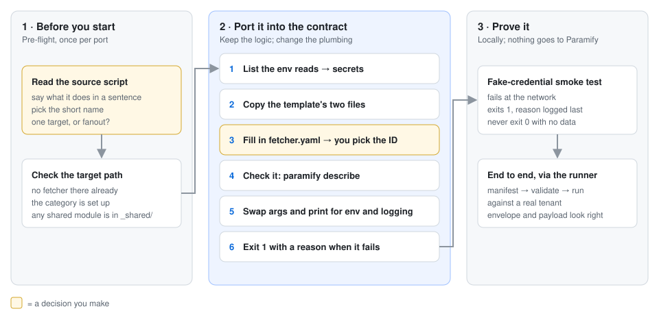
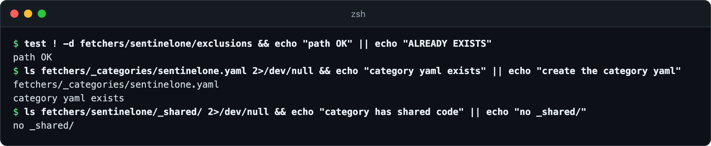
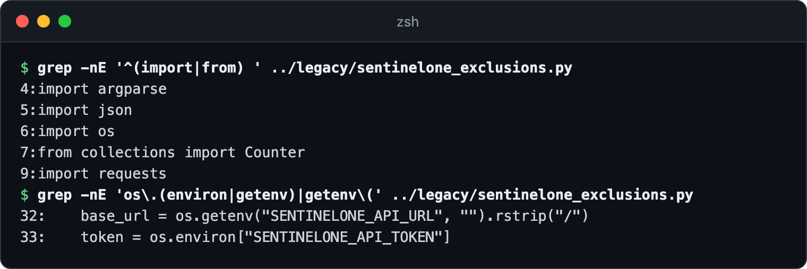
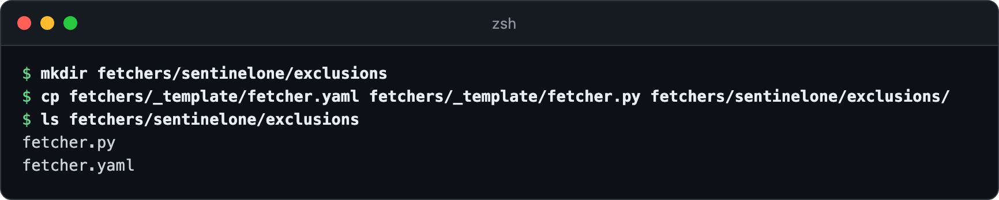
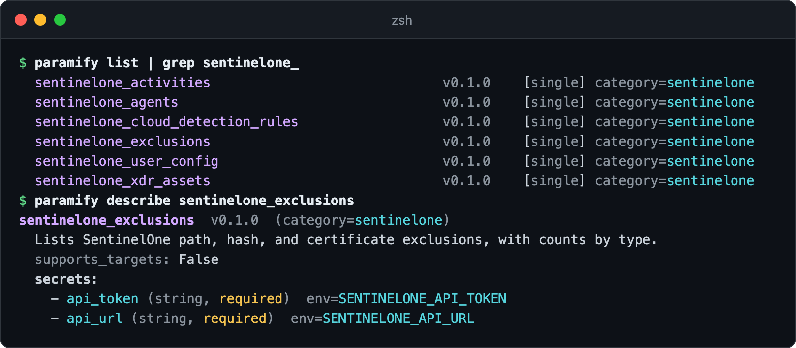
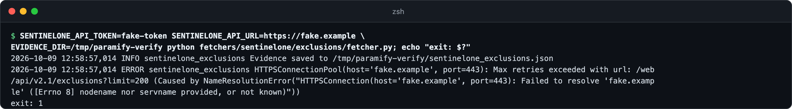
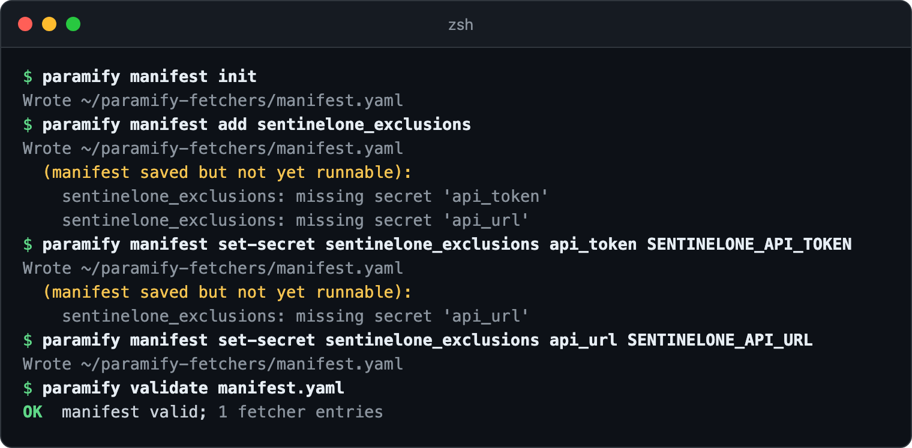
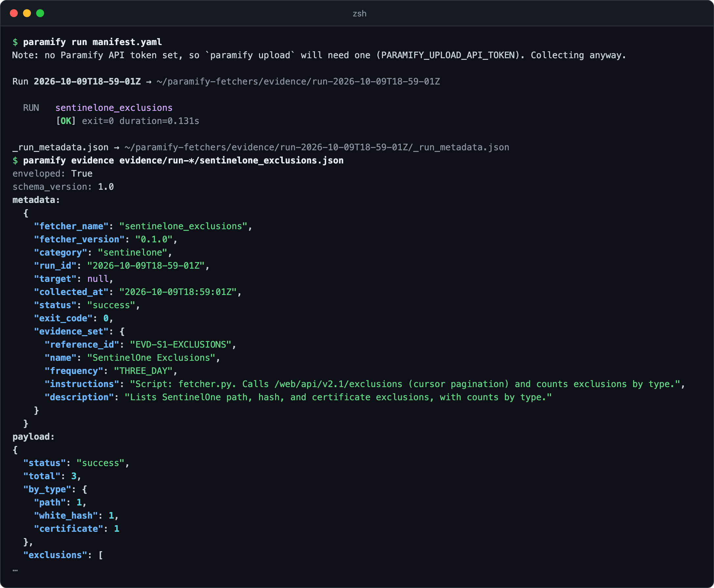

# Porting a script into the fetcher contract

A port moves a working collection script, such as one from Paramify's older
`evidence-fetchers` repo, into this repo as a fetcher. Port it as-is: keep what
it collects and how, and change only the plumbing around it
([why](porting_playbook.md)). You end with a fetcher the runner discovers, runs,
and wraps in an envelope. The running example ports a made-up script,
`sentinelone_exclusions.py`, to the fetcher `sentinelone_exclusions`.



**You need:** [the repo installed](../README.md#install) · the source script,
plus any shared module it imports · credentials for a real tenant, for step 7

No script to start from? [Write a new fetcher](authoring_a_fetcher.md). If the
source exports scanner findings (Nessus, Wiz), write an
[issue-report fetcher](issue_report_fetchers.md) instead. Your AI agent can do
the port: the `create-fetcher` skill follows these steps
([AI agent](../README.md#drive-it-with-an-ai-agent)).

---

## 1. Check the source and the target path

Say in one sentence what the script does, and pick its names: the directory is
the short name (`exclusions`), and `name:` adds the category
(`sentinelone_exclusions`). A script that loops over projects, regions, or hosts
becomes a [fanout fetcher](authoring_a_fetcher.md#fanout-when-one-fetcher-should-run-against-n-targets).
Then check that nothing is in the way:



<details><summary>Copy the commands</summary>

```bash
test ! -d fetchers/<category>/<short_name> && echo "path OK" || echo "ALREADY EXISTS"
ls fetchers/_categories/<category>.yaml 2>/dev/null && echo "category yaml exists" || echo "create the category yaml"
ls fetchers/<category>/_shared/ 2>/dev/null && echo "category has shared code" || echo "no _shared/"
```
</details>

A new category needs [one-time setup](porting_playbook.md#per-category-setup-once-per-category)
first. Porting from `evidence-fetchers` also has
[source checks](porting_playbook.md#pre-flight-before-every-port) that need
access to that private repo.

## 2. List the env vars it reads

Each env var the script reads becomes a `secrets:` entry in step 4. Check its
imports too: a shared module's env reads count, and the module moves to
`fetchers/<category>/_shared/` unchanged. This one imports none.



<details><summary>Copy the commands</summary>

```bash
grep -nE '^(import|from) ' <source script>
grep -nE 'os\.(environ|getenv)|getenv\(' <source script>
```
</details>

## 3. Create the directory

Name the directory with the short name only. Copy just the template's
`fetcher.yaml` and `fetcher.py`; the [reference ports](porting_playbook.md#reference-ports)
ship nothing else. A bash port starts `fetcher.sh` from the
[bash skeleton](porting_playbook.md#bash-fetchersh) instead.



<details><summary>Copy the commands</summary>

```bash
mkdir fetchers/<category>/<short_name>
cp fetchers/_template/fetcher.yaml fetchers/_template/fetcher.py fetchers/<category>/<short_name>/
ls fetchers/<category>/<short_name>
```
</details>

## 4. Fill in `fetcher.yaml`

Fill it in as for a [new fetcher](authoring_a_fetcher.md#fetcheryaml), with
`version: 0.1.0` and one secret per env var from step 2. The template has no
`evidence_set` block, so add one. Copy its values from the source's catalog
entry if it has one; if not, make up a stable `reference_id`.
**Don't base `reference_id` on a KSI ID:** KSI IDs get renumbered, and changing
`reference_id` orphans the evidence set in every workspace
([why](porting_playbook.md#4-fill-in-fetcheryaml)).

```yaml
name: sentinelone_exclusions
version: 0.1.0
description: Lists SentinelOne path, hash, and certificate exclusions, with counts by type.
category: sentinelone

supports_targets: false

runtime:
  type: python
  entry: fetcher.py

output:
  type: json
  path: sentinelone_exclusions.json

secrets:
  - name: api_token
    env: SENTINELONE_API_TOKEN
  - name: api_url
    env: SENTINELONE_API_URL

evidence_set:
  reference_id: EVD-S1-EXCLUSIONS
  name: SentinelOne Exclusions
  instructions: 'Script: fetcher.py. Calls /web/api/v2.1/exclusions (cursor pagination) and counts exclusions by type.'
```

Check that discovery reads it the way you meant:



<details><summary>Copy the commands</summary>

```bash
paramify list | grep <category>_
paramify describe <category>_<short_name>
```
</details>

## 5. Write the entry script

Move the collection code into the entry script unchanged, and rebuild only `main()`
on the [Python or bash skeleton](porting_playbook.md#5-write-the-entry-script): read
`EVIDENCE_DIR` instead of an `--output-dir` flag, log instead of `print`, and
exit 1 with `report_failure` when collection fails
([what not to port](porting_playbook.md#what-to-deliberately-not-do) ·
[exit codes](porting_playbook.md#exit-code-convention) ·
[say why you failed](porting_playbook.md#say-why-you-failed)).
The example's whole change, with `get_exclusions` untouched:

```diff
--- sentinelone_exclusions.py
+++ fetchers/sentinelone/exclusions/fetcher.py
@@ -3,8 +3,18 @@
 
-import argparse
 import json
+import logging
 import os
+import sys
 from collections import Counter
+from pathlib import Path
 
 import requests
+from dotenv import load_dotenv
+
+SCRIPT_DIR = Path(__file__).resolve().parent
+sys.path.insert(0, str(SCRIPT_DIR.parents[1] / "_lib"))
+
+from fetcher_status import report_failure  # noqa: E402
+
+logger = logging.getLogger("sentinelone_exclusions")
 
@@ -26,6 +36,11 @@ def get_exclusions(base_url, token):
 
-def main():
-    parser = argparse.ArgumentParser()
-    parser.add_argument("--output-dir", default="evidence")
-    args = parser.parse_args()
+def main() -> int:
+    logging.basicConfig(
+        level=os.environ.get("LOG_LEVEL", "INFO"),
+        format="%(asctime)s %(levelname)s %(name)s %(message)s",
+    )
+    load_dotenv()
+
+    output_dir = Path(os.environ.get("EVIDENCE_DIR", "./evidence"))
+    output_dir.mkdir(parents=True, exist_ok=True)
 
@@ -43,10 +58,13 @@ def main():
     except Exception as e:
-        print(f"Error fetching exclusions: {e}")
         result = {"status": "error", "message": str(e), "exclusions": []}
 
-    os.makedirs(args.output_dir, exist_ok=True)
-    path = os.path.join(args.output_dir, "sentinelone_exclusions.json")
-    with open(path, "w") as f:
+    output_path = output_dir / "sentinelone_exclusions.json"
+    with open(output_path, "w") as f:
         json.dump(result, f, indent=2)
-    print(f"Wrote {path}")
+    logger.info("Evidence saved to %s", output_path)
+
+    if result["status"] != "success":
+        report_failure(result["message"])
+        return 1
+    return 0
 
@@ -54,2 +72,2 @@ def main():
 if __name__ == "__main__":
-    main()
+    sys.exit(main())
```

A bash port also needs `chmod +x fetcher.sh`.

## 6. Smoke-test it with fake credentials

Before you touch a real tenant, run it with fake values. The wiring works if it
fails at the network: exit 1, with the reason as the last log line.



<details><summary>Copy the command</summary>

```bash
<ENV_VAR>=fake-token <ANOTHER_ENV_VAR>=https://fake.example \
EVIDENCE_DIR=/tmp/paramify-verify python fetchers/<category>/<short_name>/fetcher.py; echo "exit: $?"
```
</details>

## 7. Run it end to end

Export the real credentials in the shell you run from, or have your secret
manager set them. Then [build a manifest](../README.md#building-a-manifest) for
the fetcher:



<details><summary>Copy the commands</summary>

```bash
paramify manifest init
paramify manifest add <category>_<short_name>
paramify manifest set-secret <category>_<short_name> <secret> <ENV_VAR>   # once per secret
paramify validate manifest.yaml
```
</details>

Run it, then open the evidence file. The runner wraps it in an
[envelope](envelope_design.md#field-reference-metadata): `metadata` should carry
your `evidence_set`, and `payload` should match what the old script wrote. These
pictures ran against a local stand-in for the SentinelOne API, with synthetic
data.



<details><summary>Copy the commands</summary>

```bash
paramify run manifest.yaml
paramify evidence evidence/run-<timestamp>/<category>_<short_name>.json
```
</details>

Next, [upload the run](../README.md#collect-then-upload) and
[write validators](suggest_validator_guide.md) for it.

---

## Troubleshooting

| Symptom | Fix |
|---|---|
| `paramify list` fails with `schema validation failed` | The message names the file and the field. Fix `fetcher.yaml` against the [field list](porting_playbook.md#4-fill-in-fetcheryaml). |
| `ModuleNotFoundError` in the smoke test | Fix the imports: put the `_shared/` directory on `sys.path` as the [skeleton](porting_playbook.md#python-fetcherpy) does. |
| `Missing required env var`, or a `KeyError` naming one | The env var name in `fetcher.yaml` or your test command doesn't match the script. Re-check [step 2](#2-list-the-env-vars-it-reads). |
| The smoke test exits 0 with empty data | The script catches the failure and reports success, as the example's source did. Exit 1 with `report_failure` ([step 5](#5-write-the-entry-script)). |
| `Secret reference ${env:…} could not be resolved` | The runner reads secrets from its own environment, not from `.env`. Export them in the shell you run from. |
| A failed run's `metadata.error` reads "Evidence saved to …" | Nothing reported the reason, so the runner used the end of stderr. Call `report_failure` after the saved line. |

**More detail:** [known interim violations](porting_playbook.md#known-interim-violations) ·
[AWS fanout shape](porting_playbook.md#aws-fanout-shape) ·
[reference ports](porting_playbook.md#reference-ports) ·
[the fetcher contract](fetcher_contract.md) ·
[design rationale](design.md)
