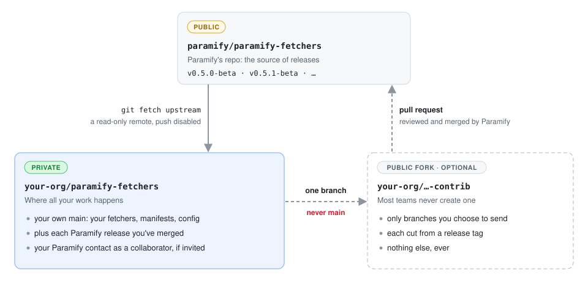
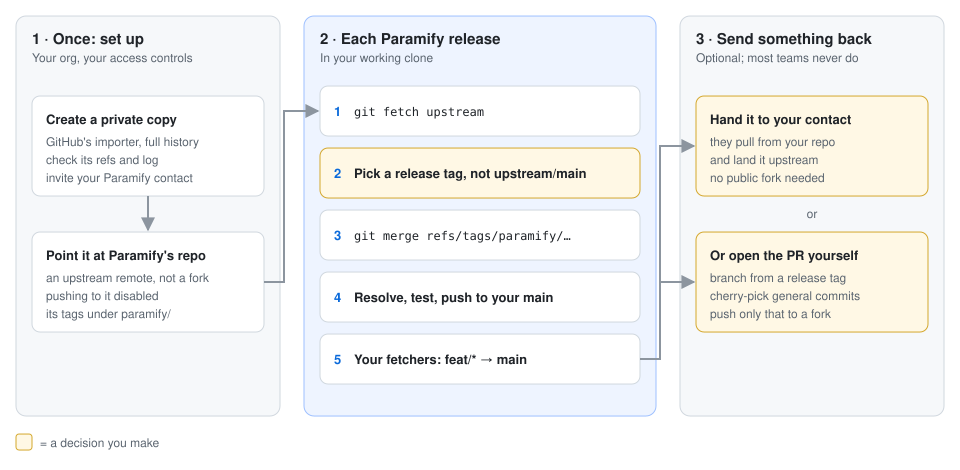
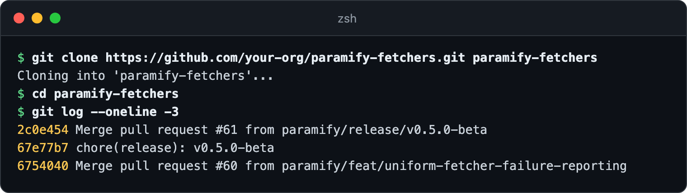
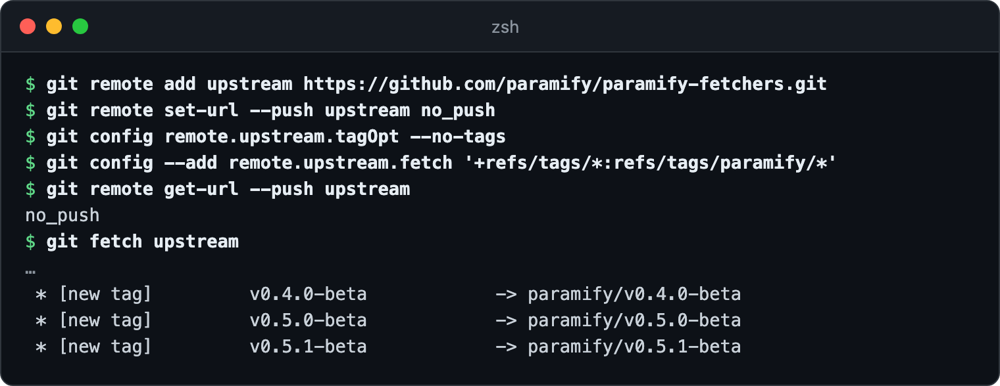
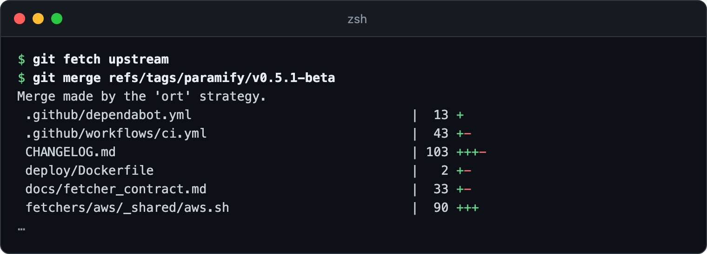
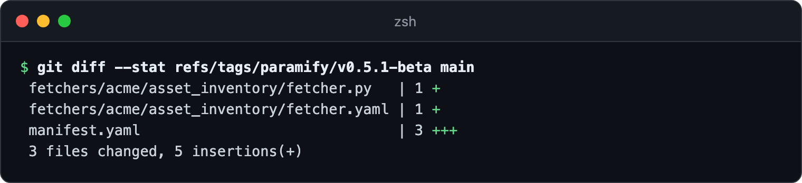
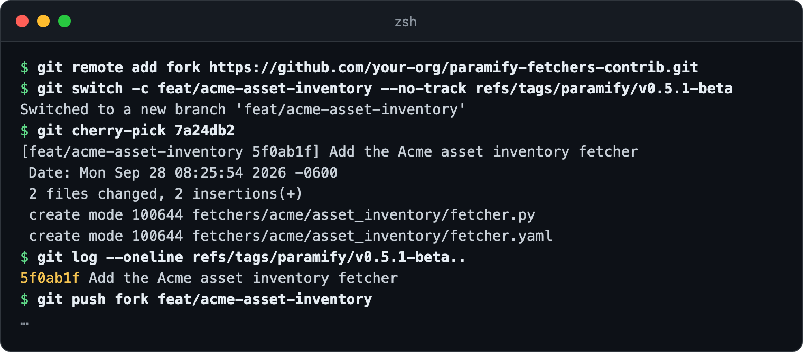

# Working in a private copy of `paramify-fetchers`

Copy our repo into a private repo in your GitHub organization and add ours as a
read-only remote. You build your own fetchers there and merge each Paramify
release as it ships. Don't fork it: a fork of a public repo is public
([why not a fork](private_mirror_workflow.md#why-not-a-fork)).





**You need:** git · a GitHub organization where you can create private repos

---

## 1. Create your private copy

Use GitHub's importer (**+ → Import repository**) with the source
`https://github.com/paramify/paramify-fetchers.git`, and make the new repo private.
It copies the full history, which every later merge depends on
([command-line alternative](private_mirror_workflow.md#alternative-the-command-line)).
Then clone your copy:



<details><summary>Copy the commands</summary>

```bash
git clone https://github.com/your-org/paramify-fetchers.git paramify-fetchers
cd paramify-fetchers
git log --oneline -3
```
</details>

## 2. Point it at Paramify's repo

Add ours as `upstream`. Pushing to it is disabled, and our tags land under
`paramify/` so they never collide with yours
([why](private_mirror_workflow.md#2-point-your-copy-at-paramifys-repo)).



<details><summary>Copy the commands</summary>

```bash
git remote add upstream https://github.com/paramify/paramify-fetchers.git
git remote set-url --push upstream no_push
git config remote.upstream.tagOpt --no-tags
git config --add remote.upstream.fetch '+refs/tags/*:refs/tags/paramify/*'
git remote get-url --push upstream
git fetch upstream
```
</details>

## 3. Merge each Paramify release

When we publish a release, fetch and merge its tag. Then resolve any conflicts,
run the tests, and push to your `main`. Merge tags, not `upstream/main`: a tag is
a reviewed point your change control can cite
([how releases are cut](releasing.md)).



<details><summary>Copy the commands</summary>

```bash
git fetch upstream
git merge refs/tags/paramify/v0.5.1-beta
```
</details>

## 4. Keep your work on your own `main`

Build on `feat/*` branches and merge them into your `main` by pull request. Your
work is mostly new files under `fetchers/<category>/`, so release merges rarely
conflict. This shows everything you've changed since a release:



<details><summary>Copy the command</summary>

```bash
git diff --stat refs/tags/paramify/v0.5.1-beta main
```
</details>

**Commit your manifests.** They name secrets without holding them
([secret references](run_manifest_reference.md#secret-references)). `.gitignore`
ignores `manifests/*` despite its comment, so keep yours at the repo root or
`git add -f` them. **Don't bump our version**, or every release merge conflicts
([why](private_mirror_workflow.md#5-two-things-that-will-fight-you)).

## 5. Send something back (optional)

Hand general work to your Paramify contact, or open a pull request yourself from
a fork named differently from your private copy. Push only a branch cut from a
release tag, so it can't contain your private commits:



<details><summary>Copy the commands</summary>

```bash
git remote add fork https://github.com/your-org/paramify-fetchers-contrib.git
git switch -c feat/acme-asset-inventory --no-track refs/tags/paramify/v0.5.1-beta
git cherry-pick <each general-purpose commit>
git log --oneline refs/tags/paramify/v0.5.1-beta..
git push fork feat/acme-asset-inventory
```
</details>

> **Never push your `main` to `fork`.** That publishes your whole private history,
> permanently.

---

## Troubleshooting

| Symptom | Fix |
|---|---|
| Every file conflicts on your first merge | Your copy doesn't share our history. Re-create it with the importer ([step 1](#1-create-your-private-copy)). |
| A fresh clone warns `remote HEAD refers to nonexistent ref` and has no commits | [Set your repo's default branch](https://docs.github.com/en/repositories/configuring-branches-and-merges-in-your-repository/managing-branches-in-your-repository/changing-the-default-branch) to `main` and clone again. |
| `not something we can merge` | Merge `refs/tags/paramify/<tag>`, not `upstream/<tag>`. |
| No `paramify/` tags after a fetch, or `would clobber existing tag` | The tag mapping is missing. Re-run [step 2](#2-point-it-at-paramifys-repo)'s last `git config` line and fetch again. |

**More detail:** [why not a fork](private_mirror_workflow.md#why-not-a-fork) ·
[what Paramify commits to](private_mirror_workflow.md#what-paramify-commits-to) ·
[security review Q&A](private_mirror_workflow.md#questions-your-security-review-will-ask) ·
[invite your Paramify contact](https://docs.github.com/en/organizations/managing-user-access-to-your-organizations-repositories/managing-outside-collaborators/adding-outside-collaborators-to-repositories-in-your-organization)
