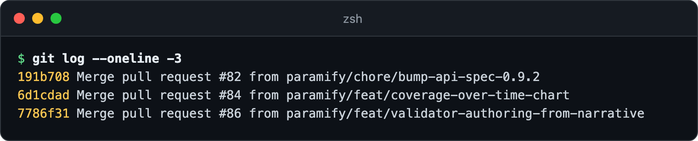
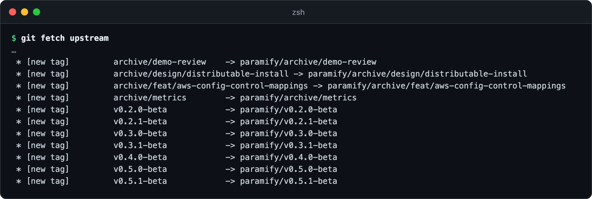
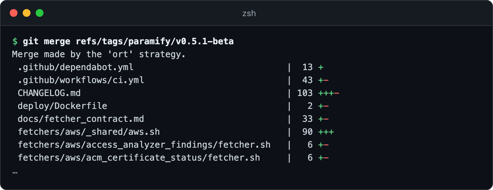
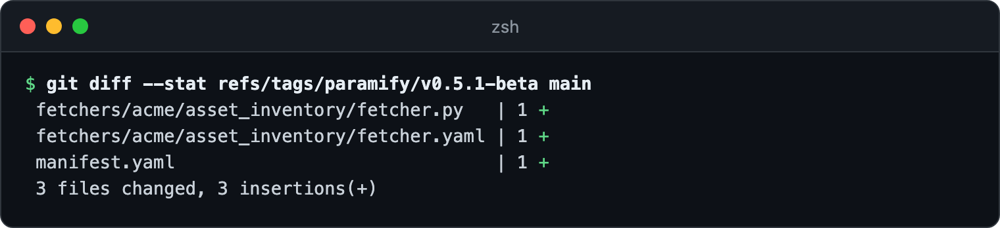

# Working in a private copy of `paramify-fetchers`

To build fetchers for your own environment without publishing them, and still
get Paramify's releases, mirror this repo into a private repo and add ours as
a read-only git remote. Don't fork it: the remote is what delivers our
updates, and a fork makes your work public.


**You need:** git · a GitHub organization where you can create private repos

**Why not a fork.** A fork of a public repo is public, and
[GitHub won't change a fork's visibility](https://docs.github.com/en/pull-requests/collaborating-with-pull-requests/working-with-forks/about-permissions-and-visibility-of-forks#visibility-of-forks).
[Its commits stay readable from our repo](https://docs.github.com/en/pull-requests/collaborating-with-pull-requests/working-with-forks/about-permissions-and-visibility-of-forks#important-security-considerations)
even after you delete the fork, so a credential pushed there can't be taken
back. And fetcher code maps your environment: tenant IDs, endpoint names, and
the scope of each control.

---

## 1. Create your private copy

Import our repo with
[GitHub's importer](https://docs.github.com/en/migrations/importing-source-code/using-github-importer/importing-a-repository-with-github-importer)
(**+ → Import repository**), from
`https://github.com/paramify/paramify-fetchers.git`, and make the new repo
private. **Keep the full history.** A copy of just the files shares no commits
with ours, so every update would conflict in every file.

If your GitHub instance can't import from outside URLs, follow
[GitHub's mirroring steps](https://docs.github.com/en/repositories/creating-and-managing-repositories/duplicating-a-repository#mirroring-a-repository)
in a throwaway directory, then delete it. `git push --mirror` overwrites and
deletes refs at the destination, so never run it from your working clone.

**Check the copy** against ours:

```bash
git ls-remote https://github.com/paramify/paramify-fetchers.git | grep -v refs/pull/ > paramify.refs
git ls-remote https://github.com/your-org/paramify-fetchers.git | grep -v refs/pull/ > yours.refs
diff paramify.refs yours.refs
```

GitHub makes `refs/pull/*` per repo and never copies them, so they're left
out. Expect no output, or `<` lines only for branches we've pushed since your
import. **If `HEAD` shows up,
[set your default branch](https://docs.github.com/en/repositories/configuring-branches-and-merges-in-your-repository/managing-branches-in-your-repository/changing-the-default-branch)
to `main` before anyone clones.** Otherwise a clone lands on an empty branch,
and its first commit starts a history unrelated to ours.

Then clone your repo. That's your working clone from here on, and
`git log --oneline -3` in it should show our commits:



To get our help in the repo,
[invite your Paramify contact](https://docs.github.com/en/organizations/managing-user-access-to-your-organizations-repositories/managing-outside-collaborators/adding-outside-collaborators-to-repositories-in-your-organization)
as an outside collaborator.

## 2. Point it at Paramify's repo

In your working clone:

```bash
git remote add upstream https://github.com/paramify/paramify-fetchers.git
git remote set-url --push upstream no_push
git config remote.upstream.tagOpt --no-tags
git config --add remote.upstream.fetch '+refs/tags/*:refs/tags/paramify/*'
```

**Push guard (line 2).** A push to `upstream` fails with
`fatal: 'no_push' does not appear to be a git repository` instead of
publishing your branches.

**Tag namespace (lines 3–4).** Git keeps all tags in one list. Without the
namespace, if you tag an internal `v0.6.0-beta` and we publish one too,
`git fetch upstream --tags` rejects ours with a single
`would clobber existing tag` line among the branch updates. After that,
`git merge v0.6.0-beta` merges your own commit. With the namespace, our tags
land under `paramify/`. Check with `git fetch upstream`:



## 3. Merge Paramify releases

When we publish a release, fetch and merge its tag:

```bash
git fetch upstream
git merge refs/tags/paramify/v0.5.1-beta
```

Resolve any conflicts, run the tests, and push to your `main`.



**Use the full `refs/tags/paramify/…` name.** There's no
`upstream/v0.5.1-beta`: that shorthand only works for branches.

**Merge release tags, not `upstream/main`.** Releases are
[curated, not cut on every merge](releasing.md), so a tag is a reviewed,
fixed point your change control can cite. `upstream/main` keeps moving.

## 4. Organize your work

Work on your own `main`. It's your default branch, and it holds your
fetchers, your manifests, and the releases you've merged. Build each change
on a `feat/*` branch and merge it with a pull request. Don't keep `main` as a
pristine copy of ours: the release tags already mark our code, and a default
branch nobody uses sends pull requests to the wrong place.

Most of your work is new files under
[`fetchers/<category>/<name>/`](../README.md#repository-layout), so conflicts
are rare, and only hit shared framework code you've edited. To see everything
you've changed since a release (before an audit, say), run
`git diff --stat refs/tags/paramify/v0.5.1-beta main`:



**Commit your manifests.** A manifest names its secrets without holding them
(`${env:VAR}` is [resolved at run time](run_manifest_reference.md#secret-references)),
and we ship nothing at `./manifest.yaml`, so yours can't conflict with ours.
Start from [`example_manifest.yaml`](../example_manifest.yaml) or
[`examples/`](../examples). **`.gitignore` ignores `manifests/*`,** even
though its own comment says manifests aren't ignored. Keep manifests at the
repo root, or `git add -f` each one under `manifests/` once.

**Don't bump the version.** If you edit `pyproject.toml` or `CHANGELOG.md`,
every release merge conflicts there. For a build identifier of your own, add
a local suffix like `0.5.1+yourorg.3`.

## 5. Send something back (optional)

Most of your work stays private. For something general, like a framework fix
or a fetcher other teams would want, you have two options.

**Simplest: hand it to your Paramify contact.** They pull it from your repo
and land it upstream. You never need a fork, which would show up in our
public forks list and tell anyone looking that you're building a FedRAMP
evidence pipeline.

**Or open the pull request yourself.** Fork our repo under a different name
from your private one. Then push only a branch cut from a release tag:

```bash
git remote add fork https://github.com/your-org/paramify-fetchers-contrib.git
git switch -c feat/acme-asset-inventory refs/tags/paramify/v0.5.1-beta
git cherry-pick <each general-purpose commit>
git log --oneline refs/tags/paramify/v0.5.1-beta..
git push fork feat/acme-asset-inventory
```

That branch can't contain your private commits, because they were never in
its history. Strip tenant identifiers from what you cherry-pick. Before you
push, check that the log lists only what you mean to publish:


Then open the pull request against `paramify/paramify-fetchers`.

> **Never push your `main` to `fork`.** That publishes your entire private
> history, permanently. There's no undo.

---

## What Paramify commits to

Our published history is append-only: no force-pushes to `main`, and no
rewritten or moved tags, which would strand your work on commits our repo no
longer has. If a rewrite ever becomes unavoidable, we'll contact you with a
migration path first.

## For your security review

| Question | Answer |
|---|---|
| Does Paramify need access to our systems? | No. Only to your private repo, as an outside collaborator, if you invite us. |
| Do we need credentials to read Paramify's repo? | No. It's public, so `git fetch` needs no authentication. |
| Does any of our code leave our organization? | Only what you push to a public fork, which is optional. |
| How do we revoke Paramify's access? | Remove the outside collaborator. Your copy keeps working, since it only reads a public repo. |
| Where do secrets live? | Never in the repo. `.env` files are git-ignored, and manifests reference secrets by name, resolved from your secret store at run time. |

## Troubleshooting

| Symptom | Fix |
|---|---|
| Every file conflicts on your first merge | Your copy doesn't share our history. Re-create it with the importer ([step 1](#1-create-your-private-copy)). |
| A fresh clone warns `remote HEAD refers to nonexistent ref`, and `git log` says `does not have any commits yet` | Your repo's default branch points at a branch that doesn't exist. Set it to `main` and clone again. Don't commit in the broken clone. |
| `not something we can merge` | You merged `upstream/<tag>`. Merge `refs/tags/paramify/<tag>` instead. |
| No `refs/tags/paramify/…` after a fetch | The tag refspec is missing. Re-run the last line of [step 2](#2-point-it-at-paramifys-repo), then fetch again. |
| `! [rejected] … (would clobber existing tag)` | You fetched our tags without the namespace. Set it up ([step 2](#2-point-it-at-paramifys-repo)) and fetch again. |

**More detail:** [how releases are cut](releasing.md) ·
[versioning policy](versioning.md) ·
[writing a fetcher](authoring_a_fetcher.md)
