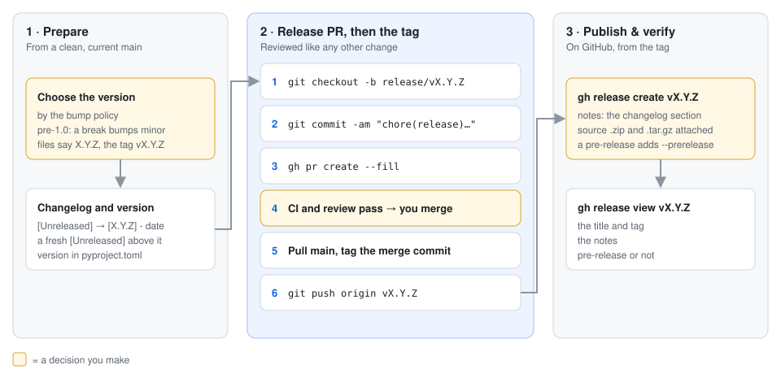
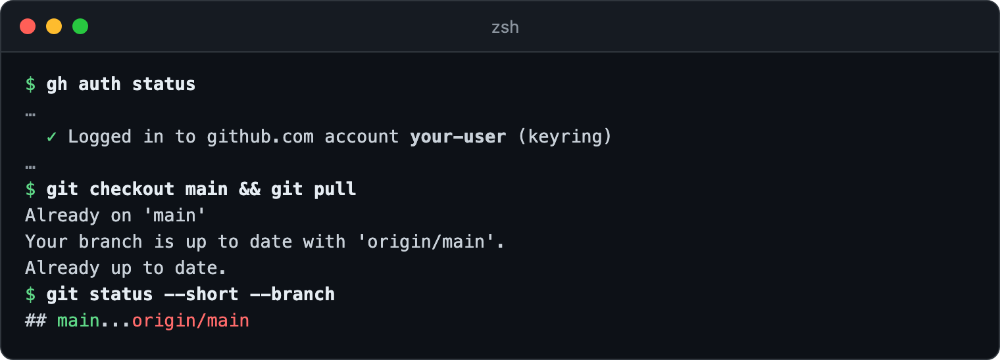
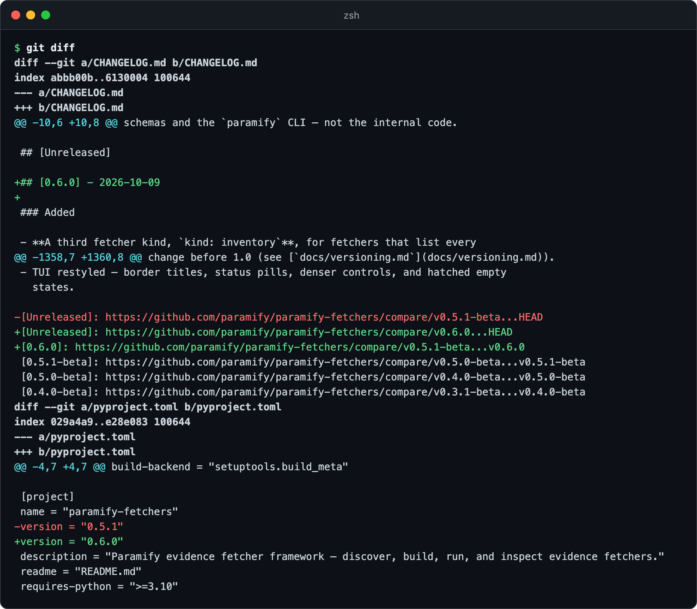
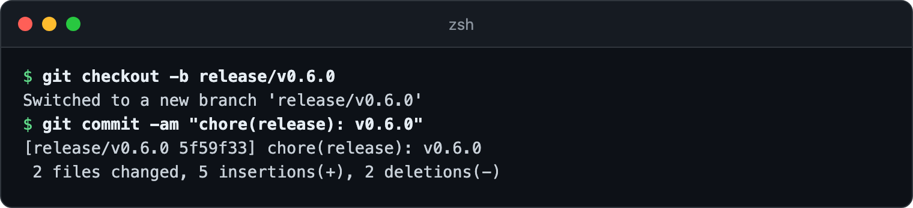
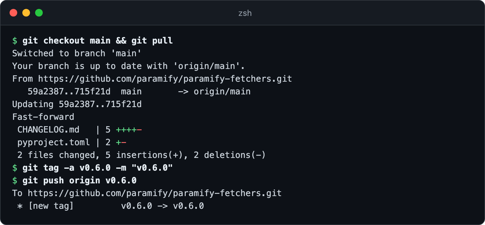
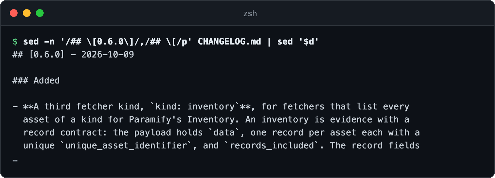
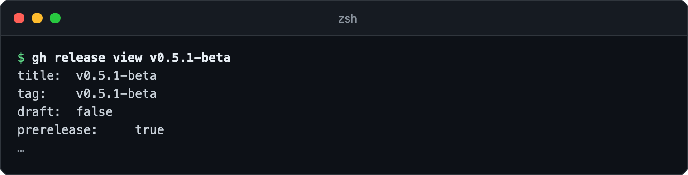

# Cutting a `paramify-fetchers` release

A release is a tag plus a GitHub Release, cut by hand. The pictures cut
`0.6.0` in a scratch copy.



**You need:** push access · [green CI](https://github.com/paramify/paramify-fetchers/actions) on `main` · a version from the [bump policy](versioning.md#bump-policy)

---

## 1. Start from a clean `main`

Confirm `gh` is signed in, then pull `main`.



<details><summary>Copy the commands</summary>

```bash
gh auth status
git checkout main && git pull
git status --short --branch
```
</details>

## 2. Update the changelog and version

In `CHANGELOG.md`, rename `## [Unreleased]` to `## [X.Y.Z] - <today>`, add a fresh one above it,
repoint the bottom links, and bump `pyproject.toml`. **Every release so far is
a pre-release** (`v0.5.1-beta`). If this one is too, write `X.Y.Z-beta`
everywhere but `pyproject.toml`, and add `--prerelease` in step 5
([pre-releases](releasing.md#pre-releases)).



<details><summary>Copy the link lines and the check</summary>

```markdown
[Unreleased]: https://github.com/paramify/paramify-fetchers/compare/vX.Y.Z...HEAD
[X.Y.Z]: https://github.com/paramify/paramify-fetchers/compare/vPREV...vX.Y.Z
```

```bash
git diff
```
</details>

## 3. Open the release PR

Open a PR so it passes CI and review, then merge it.



<details><summary>Copy the commands</summary>

```bash
git checkout -b release/vX.Y.Z
git commit -am "chore(release): vX.Y.Z"
gh pr create --fill
```
</details>

## 4. Tag the merge commit

Pull the merged `main`, then tag it.



<details><summary>Copy the commands</summary>

```bash
git checkout main && git pull
git tag -a vX.Y.Z -m "vX.Y.Z"
git push origin vX.Y.Z
```
</details>

## 5. Create the GitHub Release

Preview the notes, then create the release with them.



<details><summary>Copy the commands</summary>

```bash
sed -n '/## \[X.Y.Z\]/,/## \[/p' CHANGELOG.md | sed '$d'
gh release create vX.Y.Z --title "vX.Y.Z" --notes-file <(sed -n '/## \[X.Y.Z\]/,/## \[/p' CHANGELOG.md | sed '$d')
```
</details>

## 6. Check the release

Check the tag and notes. Here's the latest release:



<details><summary>Copy the command</summary>

```bash
gh release view vX.Y.Z
```
</details>

---

## Troubleshooting

| Symptom | Fix |
|---|---|
| The notes preview prints nothing | Match the `sed` pattern to the heading, including any `-beta`. |

**More detail:** [what a release doesn't touch](releasing.md#what-a-release-does-not-touch) ·
[release artifacts](releasing.md#artifacts) ·
[future automation](releasing.md#future-automation)
