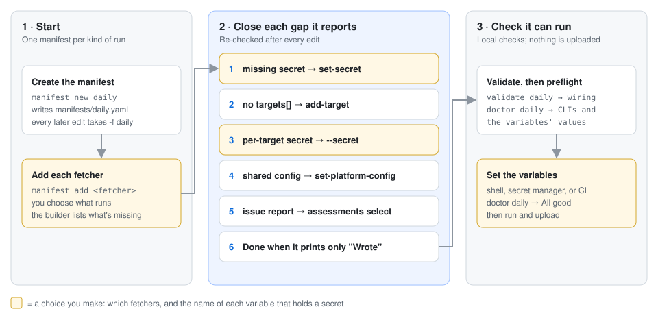
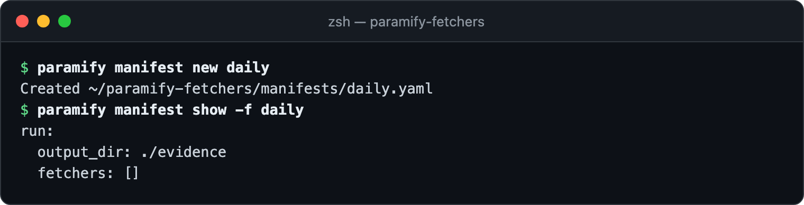
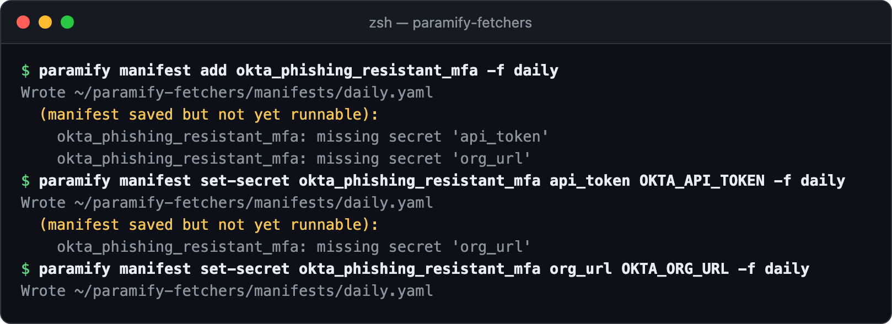
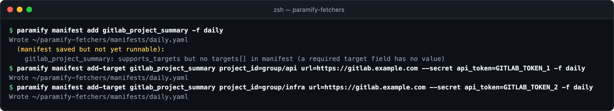
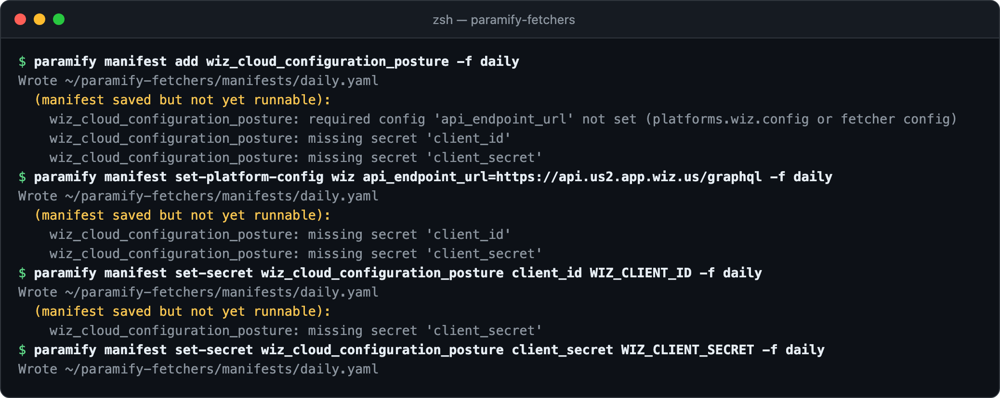
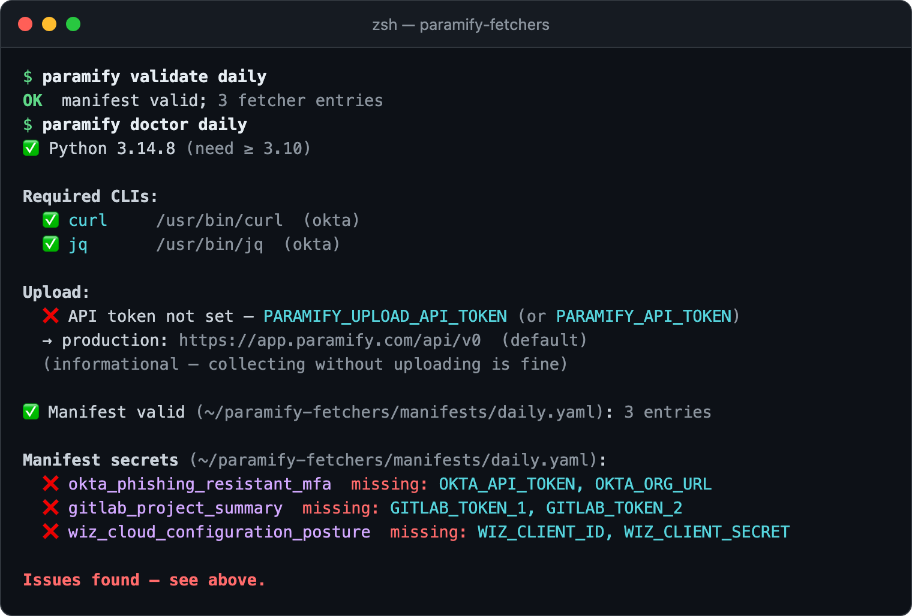
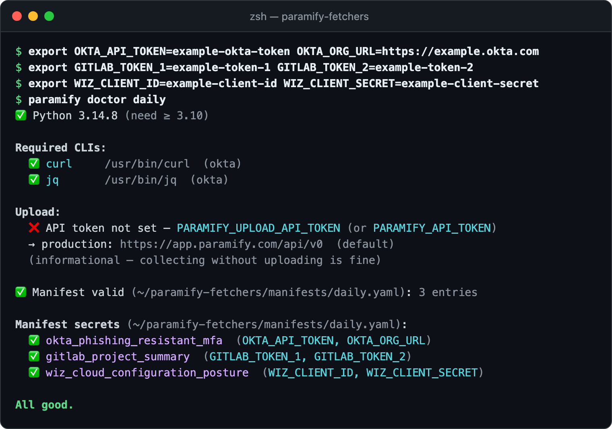

# Building a run manifest with `paramify manifest`

A run manifest says which fetchers to run and wires up each one's secrets,
targets, and config. The `paramify manifest` commands write it for you and
re-check it after every edit, listing whatever still stops it running. Then
`paramify validate` and `paramify doctor` confirm it's ready. This guide builds
`manifests/daily.yaml` with three fetchers, each needing a different kind of
wiring.



**You need:** [the repo installed](../README.md#install). No credentials
until [step 6](#6-set-the-variables-and-check-again).

**Or ask your AI agent.** Its `wire-manifest` skill reads each fetcher's
contract, shows you these same commands, and runs them when you say so
([AI agent setup](../README.md#drive-it-with-an-ai-agent)).

---

## 1. Start a manifest

`manifest new` creates the file under `manifests/`, where `paramify manifests`
and the TUI find it. Keep one per kind of run, such as daily evidence or a
weekly scan ([why](run_manifest_reference.md)). **Pass `-f daily` to every
later command.**



<details><summary>Copy the commands</summary>

```bash
paramify manifest new daily
paramify manifest show -f daily
```
</details>

## 2. Add a fetcher and close what it reports

`manifest add` saves the entry and lists what stops it running. Okta needs two
secrets. `set-secret` takes the name of the environment variable that will
hold each one, never the value, and you pick the name
([secret references](run_manifest_reference.md#secret-references)). When
nothing is missing, the builder prints only `Wrote`.



<details><summary>Copy the commands</summary>

```bash
paramify manifest add okta_phishing_resistant_mfa -f daily
paramify manifest set-secret okta_phishing_resistant_mfa api_token OKTA_API_TOKEN -f daily
paramify manifest set-secret okta_phishing_resistant_mfa org_url OKTA_ORG_URL -f daily
```
</details>

## 3. Fan out with targets

GitLab runs once per project, so it reports missing targets until you add them
([fanout](run_manifest_reference.md#fanout-example)). Each `add-target` takes
one project's fields, plus its own token with `--secret`. **The token belongs
to the target, not the entry:** `paramify describe` doesn't say so (its
`--json` shows `per_target: true`), and `set-secret` leaves every target
still missing it.



<details><summary>Copy the commands</summary>

```bash
paramify manifest add gitlab_project_summary -f daily
paramify manifest add-target gitlab_project_summary project_id=<first group/project> url=https://<your GitLab host> --secret api_token=GITLAB_TOKEN_1 -f daily
paramify manifest add-target gitlab_project_summary project_id=<second group/project> url=https://<your GitLab host> --secret api_token=GITLAB_TOKEN_2 -f daily
```
</details>

A fetcher whose target fields are all optional, like every AWS fetcher, needs
no targets. It collects wherever it runs
([why](run_manifest_reference.md#per-fetcher-entry)).

## 4. Set shared config once

Wiz needs its API endpoint, which all Wiz fetchers share. `set-platform-config`
writes it under `platforms.wiz`, so every Wiz fetcher in the manifest inherits
it. A `set-config` on one fetcher overrides it
([merge order](run_manifest_reference.md#platform-block-runplatforms)).



<details><summary>Copy the commands</summary>

```bash
paramify manifest add wiz_cloud_configuration_posture -f daily
paramify manifest set-platform-config wiz api_endpoint_url=<your Wiz API endpoint URL> -f daily
paramify manifest set-secret wiz_cloud_configuration_posture client_id WIZ_CLIENT_ID -f daily
paramify manifest set-secret wiz_cloud_configuration_posture client_secret WIZ_CLIENT_SECRET -f daily
```
</details>

That was the last gap. The manifest now reads:

```yaml
run:
  output_dir: ./evidence
  fetchers:
  - use: okta_phishing_resistant_mfa
    secrets:
      api_token: ${env:OKTA_API_TOKEN}
      org_url: ${env:OKTA_ORG_URL}
  - use: gitlab_project_summary
    targets:
    - project_id: group/api
      url: https://gitlab.example.com
      secrets:
        api_token: ${env:GITLAB_TOKEN_1}
    - project_id: group/infra
      url: https://gitlab.example.com
      secrets:
        api_token: ${env:GITLAB_TOKEN_2}
  - use: wiz_cloud_configuration_posture
    secrets:
      client_id: ${env:WIZ_CLIENT_ID}
      client_secret: ${env:WIZ_CLIENT_SECRET}
  platforms:
    wiz:
      config:
        api_endpoint_url: https://api.us2.app.wiz.us/graphql
```

## 5. Validate, then preflight

`validate` checks the wiring against each fetcher's contract
([what it checks](run_manifest_reference.md#validate-checks)). `doctor` also
checks the CLIs each category needs and whether every variable the manifest
names holds a value ([doctor's checks](../README.md#using-the-cli)). None is
set yet:



<details><summary>Copy the commands</summary>

```bash
paramify validate daily
paramify doctor daily
```
</details>

## 6. Set the variables and check again

Put the values in the environment that runs the fetchers: a shell for a local
run, or your secret manager or CI in a deployment
([deploying](../deploy/README.md)). Doctor checks that each value is set,
not that it works, so these example values pass.



<details><summary>Copy the commands</summary>

```bash
export OKTA_API_TOKEN=<token> OKTA_ORG_URL=https://<your-org>.okta.com
export GITLAB_TOKEN_1=<token> GITLAB_TOKEN_2=<token>
export WIZ_CLIENT_ID=<client id> WIZ_CLIENT_SECRET=<client secret>
paramify doctor daily
```
</details>

The manifest is runnable. Next: [run it, then upload](../README.md#collect-then-upload).

---

## Troubleshooting

| Symptom | Fix |
|---|---|
| `no such manifest: …` | `-f` is missing (the default is `./manifest.yaml`) or misspelled. The error lists the manifests it found. |
| `Not created: …/daily.yaml` | It already exists. Keep editing it with `-f daily`. |
| `entry[0] uses unknown fetcher` | The typo was saved. `paramify manifest remove <typo> -f daily`, then add the name `paramify list` shows. |
| `target[0] missing per_target secret` | `paramify manifest set-target <fetcher> 0 <every field> --secret api_token=<VAR> -f daily`. It replaces the whole target, so pass every field. |
| `does not support targets but manifest has targets[]` | That fetcher runs once. `paramify manifest remove-target <fetcher> 0 -f daily`. |
| `Not written: refusing to write schema-invalid manifest` | Usually a lowercase variable name. Use uppercase letters, digits, and `_`. |
| `no assessment_id set` or `no close_cycle set` | It's an issue-report fetcher. `paramify assessments select <fetcher> -f daily` picks the assessment by name ([details](run_manifest_reference.md#assessments-for-issue-report-fetchers)). |
| A `paramify_*` fetcher reports missing targets | Its targets are Paramify programs. `paramify programs target -f daily` writes them by name ([details](run_manifest_reference.md#targets-from-a-paramify-workspace)). |
| Doctor says a CLI is `not found on PATH` | Install it ([install](../README.md#install)). |
| Doctor lists a variable as `missing` that's in `.env` | `run` and `doctor` read only the environment, not `.env`. Export the variables first. |
| `git add` says the manifest is ignored | `.gitignore` has `manifests/*`, despite its comment. Use `git add -f`. The file holds no secret values. |

**More detail:** [every manifest field](run_manifest_reference.md#per-fetcher-entry) ·
[ambient identity and `set-passthrough`](run_manifest_reference.md#platform-block-runplatforms) ·
[what a run writes](run_manifest_reference.md#output-directory-layout) ·
[not supported yet](run_manifest_reference.md#what-the-manifest-does-not-yet-support) ·
[config model](config_injection_design.md) ·
[example manifests](../examples/)
