# Authoring validators with `/suggest-validator`

`suggest-validator` writes the regex validators that check whether a fetcher's
evidence actually proves the control it's supposed to. Point it at real
evidence and it reads the capability narrative an assessor will read. It then
suggests assertions for you to choose from, proves each one can fail, and
writes them to the `validators/` registry. You publish them to Paramify and
check the results in the app.

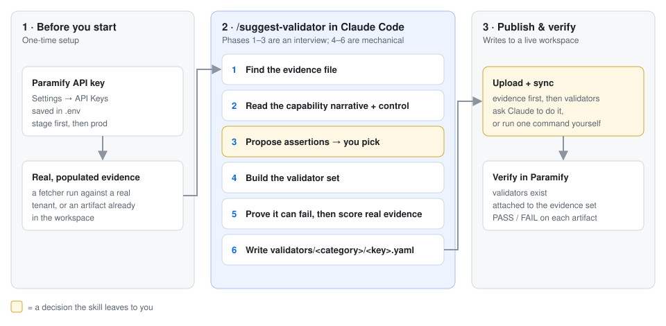

**You need:** [the repo installed](../README.md#install) ·
[Claude Code, run from the repo root](../README.md#drive-it-with-an-ai-agent) ·
Node.js (Paramify runs validator regexes as JavaScript)

---

## 1. Get a Paramify API key

Create a key and set `PARAMIFY_UPLOAD_API_TOKEN`:
[API key setup](../uploaders/paramify_evidence/README.md#paramify-api-key).
The permissions listed there leave out one this skill needs:
**View Solution Capabilities**, which it uses to read narratives.

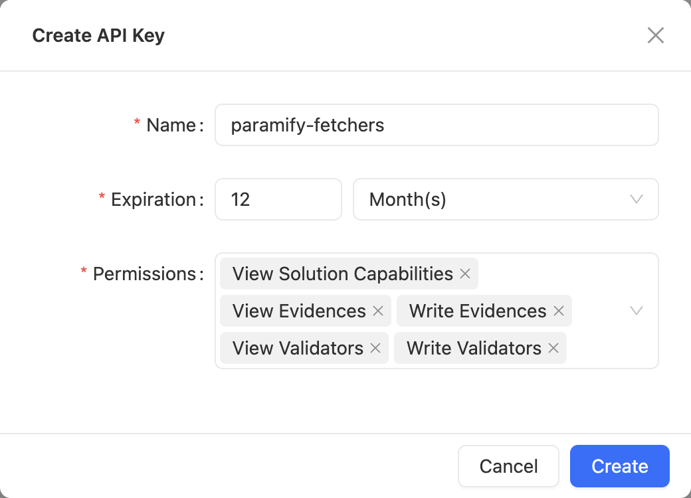

Put the key in `.env` at the repo root (`paramify` loads it automatically).
Start on stage (`PARAMIFY_API_BASE_URL=https://stage.paramify.com/api/v0`),
since syncing writes to the workspace. Stage and production keys are separate.
To check the key works:

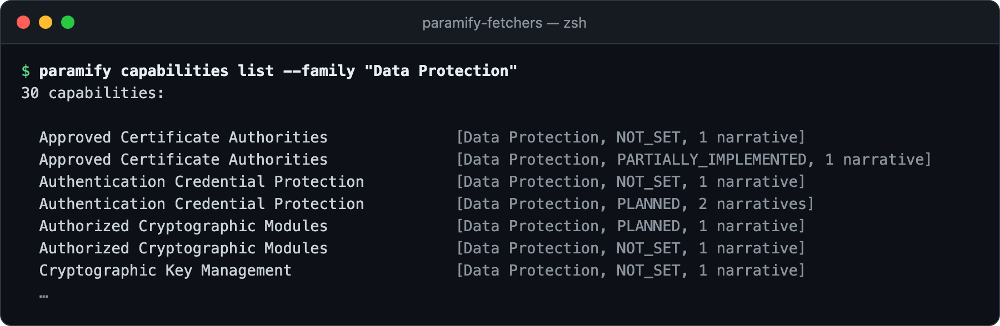

## 2. Have real evidence

[Run the fetcher against a real tenant](../README.md#collect-then-upload).
Output from a fake-credential smoke test is empty, so there's nothing to write
validators against. If there's no local run, the skill can pull an existing
artifact from the workspace instead.

---

## 3. Run the skill

In Claude Code, type `/suggest-validator <fetcher name>`, or just ask it to
*"suggest validators for the SQS encryption evidence"*. Claude handles
everything that follows. The screenshots are an example session for
`aws_sqs_encryption_status`.

**Phases 1–2: evidence and claim.** Claude finds the newest populated run and
proposes the capability it should prove. Paramify's API doesn't link evidence
sets to capabilities, so **you confirm the capability**. If it has no narrative
yet, write one in Paramify first.

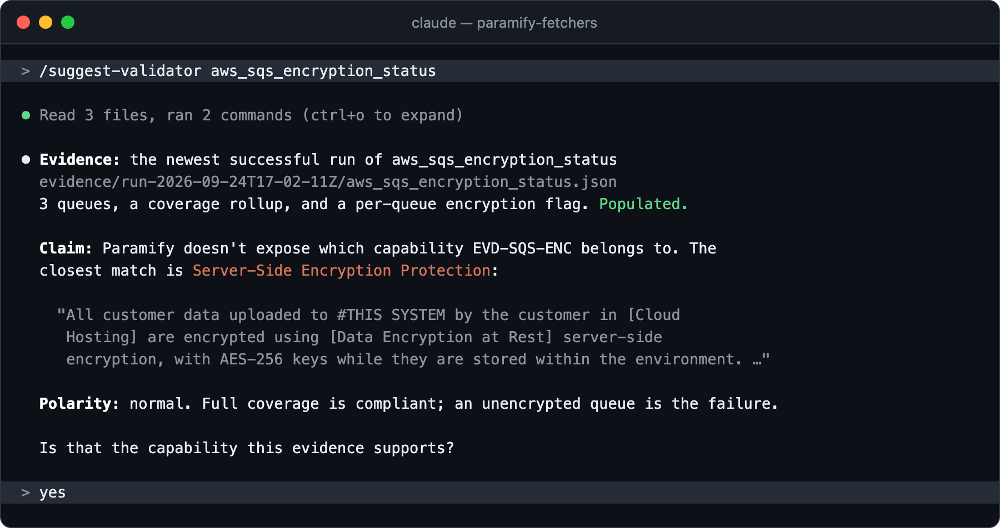

**Phase 3: you choose.** Claude ranks the assertions that would back the
claim, recommends a set, and names what the evidence can't cover.
**You pick which ones to build.**

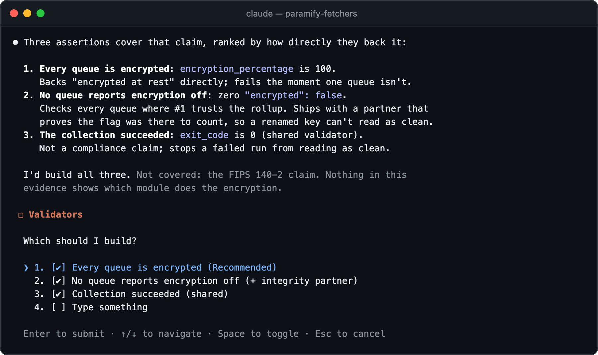

**Phases 4–5: build and prove.** Claude writes the validators and tests each
one three ways: good evidence (should pass), bad evidence (should fail), and a
renamed field (should not pass). Then it scores your real evidence.

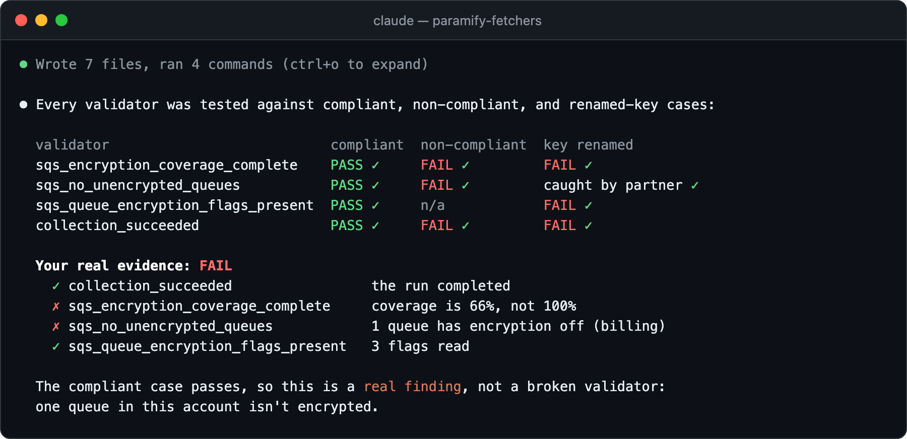

> **A FAIL on real evidence can be the right answer.** If the good-evidence case
> passes, a FAIL means your environment doesn't meet the narrative. That's a
> finding to act on, not a broken validator.

**Phase 6: hand-back.** Claude reports what each validator asserts and when it
fails, then offers to sync. It never syncs on its own.

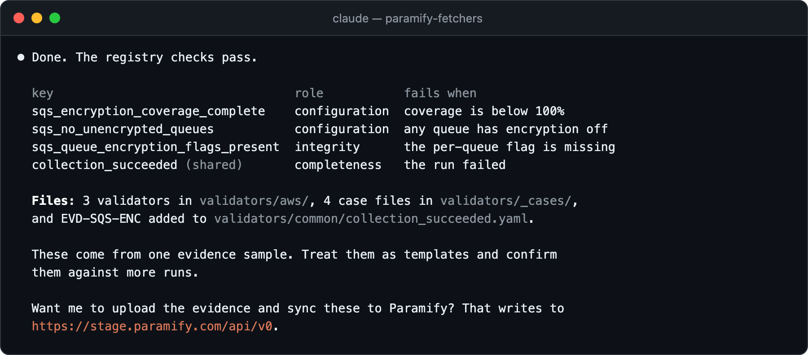

Review each `statement` in the new YAML files, then commit them together with
their `validators/_cases/` files.

---

## 4. Publish to Paramify

Tell Claude to sync, or run it yourself (add `--dry-run` to preview first):

```bash
paramify upload --with-validators
```

This uploads the evidence ([upload details](../README.md#collect-then-upload))
and then syncs the validators ([how sync works](../uploaders/paramify_validators/README.md#what-it-does-per-validator)).
The upload has to come first, because a validator can only be attached to an
evidence set that already exists.

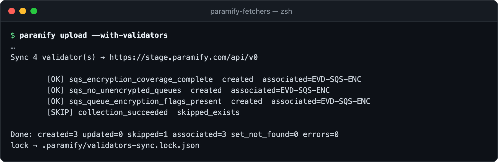

**Watch for `skipped_exists`.** A validator that's already in the workspace is
left alone, which keeps any tuning done in the app. It's also **not attached to
the new set**. This usually happens with the shared `collection_succeeded`.
Attach it by hand: on the set's **Validators** tab, click **Manage
Selection**, tick the validator, then click **Apply Selection**.

## 5. Verify in Paramify

Go to **Resources → Evidence Sets** and open the set (here, *SQS Queue
Encryption*).

**Validators tab:** every validator from the sync is listed, and **Automated
Validation** reads *True*.

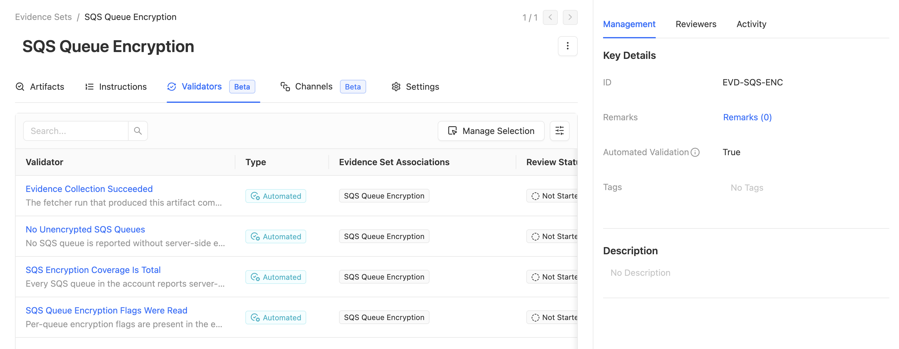

**Artifacts tab:** the **Validation Result** column shows *Pass*, *Fail*, or
*Partial* (some validators pass, some fail). An artifact uploaded **before**
the sync has no result. Upload a fresh run to get one.

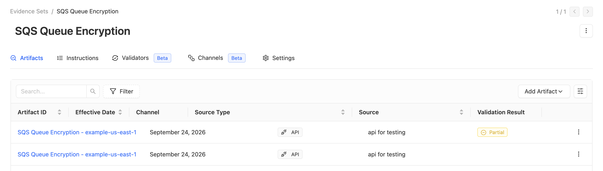

**Click the result** to see each validator's verdict. It should match what
Claude reported in phase 5.

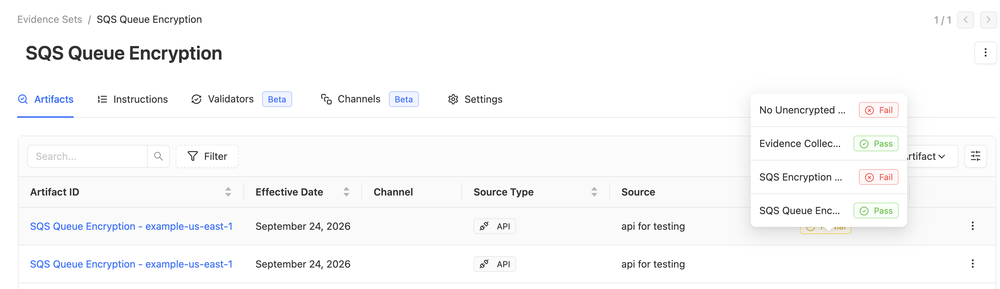

---

## Troubleshooting

| Symptom | Fix |
|---|---|
| 401/403, or "No Paramify API token" | Check the key's permissions ([step 1](#1-get-a-paramify-api-key)) and that `PARAMIFY_API_BASE_URL` matches the environment where the key was created. |
| "No narrative written on this capability" | Write the narrative in Paramify, or pick another capability. |
| Claude says the evidence is empty | Run the fetcher against real data. For findings-style fetchers (GuardDuty, vulnerability scans), tell Claude that zero findings is the compliant result. |
| Sync fails with HTTP 400 | That validator `name` is already used in the workspace. Rename it in the YAML. |
| Sync shows `set_not_found=EVD-…` | Sync ran before the upload, so the validator was created without being attached. Attach it from the set's **Validators** tab → **Manage Selection**. |
| A validator is missing from the set's Validators tab | Sync only attaches validators when it first creates them (`skipped_exists` means it didn't). Attach it via **Manage Selection**. |
| An artifact has no Validation Result | It was uploaded before the validators were attached. Upload a fresh run. |
| App verdicts differ from what Claude reported | The app copy was edited, or is out of date. `--update` overwrites it with the repo version ([sync options](../uploaders/paramify_validators/README.md#run-it)). |

**More detail:** [the skill](../.claude/skills/suggest-validator/SKILL.md) ·
[validator design](validators_design.md) ·
[sync internals](../uploaders/paramify_validators/README.md)
