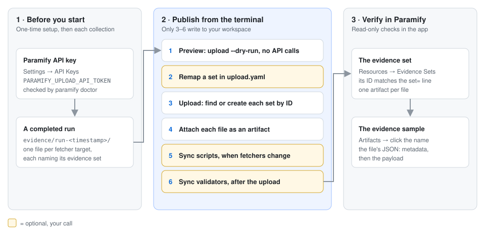
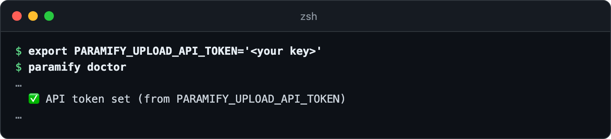
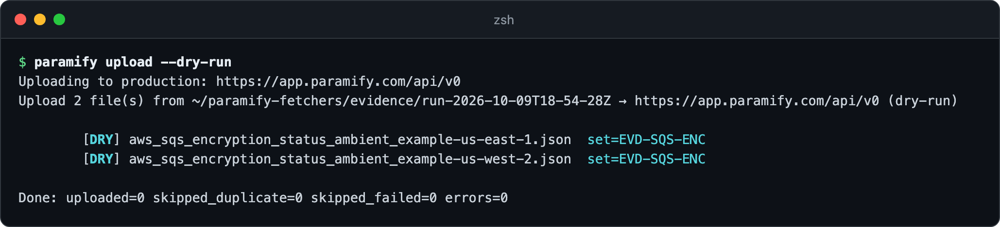
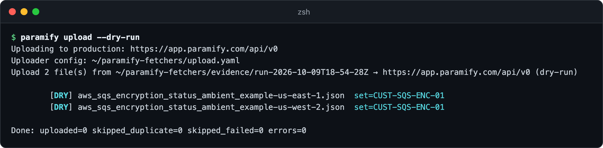
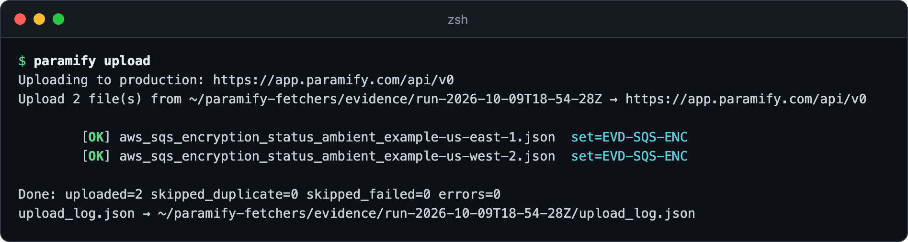
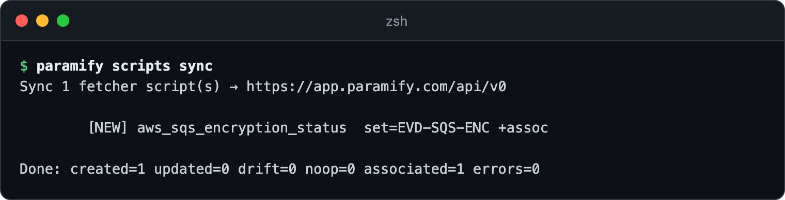
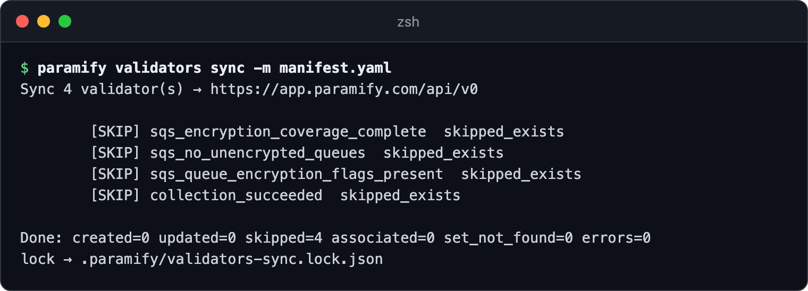
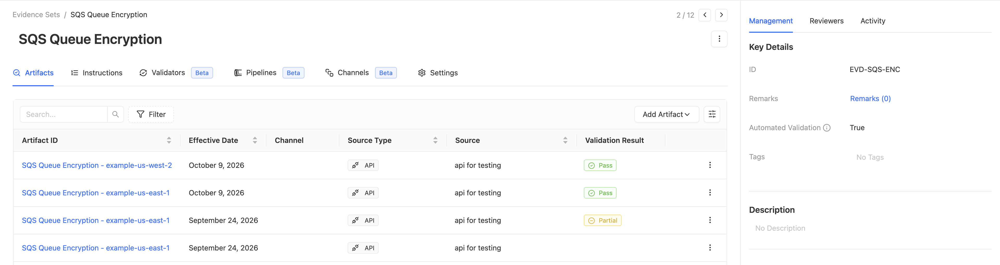
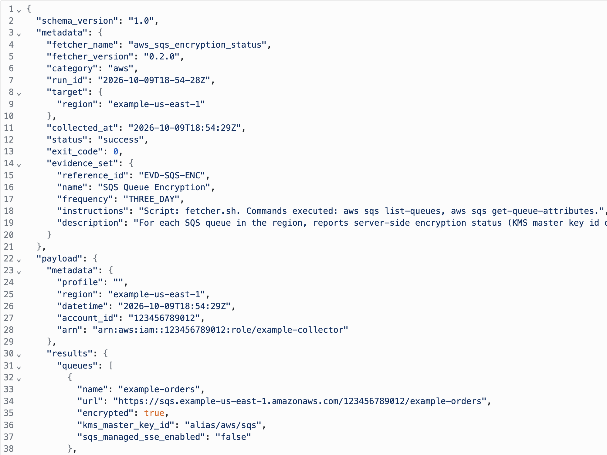

# Publishing a run to Paramify with `paramify upload`

`paramify upload` sends a completed run's evidence to Paramify. Each file lands
on its fetcher's evidence set, which the upload creates the first time it sees
it. You can then sync each fetcher's script and validators to the same set, and
check the evidence in the app.



**You need:** [the repo installed](../README.md#install) ·
[a completed run](../README.md#collect-then-upload) · a Paramify account that
can create API keys. The TUI's **Paramify** tab does the same upload and script
sync ([TUI walkthrough](https://support.paramify.com/hc/en-us/articles/55867428958355-Setup-Fetchers)).

---

## 1. Set your API key

Create a key with the permissions in
[API key setup](../uploaders/paramify_evidence/README.md#paramify-api-key)
([help-center steps](https://support.paramify.com/hc/en-us/articles/43292803890451-Create-a-Paramify-API-Key)),
then export it. `paramify doctor` confirms it's set. Uploads also read `.env` at
the repo root, but `paramify doctor` doesn't.



<details><summary>Copy the commands</summary>

```bash
export PARAMIFY_UPLOAD_API_TOKEN='<your key>'
paramify doctor
```
</details>

## 2. Preview the upload

`--dry-run` reads the newest run and lists each file with the evidence set it
will land on. It makes no API calls. Check the destination on the first line
and each `set=` ([how sets are matched](uploader_design.md#the-evidence-set-identity-model-shared)).
To upload an older run, pass its directory.



<details><summary>Copy the command</summary>

```bash
paramify upload --dry-run
```
</details>

## 3. Use your own evidence set (optional)

If your program already tracks this evidence under its own reference ID, map
the fetcher to it in `upload.yaml` at the repo root
([all options](../examples/upload.yaml)). Script sync reads the same file, so
scripts follow the evidence. Re-run the [preview](#2-preview-the-upload) to check
the new `set=`.

```yaml
overrides:
  aws_sqs_encryption_status:
    reference_id: CUST-SQS-ENC-01
```



## 4. Upload

Run it without `--dry-run`. Each file shows `OK`, plus `channel=` when its set
has a channel ([channels](uploader_design.md#channels)).



<details><summary>Copy the command</summary>

```bash
paramify upload
```
</details>

**Re-running a run is safe.** Files already uploaded show `SKIP`
(`skipped_duplicate`); a new run adds new artifacts. To collect and upload on a
schedule, [run it in a container](../deploy/README.md#4-run-it-on-a-schedule).

## 5. Sync scripts and validators (optional)

**Scripts** show in Paramify how the evidence was collected. Run this when you
add a fetcher or bump its version, not after every collection. It covers the
fetchers in `manifest.yaml`; name another manifest, or pass `--all`
([what it does](../uploaders/paramify_scripts/README.md#what-it-does-per-fetcher)).



<details><summary>Copy the command</summary>

```bash
paramify scripts sync
```
</details>

**Validators** from the registry check each new artifact. Sync them after the
upload, because a validator attaches only to a set that exists
([how sync works](../uploaders/paramify_validators/README.md#what-it-does-per-validator)).
`-m` limits it to your manifest's sets. To write your own, see
[authoring validators](suggest_validator_guide.md).

**Watch for `skipped_exists`.** The validator was already in the workspace, so
the sync didn't attach it again. Check the set's **Validators** tab.



<details><summary>Copy the command</summary>

```bash
paramify validators sync -m manifest.yaml
```
</details>

## 6. Verify in Paramify

Go to **Implementation → Evidence Sets** and open *SQS Queue Encryption*. **Key
Details** shows the ID from the `set=` line, and the **Artifacts** tab has one
artifact per uploaded file.



**Click an artifact's name** to see exactly what was uploaded: the file's
`metadata` (fetcher, run, target, status) above its `payload`. For validation
results, see [verify validators](suggest_validator_guide.md#5-verify-in-paramify).



---

## Troubleshooting

| Symptom | Fix |
|---|---|
| `[FAIL]` with `401` or `403` | Check the key's permissions ([step 1](#1-set-your-api-key)) and that `PARAMIFY_API_BASE_URL` points where the key was made. |
| `No run under ./evidence that collected evidence.` | Your manifest writes elsewhere. Add `-f <manifest>`, or pass the run directory. |
| `… has 2 channels …; uploading through more than one channel is not supported yet` | The uploader won't guess a channel. Upload that file [through a channel in the app](https://support.paramify.com/hc/en-us/articles/55868678007571-Manually-Uploading-Evidence-to-a-Channel). |
| Scheduled container uploads ignore `upload.yaml` | `deploy/run-and-upload.sh` calls the uploader directly, which reads no default config. Add `--config upload.yaml` to its upload line. |
| Validators attach to `EVD-…`, not your remapped set | Validator sync uses the registry's reference IDs. Attach them on the set's **Validators** tab → **Manage Selection**. |
| `No fetchers in the manifest …` from `scripts sync` | It found none in `manifest.yaml` at the repo root. Name your manifest, or pass `--all`. |
| The run also collected scan reports | `paramify upload` sends evidence only. Send reports with the [issues uploader](../uploaders/paramify_issues/README.md). |

**More detail:** [why upload is its own stage](uploader_design.md#why-uploading-is-its-own-stage) ·
[the identity model](uploader_design.md#the-evidence-set-identity-model-shared) ·
[how scripts sync decides](uploader_design.md#action-per-fetcher) ·
[when to run which](uploader_design.md#when-to-run-which) ·
[upload options](../uploaders/paramify_evidence/README.md#config---config-optional)
