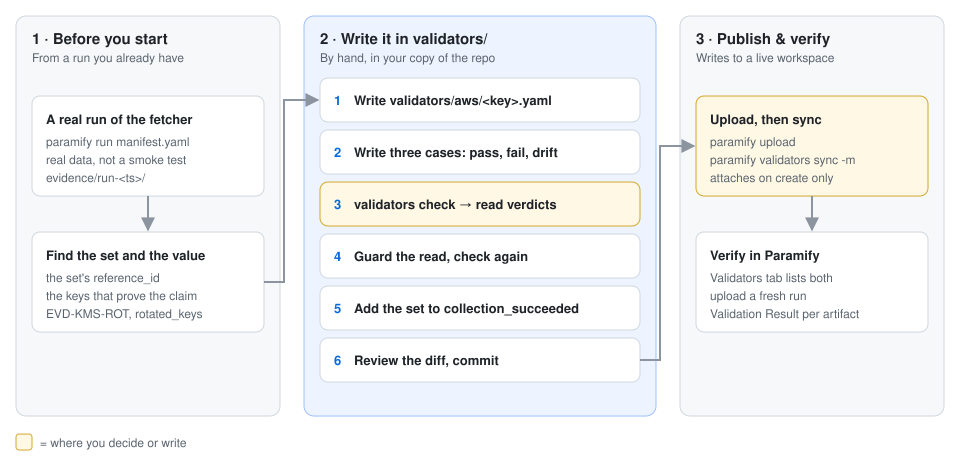
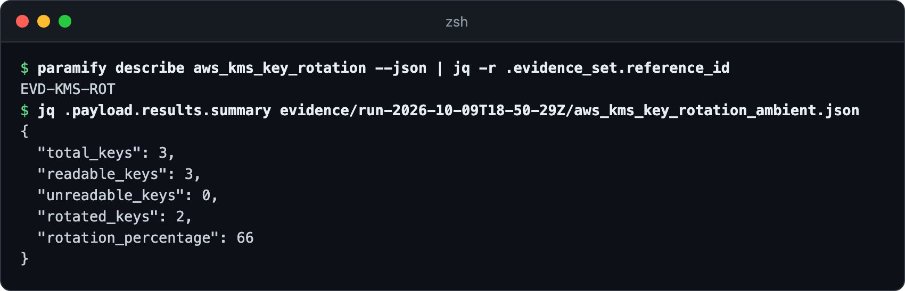
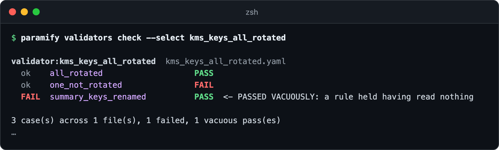
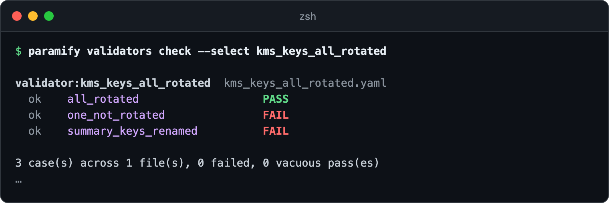
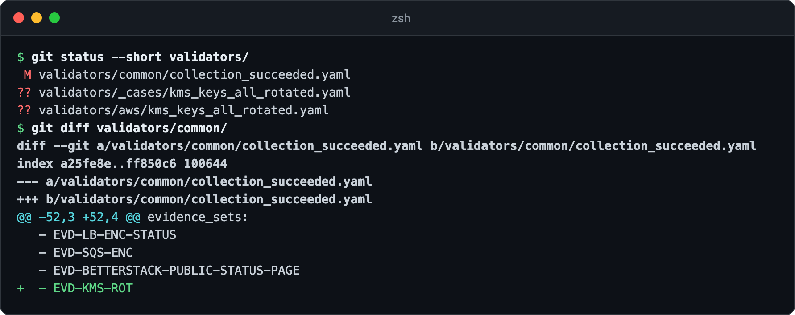
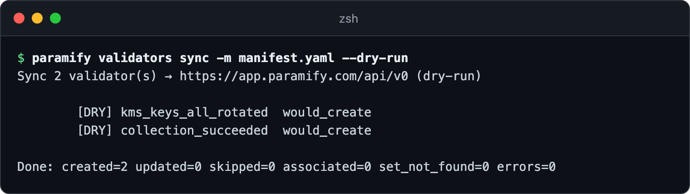
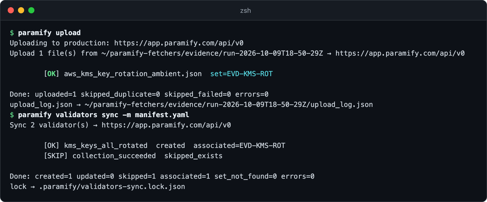
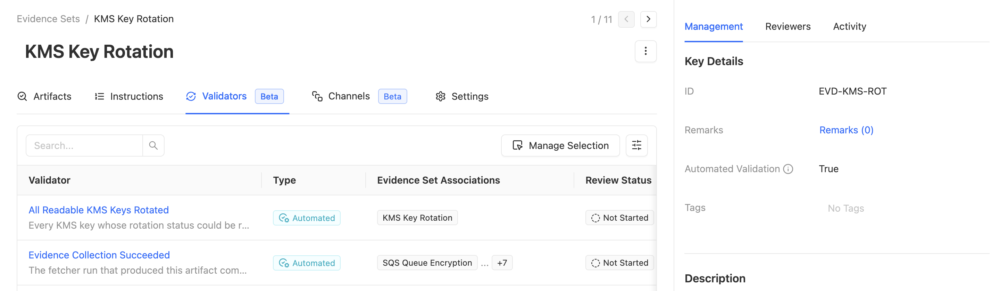
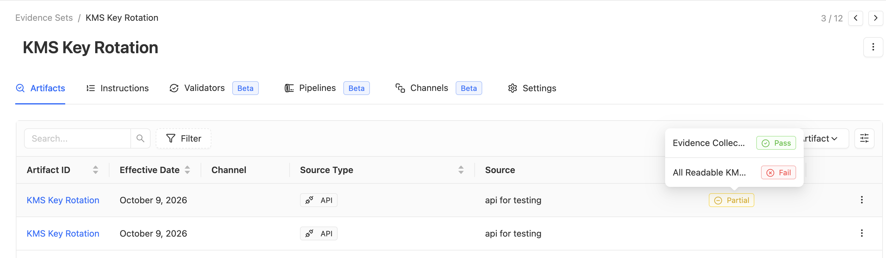

# Writing a validator by hand

A validator is a regex plus rules that Paramify runs against every artifact
uploaded to an evidence set ([what a validator is](validators_design.md#what-a-validator-is)).
This guide writes one by hand in the `validators/` registry, proves it can
fail, publishes it, and checks its verdict in Paramify. The running example is
`aws_kms_key_rotation`. To have your AI agent write and prove validators for
you, use [`/suggest-validator`](suggest_validator_guide.md) instead.



**You need:** [the repo installed](../README.md#install) ·
Node.js (Paramify runs validator regexes as JavaScript, and so does `check`) ·
[a real run of the fetcher](../README.md#collect-then-upload) ·
[a Paramify API key](../uploaders/paramify_evidence/README.md#paramify-api-key) for step 6

---

## 1. Find the set and the value

A validator names the evidence sets it applies to by `reference_id`
([set identity](uploader_design.md#the-evidence-set-identity-model-shared)). Then find the keys in
your newest run that prove the claim. Here the claim is "every key we can read
rotates", so the regex reads `readable_keys` and `rotated_keys`:



<details><summary>Copy the commands</summary>

```bash
paramify describe aws_kms_key_rotation --json | jq -r .evidence_set.reference_id
jq .payload.results.summary evidence/<run>/aws_kms_key_rotation_<target>.json
```
</details>

## 2. Write the validator

Copy [the template](../validators/_template/validator.yaml) to
`validators/aws/kms_keys_all_rotated.yaml`. The `key` must match the filename,
and the `name` must be unique in your workspace. Write the regex as JavaScript,
with named groups ([regex rules](validators_design.md#writing-the-regex-flavor-named-groups-and-the-error-state)).
A first draft states the claim in one rule:

```yaml
key: kms_keys_all_rotated
name: All Readable KMS Keys Rotated
type: AUTOMATED
role: configuration
statement: Every KMS key whose rotation status could be read has automatic rotation enabled.
regex: '"readable_keys":\s*(?<readable_keys>\d+)[\s\S]*?"rotated_keys":\s*(?<rotated_keys>\d+)'
rules_summary: MATCH_GROUP[1] EQUALS MATCH_GROUP[2]
validation_rules:
  - regexOperation: { type: MATCH_GROUP, groupNumber: 1 }   # readable_keys
    criteria: EQUALS
    value: { type: MATCH_GROUP, groupNumber: 2 }            # rotated_keys
evidence_sets:
  - EVD-KMS-ROT
```

The [validator schema](../framework/schemas/validator_schema.json) describes
every field.

## 3. Write its cases

Pin three verdicts in `validators/_cases/kms_keys_all_rotated.yaml`: compliant,
non-compliant, and the keys renamed upstream
([case format](../validators/_cases/README.md)). Keep the artifacts minimal
and synthetic. Never paste real evidence into a case.

```yaml
validator: kms_keys_all_rotated
cases:
  - name: all_rotated
    expect: PASS
    artifact: '{"metadata":{"exit_code":0},"payload":{"results":{"summary":{"readable_keys":3,"rotated_keys":3}}}}'

  - name: one_not_rotated
    expect: FAIL
    artifact: '{"metadata":{"exit_code":0},"payload":{"results":{"summary":{"readable_keys":3,"rotated_keys":2}}}}'

  - name: summary_keys_renamed
    expect: FAIL
    artifact: '{"metadata":{"exit_code":0},"payload":{"results":{"summary":{"readableKeys":3,"rotatedKeys":2}}}}'
```

## 4. Prove it can fail

`check` runs the cases with the semantics Paramify uses, in JavaScript. The
draft fails it: with the keys renamed, its rule compares nothing to
nothing and passes ([why](validators_design.md#3-guard-the-read-and-put-collection-health-in-its-own-validator)).



Guard the read. Put a presence rule first, so a regex that matched nothing
fails:

```yaml
rules_summary: MATCH_COUNT NOT_EQUALS 0; MATCH_GROUP[1] EQUALS MATCH_GROUP[2]
validation_rules:
  - regexOperation: { type: MATCH_COUNT }                   # the summary was read
    criteria: NOT_EQUALS
    value: { type: CUSTOM_TEXT, customText: "0" }
  - regexOperation: { type: MATCH_GROUP, groupNumber: 1 }   # readable_keys
    criteria: EQUALS
    value: { type: MATCH_GROUP, groupNumber: 2 }            # rotated_keys
```

Run it again. Every case now gets the verdict it expects:



<details><summary>Copy the command</summary>

```bash
paramify validators check --select kms_keys_all_rotated
```
</details>

A validator that counts violations (zero matches means pass) can't guard
itself this way. It needs an `integrity` partner and a set-level case
([example](../validators/_cases/set_EVD-SQS-ENC.yaml)).

## 5. Add the set's collection check

Every set also gets the shared `collection_succeeded` validator, which fails
an artifact from a run that didn't finish
([why it's shared](../validators/README.md#authoring)).
Add `EVD-KMS-ROT` to its `evidence_sets` rather than writing your own. Then
review the change:



<details><summary>Copy the commands</summary>

```bash
git status --short validators/
git diff validators/common/
```
</details>

Commit all three in your [private copy](private_mirror_workflow.md) of the repo.

## 6. Publish to Paramify

Upload a run before you sync. The sync attaches a validator to its sets only
when it creates it, so the set must already exist
([how sync works](../uploaders/paramify_validators/README.md#what-it-does-per-validator)).
Preview the sync, scoped to your manifest:



With your key set, the preview reads the workspace, so a validator that's
already there shows `would_skip_exists`. Then upload and sync for real
(`paramify upload --with-validators` does both in one command):



<details><summary>Copy the commands</summary>

```bash
paramify validators sync -m manifest.yaml --dry-run
paramify upload
paramify validators sync -m manifest.yaml
```
</details>

**Watch for `skipped_exists` on the collection check.** If your workspace
already has it, the sync leaves it alone and doesn't attach it to the new set.
[Attach it by hand](suggest_validator_guide.md#4-publish-to-paramify).

## 7. Verify in Paramify

Go to **Implementation → Evidence Sets** and open *KMS Key Rotation*.

**Validators tab:** both validators are listed.



**Artifacts tab:** upload a fresh run, because artifacts uploaded before the
sync get no result. With one key in three not rotated, its **Validation
Result** is *Partial*. Click it to see each validator's verdict.



[Using Validators in Paramify](https://support.paramify.com/hc/en-us/articles/49505346387987-Using-Validators-in-Paramify)
explains the rules and results views.

---

## Troubleshooting

| Symptom | Fix |
|---|---|
| `check` shows `COMPILE_ERROR` on every case | The regex uses Python's `(?P<name>…)`. Write `(?<name>…)`. |
| `check` stops with `must equal the filename` or `schema validation failed` | Make `key` match the filename, and fix the field the error names ([schema](../framework/schemas/validator_schema.json)). |
| `check` prints `SKIP … names nothing in the registry` | The case file's `validator:` doesn't match any registry `key`. Check the spelling. |
| `check --select` lists other validators under "no cases" | It counts only the files the filter picked. Run `paramify validators check` with no filter for the real list. |
| A rule's `disposition` has no effect | The API discards it, so every rule must hold for a pass ([why](validators_design.md#consequence-for-the-rule-shape)). |
| HTTP 400, `set_not_found`, or app verdicts that differ from the YAML | See [the agent guide's troubleshooting](suggest_validator_guide.md#troubleshooting). |

**More detail:** [the registry model](validators_design.md#the-model-a-deduplicated-registry-linked-on-the-validator) ·
[validator roles](validators_design.md#cardinality-recap-of-the-confirmed-evidence-model) ·
[templates, never clobbered](validators_design.md#these-are-templates--create-or-skip-never-clobber) ·
[the API calls sync makes](validators_design.md#uploading--associating-paramify-rest-api-v080) ·
[registry README](../validators/README.md)
