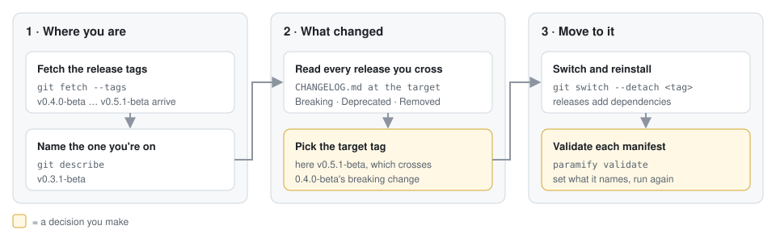
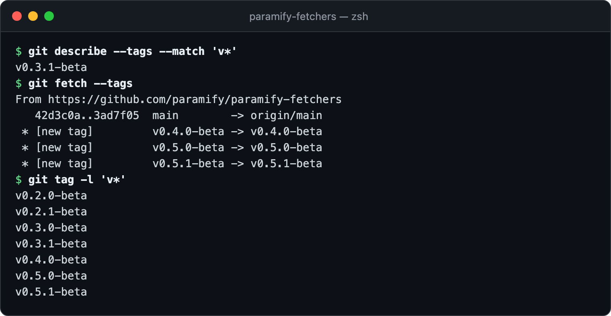
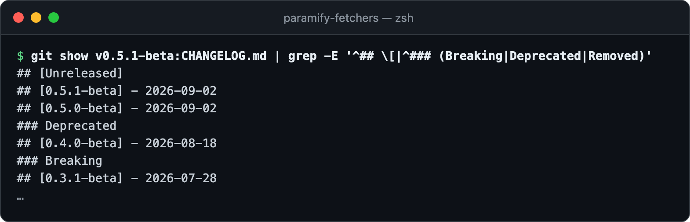
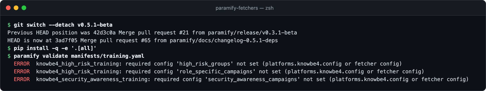

# Pinning a release and upgrading safely

Run a release tag, not `main`. Before moving to a newer one, read what changed
and check your manifests still validate.



**You need:** [a clone installed from source](../README.md#install). Private
copy? [Merge the tag](private_mirror_workflow.md#3-pull-in-paramify-releases)
instead. Container? [Build from the tag](../deploy/README.md#running-this-in-production).

---

## 1. See where you are

Fetch the release tags. `git describe` names the one you're on.



<details><summary>Copy the commands</summary>

```bash
git describe --tags --match 'v*'
git fetch --tags
git tag -l 'v*'
```
</details>

## 2. Read what changed

Read every release between yours and the target, and act on each **Breaking**,
**Deprecated**, and **Removed** section:



<details><summary>Copy the command</summary>

```bash
git show v0.5.1-beta:CHANGELOG.md | grep -E '^## \[|^### (Breaking|Deprecated|Removed)'
```
</details>

Here, `0.4.0-beta` made three KnowBe4 settings required. What each bump means
([the contract](versioning.md#the-contract--the-public-api-surface)):

| Bump | For you |
|---|---|
| Major | A manifest field, CLI flag, or fetcher output you use can break. |
| Minor | New fetchers and options. **Before 1.0, a minor can also break** ([why](versioning.md#pre-10-and-the-meaning-of-10)). |
| Patch | Fixes and dependency bumps. |

## 3. Switch, reinstall, validate

Switch, reinstall with [your extras](../README.md#install), and validate each
manifest. **Skipping the reinstall can fail with `ModuleNotFoundError`**:
releases add dependencies.



<details><summary>Copy the commands</summary>

```bash
git switch --detach v0.5.1-beta
pip install -q -e '.[all]'
paramify validate manifests/<your manifest>.yaml
```
</details>

Set what it names as the entry says
([manifest commands](../README.md#building-a-manifest)), then validate again.

---

## Troubleshooting

| Symptom | Fix |
|---|---|
| `git describe` prints `v0.5.1-beta-291-g59a2387` | You're on `main`, 291 commits past it. Switch to a tag. |
| A run breaks after upgrading | Switch back to your old tag, then reinstall. |

**More detail:** [bump policy](versioning.md#bump-policy) ·
[the three version axes](versioning.md#the-three-version-axes) ·
[how releases are cut](releasing.md) · [CHANGELOG](../CHANGELOG.md)
