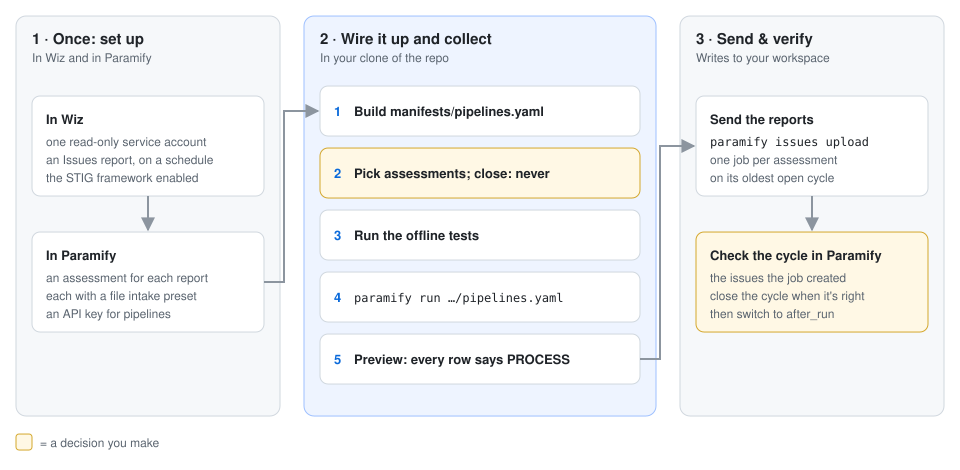
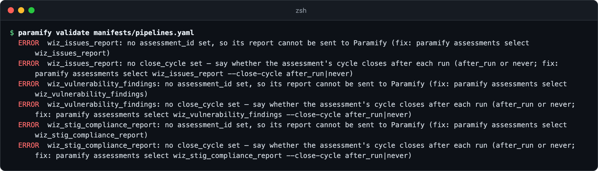
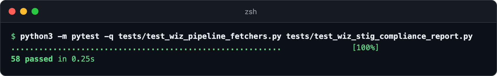
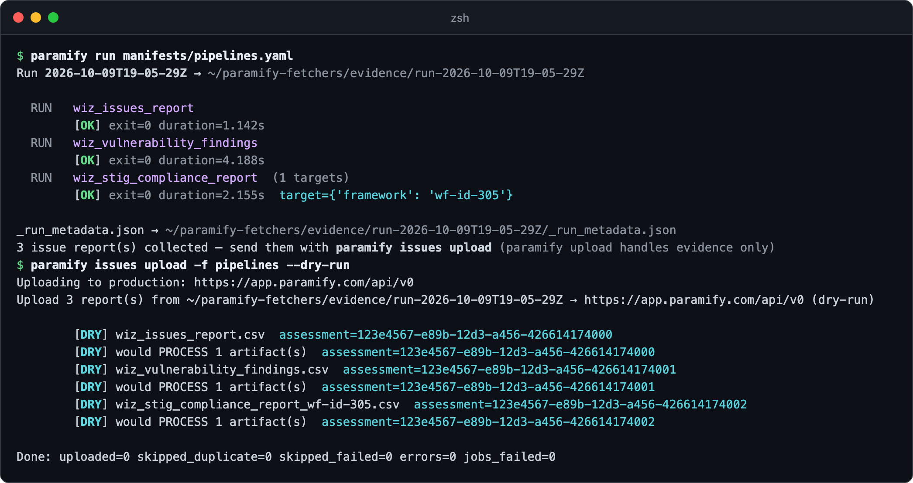

# Sending Wiz scan reports to Paramify assessments

Three read-only Wiz fetchers write CSVs for Paramify assessment pipelines.
`wiz_issues_report` and `wiz_stig_compliance_report` feed configuration
assessments, and `wiz_vulnerability_findings` feeds a vulnerability one. You
wire them into a manifest, test them offline, send the reports, and check the
issues in Paramify.



**You need:** [the repo installed](../README.md#install) ·
an assessment per report and a pipeline API key ([setup](pipelines.md#before-you-start)) ·
a Wiz tenant where you can add a service account

---

## 1. Set up Wiz

Create one service account for all three: **Custom Integration (GraphQL API)**,
all projects, `read:` scopes only
([scopes per fetcher](../fetchers/wiz/README.md#issue-reports)). The fetchers
never write to Wiz, so two things are yours to make
([details](wiz_pipeline_fetchers.md#read-only-what-a-person-sets-up-in-wiz)):

- an **Issues** report named `Paramify-Wiz-Issues`, on a schedule (daily, say), run once;
- the STIG framework, enabled under **Policies → Frameworks**.

## 2. Build the manifest

Keep scan fetchers in their own manifest
([why](pipelines.md#1-give-scan-fetchers-their-own-manifest)). Build it in the
TUI or by hand. This is `manifests/pipelines.yaml`
([every setting](wiz_pipeline_fetchers.md#configuration)):

```yaml
run:
  output_dir: ./evidence
  platforms:
    wiz:
      config:
        api_endpoint_url: https://api.us2.app.wiz.us/graphql  # Wiz → Tenant Info → API Endpoint URL
        # auth_url: https://auth.app.wiz.io/oauth/token       # commercial Wiz; the default is Wiz for Gov
  fetchers:
  - use: wiz_issues_report            # reads the report named Paramify-Wiz-Issues
    secrets:
      client_id: ${env:WIZ_CLIENT_ID}
      client_secret: ${env:WIZ_CLIENT_SECRET}
  - use: wiz_vulnerability_findings
    secrets:
      client_id: ${env:WIZ_CLIENT_ID}
      client_secret: ${env:WIZ_CLIENT_SECRET}
    # config:
    #   project_id: <Wiz project id>  # unset = all projects; the filter is unverified against real Wiz
  - use: wiz_stig_compliance_report
    secrets:
      client_id: ${env:WIZ_CLIENT_ID}
      client_secret: ${env:WIZ_CLIENT_SECRET}
    targets:
    - framework: wf-id-305            # one target per framework: its id or exact name
    config:
      include_host_configuration: false  # Okta IDaaS STIG is cloud-only
```

`validate` then lists what's left: an assessment and a close policy for each.



<details><summary>Copy the command</summary>

```bash
paramify validate manifests/pipelines.yaml
```
</details>

## 3. Point each at its assessment

Press `A` on each entry in the TUI
([how](pipelines.md#2-point-each-fetcher-at-an-assessment)) or run the commands
below, and start with `never`. **Closing a cycle auto-closes every open issue it
didn't see, and it sees only what the files hold: the Wiz report's own scope,
or one project if you set `project_id`** ([scope warning](wiz_pipeline_fetchers.md#warning-close_cycle-and-scope)).
Switch to `after_run` once a cycle looks right in Paramify.

<details><summary>Copy the commands</summary>

```bash
paramify assessments select wiz_issues_report -f pipelines --assessment "<your Wiz issues assessment>" --close-cycle never
paramify assessments select wiz_vulnerability_findings -f pipelines --assessment "<your Wiz vulnerability assessment>" --close-cycle never
paramify assessments select wiz_stig_compliance_report -f pipelines --assessment "<your Wiz STIG assessment>" --close-cycle never
paramify validate manifests/pipelines.yaml
```
</details>

## 4. Test offline

The tests stand in for Wiz at the HTTP boundary, so nothing leaves your
machine. They prove the fetchers' logic, not Wiz's behavior
([what's verified against real Wiz](wiz_pipeline_fetchers.md#verified-vs-unverified-against-real-wiz)).



<details><summary>Copy the command</summary>

```bash
python3 -m pytest -q tests/test_wiz_pipeline_fetchers.py tests/test_wiz_stig_compliance_report.py
```
</details>

## 5. Run it and send the reports

Set `WIZ_CLIENT_ID` and `WIZ_CLIENT_SECRET`, run the manifest, then preview the
upload: each assessment should get `would PROCESS` while its policy is `never`.
This example run used a stand-in for Wiz:



Then send. Each assessment gets one processing job, on its **oldest open
cycle** ([how cycles work](pipelines.md#how-cycles-work)).

<details><summary>Copy the commands</summary>

```bash
paramify run manifests/pipelines.yaml
paramify issues upload -f pipelines --dry-run
paramify issues upload -f pipelines
```
</details>

## 6. Verify in Paramify

Open each assessment under **Assessments**, then its open cycle
([cycles in the app](https://support.paramify.com/hc/en-us/articles/46555535314451-Create-a-Cycle-Within-an-Assessment-in-Paramify)).
The issues the job created are listed there. When the cycle is complete,
[close it](pipelines.md#4-jobs-and-closing-a-cycle).

---

## Troubleshooting

| Symptom | Fix |
|---|---|
| A fetcher shows `[FAIL] exit=1` | Its reason is the `error` in the run's `issue-reports/_issue_reports.json`. Match it below. |
| `auth_failed` | Check the service account's ID and secret, and set `auth_url` if your Wiz is commercial. |
| `not_authorized` | The service account lacks that fetcher's scope ([scopes](../fetchers/wiz/README.md#issue-reports)). |
| `no Wiz report is named …`, or two are | Create or rename the report in Wiz, or set `report_id`. |
| `… hours old (limit 26 …)` | The report's schedule lapsed. Fix it in Wiz, or raise `max_report_age_hours`. |
| `… not COMPLETED` | The report's last run hasn't finished. Run again once it has. |
| `header and no rows`, or zero findings | Set `allow_empty: "true"` only if zero is the real answer. |
| STIG fetcher `bad_config` | The framework is unknown or not enabled ([STIG failures](../fetchers/wiz/stig_compliance_report/README.md#failure-behavior)). |
| HTTP 400 or 409, or a failed job | [Pipeline troubleshooting](pipelines.md#when-something-goes-wrong). |

**More detail:** [why every run is a full export](wiz_pipeline_fetchers.md#why-delta_mode-was-removed) ·
[verified vs unverified](wiz_pipeline_fetchers.md#verified-vs-unverified-against-real-wiz) ·
[STIG report columns](../fetchers/wiz/stig_compliance_report/README.md#columns) ·
[the issues uploader](../uploaders/paramify_issues/README.md)
